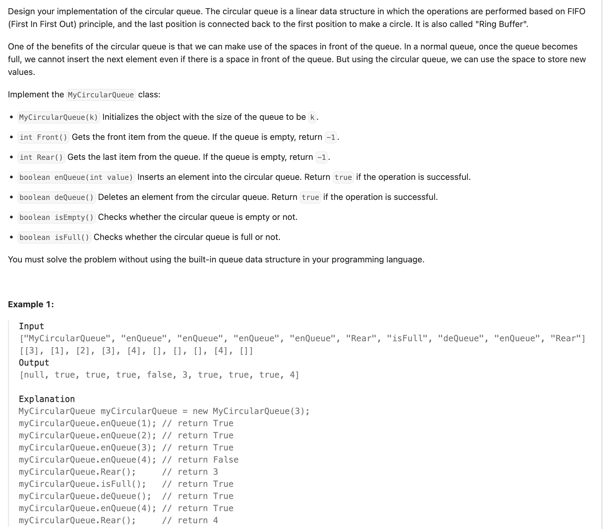

## 622. Design Circular Queue

---

```py
class MyCircularQueue:

    def __init__(self, k: int):
        self.size = 0
        self.items = [None] * k
        self.first = 0
        self.last = k - 1

    def enQueue(self, value: int) -> bool:
        if self.isFull():
            return False
        self.last = (self.last + 1) % len(self.items) # Move last pointer forward
        self.items[self.last] = value
        self.size += 1
        return True

    def deQueue(self) -> bool:
        if self.isEmpty():
            return False
        self.first = (self.first + 1) % len(self.items) # Move first pointer forward
        self.size -= 1
        return True

    def Front(self) -> int:
        return -1 if self.isEmpty() else self.items[self.first]

    def Rear(self) -> int:
        return -1 if self.isEmpty() else self.items[self.last]

    def isEmpty(self) -> bool:
        return self.size == 0

    def isFull(self) -> bool:
        return self.size == len(self.items)


# Your MyCircularQueue object will be instantiated and called as such:
# obj = MyCircularQueue(k)
# param_1 = obj.enQueue(value)
# param_2 = obj.deQueue()
# param_3 = obj.Front()
# param_4 = obj.Rear()
# param_5 = obj.isEmpty()
# param_6 = obj.isFull()
```