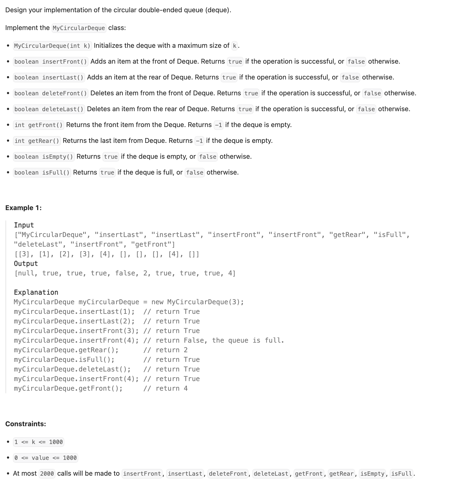

## 641. Design Circular Deque

---

- [circular deque's explanation](https://youtu.be/J4mk0tbIi8w?t=61)

---
- Initialization(k = 3)
  - self.items = [None, None, None]
  - self.first = 0
  - self.last = 2
  - self.size = 0


```ruby
    Index:    0         1       2      
            [None]   [None]   [None]  
            ↑(F)               ↑(L)    
```


- Step 1: `insertLast(10)`
  - Move last forward: (2 + 1) % 3 = 0
  - Set items[last] = 10
  - Increment size to 1


```ruby
    Index:    0         1         2      
             [10]     [None]    [None]  
           ↑(F) ↑(L)                  
```


- Step 2: `insertLast(20)`
  - Move last forward: (0 + 1) % 3 = 1
  - Set items[last] = 20
  - Increment size to 2


```ruby
    Index:    0         1         2      
             [10]      [20]    [None]  
             ↑(F)      ↑(L)    
```


- Step 3: `insertFront(5)`
  - Move first backward: (0 - 1 + 3) % 3 = 2
  - Set items[first] = 5
  - Increment size to 3


```ruby
    Index:    0         1         2      
             [10]      [20]      [5]  
                       ↑(L)      ↑(F)
```


---


```py
class MyCircularDeque:

    def __init__(self, k: int):
        """
        Initialize your data structure here. Set the size of the deque to be k.
        :type k: int
        """
        self.size = 0
        self.items = [None] * k
        self.first = 0
        self.last = k - 1

    def insertFront(self, value: int) -> bool:
        """
        Adds an item at the front of Deque. Return true if the operation is successful.
        :type value: int
        :rtype: bool
        """
        if self.isFull():
            return False
        self.first = (self.first - 1 + len(self.items)) % len(self.items)
        self.items[self.first] = value
        self.size += 1
        return True

    def insertLast(self, value: int) -> bool:
        """
        Adds an item at the rear of Deque. Return true if the operation is successful.
        :type value: int
        :rtype: bool
        """
        if self.isFull():
            return False
        self.last = (self.last + 1) % len(self.items)
        self.items[self.last] = value
        self.size += 1
        return True

    def deleteFront(self) -> bool:
        """
        Deletes an item from the front of Deque. Return true if the operation is successful.
        :rtype: bool
        """
        if self.isEmpty():
            return False
        self.first = (self.first + 1) % len(self.items)
        self.size -= 1
        return True

    def deleteLast(self) -> bool:
        """
        Deletes an item from the rear of Deque. Return true if the operation is successful.
        :rtype: bool
        """
        if self.isEmpty():
            return False
        self.last = (self.last - 1 + len(self.items)) % len(self.items)
        self.size -= 1
        return True

    def getFront(self) -> int:
        """
        Get the front item from the deque.
        :rtype: int
        """
        return -1 if self.isEmpty() else self.items[self.first]

    def getRear(self) -> int:
        """
        Get the last item from the deque.
        :rtype: int
        """
        return -1 if self.isEmpty() else self.items[self.last]

    def isEmpty(self) -> bool:
        """
        Checks whether the circular deque is empty or not.
        :rtype: bool
        """
        return self.size == 0

    def isFull(self) -> bool:
        """
        Checks whether the circular deque is full or not.
        :rtype: bool
        """
        return self.size == len(self.items)
```