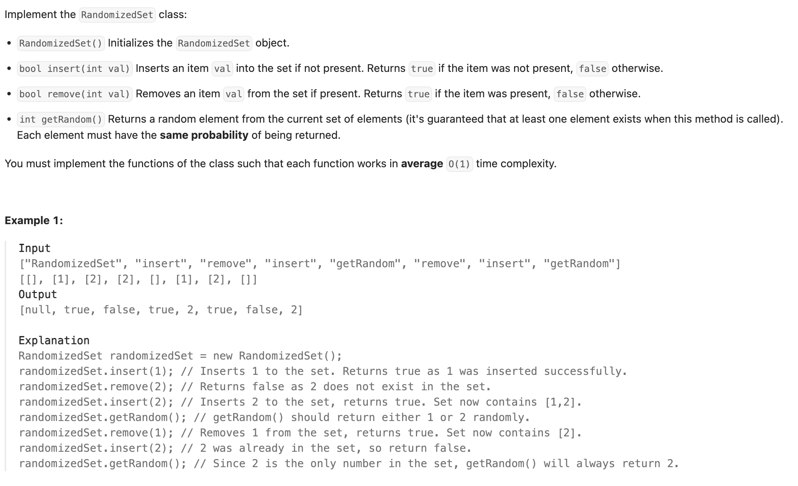
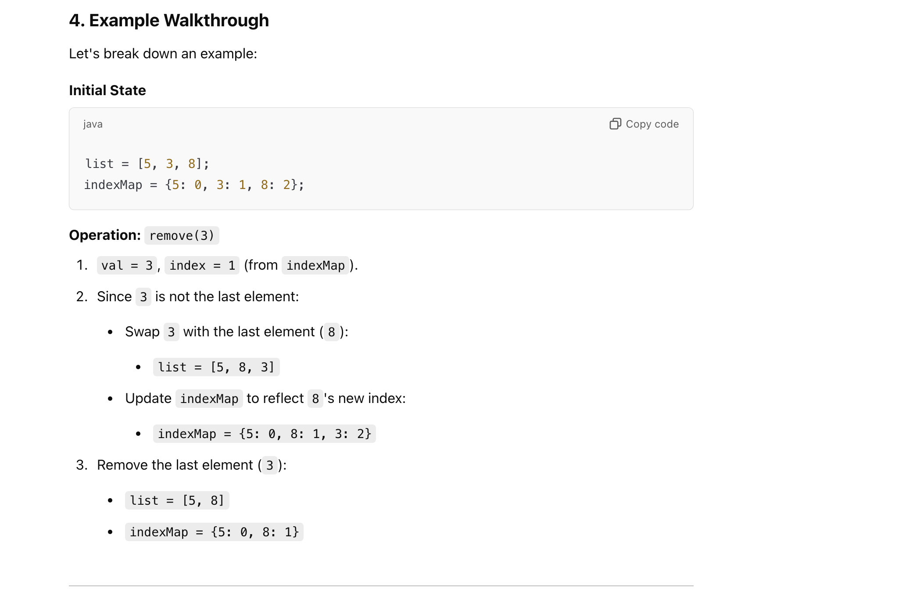

## 380. Insert Delete GetRandom O(1)


---

### designed to achieve `O(1)` time complexity for the removal operation.

- The goal of **remove()** is to:
  1. Remove the specified value val from the set (represented by the list and indexMap).
  2. Maintain the **O(1)** time complexity.

The main challenge is that removing an element from the middle of a list in Java is** O(n)** 
because **all subsequent elements need to be shifted**. To avoid this, the solution uses a **swap-and-remove** strategy.





---

```java
class _380_InsertDeleteGetRandom_O1 {
    private Map<Integer, Integer> indexMap;
    private List<Integer> list;
    private Random random;

    public _380_InsertDeleteGetRandom_O1() {
        indexMap = new HashMap<>();
        list = new ArrayList<>();
        random = new Random();
    }

    /*  Inserts an item val into the set if not present. Returns true if the item was not present,
    false otherwise. */
    public boolean insert(int val) {
        if (indexMap.containsKey(val)) {
            return false;
        }
        indexMap.put(val, list.size());
        list.add(val);
        return true;
    }

    /*  Removes an item val from the set if present. Returns true if the item was present,
    false otherwise. */
    public boolean remove(int val) {
        Integer index = indexMap.get(val);
        if (index == null) {
            return false;
        }
        int toDelete = list.get(index);
        if (index != list.size() - 1) {
            swap(list, index, list.size() - 1);
            indexMap.put(list.get(index), index);
        }
        indexMap.remove(toDelete);
        list.remove(list.size() - 1);
        return true;
    }

    private void swap(List<Integer> list, Integer i, int j) {
        int temp = list.get(i);
        list.set(i, list.get(j));
        list.set(j, temp);
    }

    /* Returns a random element from the current set of elements */
    public int getRandom() {
        int randomIndex = random.nextInt(list.size());
        return list.get(randomIndex);
    }
}
```
---

#### Python

```py
class RandomizedSet:

    def __init__(self):
        self.indexMap = {}
        self.list = []

    def insert(self, val: int) -> bool:
        if val in self.indexMap:
            return False
        self.indexMap[val] = len(self.list)
        self.list.append(val)
        return True

    def remove(self, val: int) -> bool:
        if val not in self.indexMap:
            return False
        index = self.indexMap[val]
        lastElement = self.list[-1]
        if index != len(self.list) - 1:
            self.swap(index, len(self.list) - 1)
        self.indexMap[lastElement] = index
        self.indexMap.pop(val)
        self.list.pop()
        return True

    def swap(self, i, j):
        self.list[i], self.list[j] = self.list[j], self.list[i]

    def getRandom(self) -> int:
        return random.choice(self.list)
```