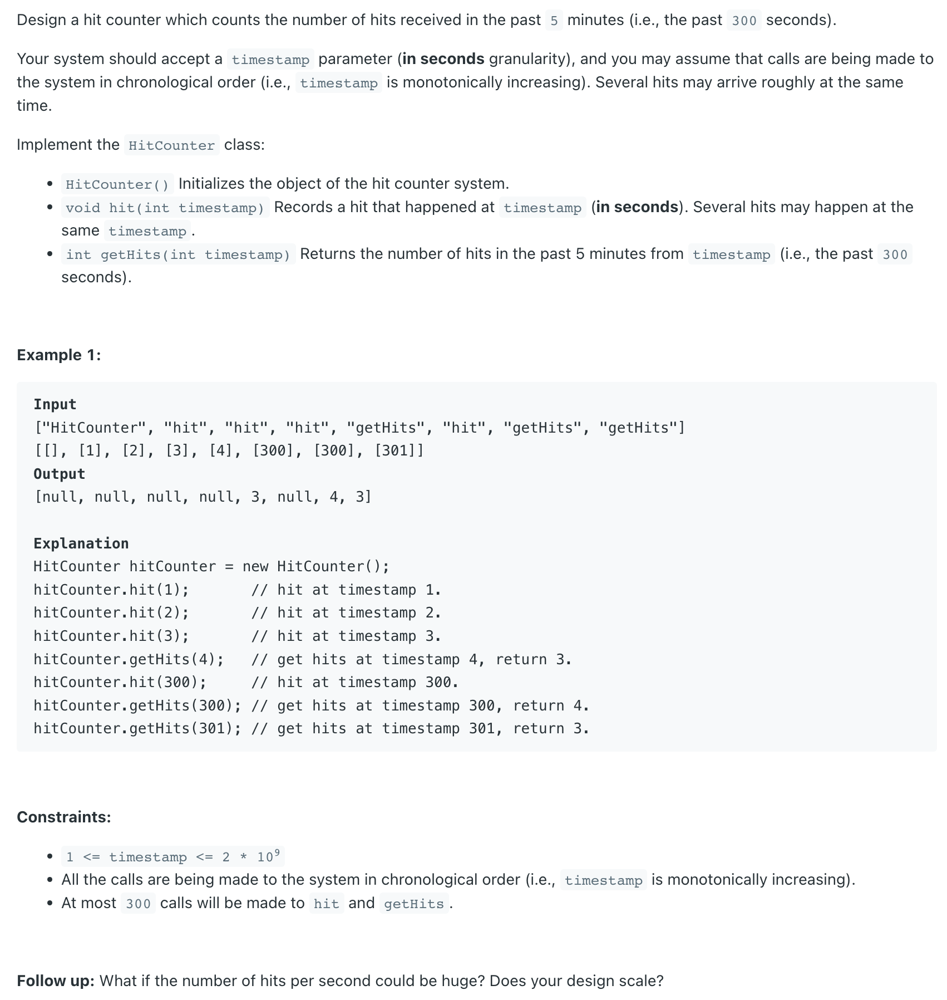

## 362. Design Hit Counter


- 300秒内，`time[index]` 用来保存 `timestamp % 300` 后的time。
- 如果 `time[index]` 从未用来保存，则初始化为 `1` 

---

```java
public class DesignHitCounter_array {
    private int[] times;
    private int[] hits;

    public DesignHitCounter_array() {
        times = new int[300];
        hits = new int[300];
    }

    /**
     * Record a hit.
     * @param timestamp - The current timestamp (in seconds granularity).
     */
    public void hit(int timestamp) {
        int index = timestamp % 300;
        if (times[index] != timestamp) {
            times[index] = timestamp;
            hits[index] = 1;
        } else {
            hits[index]++;
        }
    }

    /**
     * Return the number of hits in the past 5 minutes.
     * @param timestamp - The current timestamp (in seconds granularity).
     */
    public int getHist(int timestamp) {
        int total = 0;
        for (int i = 0; i < 300; i++) {
            if (timestamp - times[i] < 300) {
                total += hits[i];
            }
        }
        return total;
    }
}
```