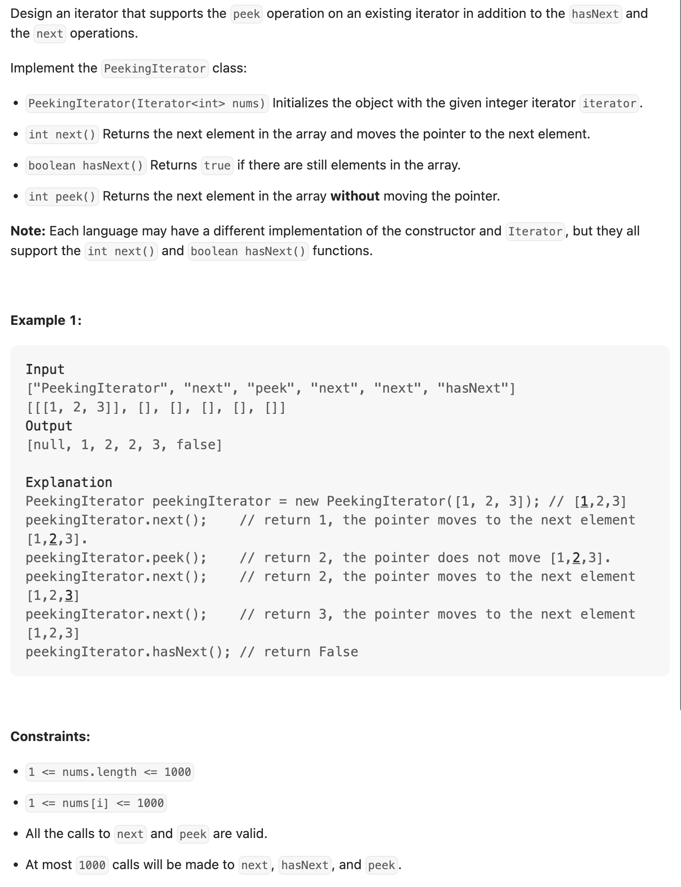
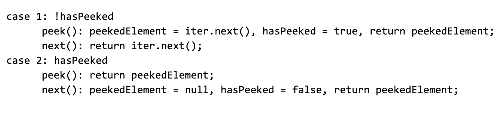

## 284. Peeking Iterator




```java
// Java Iterator interface reference:
// https://docs.oracle.com/javase/8/docs/api/java/util/Iterator.html
class _284_PeekingIterator implements Iterator<Integer> {
    Iterator<Integer> iterator;
    boolean hasPeeked;
    Integer peekedElement;

    public _284_PeekingIterator(Iterator<Integer> iterator) {
        this.iterator = iterator;
    }

    // Returns the next element in the iteration without advancing the iterator.
    public Integer peek() {
        if (!hasPeeked) {
            peekedElement = iterator.next();
        }
        hasPeeked = true;
        return peekedElement;
    }

    // hasNext() and next() should behave the same as in the Iterator interface.
    // Override them if needed.
    @Override
    public Integer next() {
        if (!hasNext()) {
            return null;
        }
        if (!hasPeeked) {
            return iterator.next();
        }
        Integer res = peekedElement;
        hasPeeked = false;
        peekedElement = null;
        return res;
    }

    @Override
    public boolean hasNext() {
        return hasPeeked || iterator.hasNext();
    }
}
```