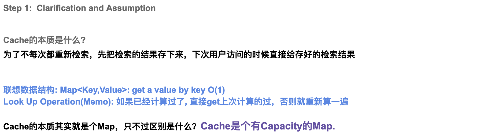
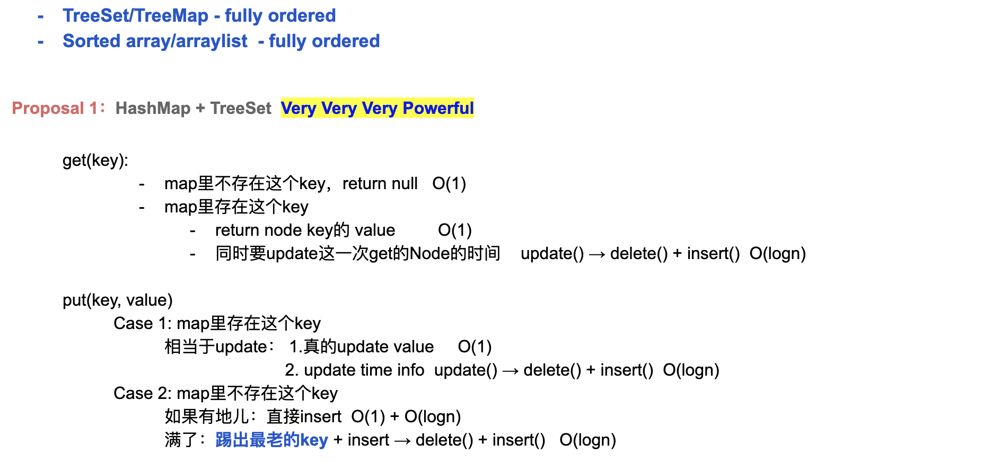

## 146. LRU Cache

---





```java
class LRUCache_TreeSet {
    private static class Element implements Comparable<Element> {
        int id;
        int key;
        int value;

        public Element(int id, int key, int value) {
            this.id = id;
            this.key = key;
            this.value = value;
        }

        @Override
        public int compareTo(Element e) {
            return Integer.compare(this.id, e.id);
        }

        @Override
        public String toString() {
            return "\nElement: " + "id: " + this.id + " " + "key: " + this.key + " " + "val: " + this.value;
        }
    }

    private final int CAPACITY;
    private Map<Integer, Element> map;
    private TreeSet<Element> treeSet;
    private int id;

    public LRUCache_TreeSet(int capacity) {
        // if (capacity <= 0) throw IllegalArgumentException
        this.CAPACITY = capacity;
        map = new HashMap<>();
        treeSet = new TreeSet<>();
        id = 0; // Integer.MIN_VALUE for a greater range of id's
    }

    public int get(int key) {
        Element currentElement = map.get(key);
        if (currentElement == null) {
            return -1;
        }
        treeSet.remove(currentElement);
        currentElement.id = id++;
        treeSet.add(currentElement);
        return currentElement.value;
    }

    public void put(int key, int value) {
        Element oldElement = map.get(key);
        if (oldElement != null) {
            map.remove(key);
            treeSet.remove(oldElement);
        }
        Element currentElement = new Element(id++, key, value);
        map.put(key, currentElement);
        treeSet.add(currentElement);
        if (treeSet.size() > CAPACITY) {
            oldElement = treeSet.first();
            treeSet.remove(oldElement);
            map.remove(oldElement.key);
        }
    }

    public static void main(String[] args) {
        LRUCache_TreeSet lRUCache = new LRUCache_TreeSet(2);
        lRUCache.put(1, 1); // cache is {1=1}
        System.out.println(lRUCache.treeSet + "\n");


        lRUCache.put(2, 2); // cache is {1=1, 2=2}
        System.out.println(lRUCache.treeSet + "\n");

        System.out.println(lRUCache.get(1) + "\n");
        ;    // return 1

        lRUCache.put(3, 3); // LRU key was 2, evicts key 2, cache is {1=1, 3=3}
        System.out.println(lRUCache.treeSet + "\n");

        System.out.println(lRUCache.get(2) + "\n");    // returns -1 (not found)


        lRUCache.put(4, 4); // LRU key was 1, evicts key 1, cache is {4=4, 3=3}
        System.out.println(lRUCache.treeSet + "\n");

        System.out.println(lRUCache.get(1) + "\n");     // return -1 (not found)

        System.out.println(lRUCache.get(3));    // return 3

        System.out.println(lRUCache.get(4));    // return 4
    }
}
```

---


```java
class LRUCache {
    static class Node {
        Node next;
        Node previous;
        int key;
        int value;

        //current node hold key and val
        Node(int key, int val) {
            this.key = key;
            this.value = val;
        }

        // update my node's value
        void update(int key, int value) {
            this.key = key;
            this.value = value;
        }
    }

    private final int capacity;
    //HashMap contain such every a element that contains:
    //<key, Node>, Node => <Node.key, value>
    protected HashMap<Integer, Node> map;

    // maintain all the time that the head and tail of
    //current doubly LinkedList
    private Node head;
    private Node tail;

    public LRUCache(int capacity) {
        this.capacity = capacity;
        map = new HashMap<>();
    }

    public int get(int key) {
        Node node = map.get(key);
        if (node == null) {
            return -1;
        }
        //Even though we just read from linkedList,
        //but we still need to move node to the head
        remove(node);
        appendToHead(node);
        return node.value;
    }

    public void put(int key, int value) {
        Node node = null;
        //1. if the key already in the cache,
        //we need to update its value
        //and move it to head (most recently used position)
        if (map.containsKey(key)) { //(1, 1) -> (1, 100)
            node = map.get(key);
            node.value = value;
            remove(node);
            appendToHead(node);
        } else { // no key exists
            node = new Node(key, value);
            if (map.size() < capacity) {
                //2. if the key is not in the cache,
                //assume we have enough space
                // we just need to add new node into the head
                appendToHead(node);
            } else { // map.size() >= capacity
                //3. if the key is not in the cache,
                // even we don't have enough space
                // we need to evict the tail
                // move the new node<Node.key, value> into the head
                remove(tail);
                appendToHead(node);
            }
        }
    }

    private void appendToHead(Node node) {
        map.put(node.key, node);
        if (head == null) {
            head = tail = node;
        } else {
            node.next = head;
            head.previous = node;
            head = node;
        }
    }

    /**
     * there are 4 cases for doubly linkedList
     * to maintain its order
     * @param node the current node that
     *  we need to remove from double LinkedList
     */
    private void remove(Node node) {
        map.remove(node.key);
        if (node == tail) {
            tail = tail.previous;
        }
        if (node.previous != null) {
            node.previous.next = node.next;
        }
        if (node.next != null) {
            node.next.previous = node.previous;
        }
        if (node == head) {
            head = head.next;
        }
        node.previous = null;
        node.next = null;
    }

    public static void main(String[] args) {
        LRUCache lRUCache = new LRUCache(5);
        lRUCache.put(1, 1);
        lRUCache.put(2, 2);
        int temp = lRUCache.get(1);
        System.out.println("Should return 1 => " + temp);
        // return 1
        lRUCache.put(3, 3);
        lRUCache.put(4, 4);
        lRUCache.put(5, 5);
        lRUCache.put(6, 6);
        // evicts key 2, cache is {1=1, 3=3, 4=4, 5=5, 6=6}

        lRUCache.map.forEach(
                (key, node) -> System.out.println(key + " => " + node.value)
        );

        temp = lRUCache.get(2);
        System.out.println("Should return -1 => " + temp);

        lRUCache.put(7, 7);
        // evicts key 1, cache is {3=3, 4=4, 5=5, 6=6, 7=7}
        lRUCache.map.forEach(
                (key, node) -> System.out.println(key + " => " + node.value)
        );

        temp = lRUCache.get(3);
        System.out.println("Should return 3 => " + temp);  // return 3
        temp = lRUCache.get(4);
        System.out.println("Should return 4 => " + temp);  // return 4
    }
}

```