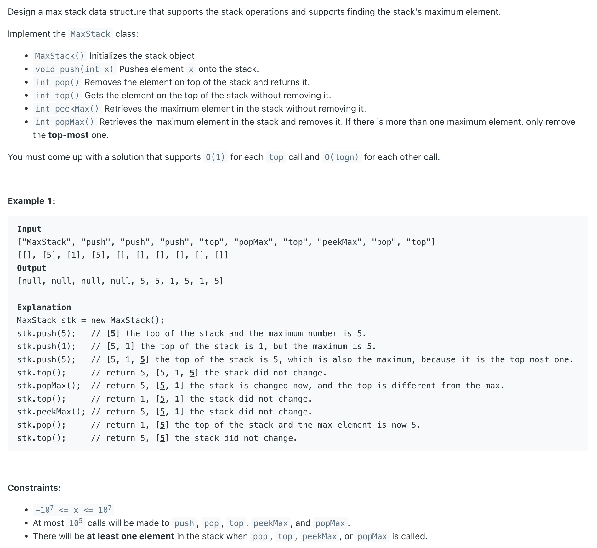

## 716. Max Stack

---

- TLE : maxHeap

```java
class MaxStack {
    
    PriorityQueue<Integer> maxHeap;
    Deque<Integer> stk;

    public MaxStack() {
        maxHeap = new PriorityQueue<>((a, b) -> b - a);
        stk = new ArrayDeque<>();
    }
    
    public void push(int x) {
        maxHeap.offer(x);
        stk.addLast(x);
    }
    
    public int pop() {
        int removed = stk.pollLast();
        maxHeap.remove(removed);
        return removed;
    }
    
    public int top() {
        return stk.peekLast();
    }
    
    public int peekMax() {
        return maxHeap.peek();
    }
    
    public int popMax() {
        int max = maxHeap.poll();
        stk.removeLastOccurrence(max);
        return max;
    }
}
```
---

### LinkedList + TreeMap

```java
public class MaxStack {
    static class Node {
        Node prev;
        Node next;
        int val;

        public Node(int x) {
            this.val = x;
            this.prev = null;
            this.next = null;
        }
    }

    private Node head;
    private Node tail;
    private TreeMap<Integer, List<Node>> treeMap;

    public MaxStack() {
        this.treeMap = new TreeMap<>();
    }

    public void push(int x) {
        Node node = new Node(x);
        append(node);
        treeMap.putIfAbsent(x, new ArrayList<>());
        treeMap.get(x).add(node);
    }

    public int pop() {
        if (head == null) {
            return Integer.MIN_VALUE;
        }
        Node node = head;
        remove(node);
        updateMap(node);
        return node.val;
    }

    public int top() {
        if (head == null) {
            return Integer.MIN_VALUE;
        }
        return head.val;
    }

    public int peekMax() {
        if (treeMap.isEmpty()) {
            return Integer.MIN_VALUE;
        }
        return treeMap.lastKey();
    }

    public int popMax() {
        if (treeMap.isEmpty()) {
            return Integer.MIN_VALUE;
        }
        int maxKey = treeMap.lastKey();
        List<Node> maxList = treeMap.get(maxKey);
        Node maxNode = maxList.get(maxList.size() - 1);
        remove(maxNode);
        updateMap(maxNode);
        return maxNode.val;
    }

    private void remove(Node node) {
        if (node.next != null) {
            node.next.prev = node.prev;
        }
        if (node.prev != null) {
            node.prev.next = node.next;
        }
        if (node == head) {
            head = head.next;
        }
        if (node == tail) {
            tail = tail.prev;
        }
    }

    private void updateMap(Node node) {
        List<Node> list = treeMap.get(node.val);
        if (list.size() == 1) {
            treeMap.remove(node.val);
        } else {
            list.remove(list.size() - 1);
        }
    }

    private void append(Node node) {
        if (head == null) {
            head = tail = node;
        } else {
            node.next = head;
            head.prev = node;
            head = node;
        }
    }
}

```