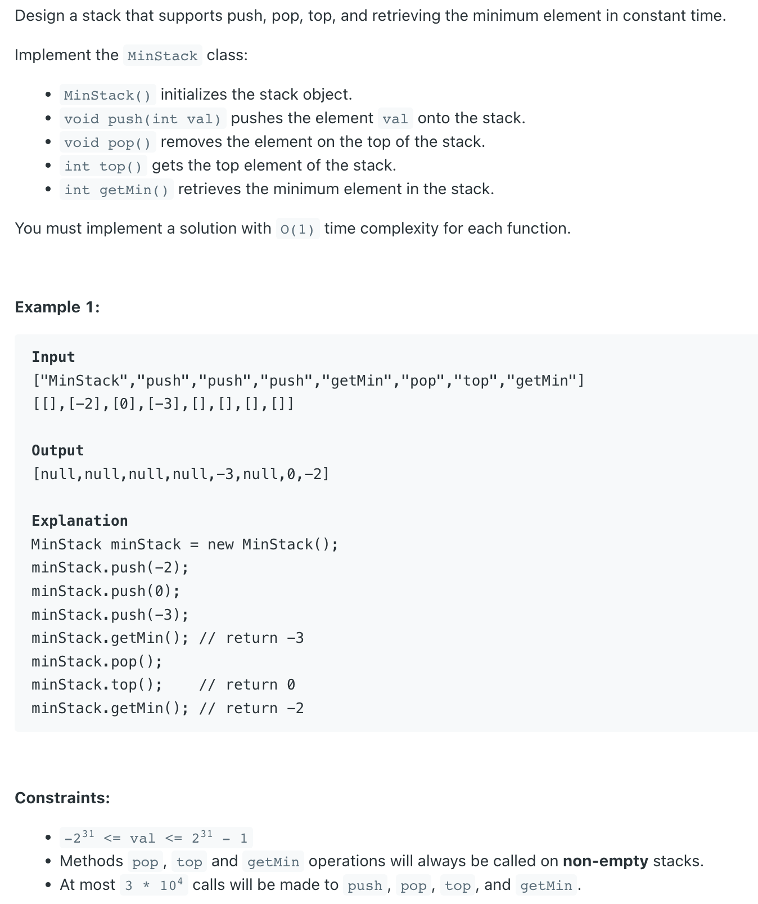

## 155. Min Stack


```ruby
## 如何维护top 元素是 min ?
## stack2 如果遇到目前为止最小的元素，则重复push
stack1 [ 3, 1, 0
stack2 [ 3, 1, 0

stack1 [ 3, 1, 0, 10, 20,  0,
stack2 [ 3, 1, 0, 0,  0,   0

stack1 [ 3, 1, 0, 10, 20,  0,  -1
stack2 [ 3, 1, 0, 0,  0,   0,  -1

stack1 [ 3, 1, 0, 10, 20,  0,  -1, 11, 12, 13
stack2 [ 3, 1, 0, 0,  0,   0,  -1, -1, -1, -1

## 那么可以不要重复 push -1 到 stack2 吗？ 当然可以！
stack1 [ 3, 1, 0, 10, 20,  0,  -1, 11, 12, 13
stack2 [ 3, 1, 0, 0,  0,   0,  -1, 

## 只要让 11，12，13 和 -1 比较，但是如果stack1遇到 -1, 
## 那么stack2 就必须再push 一次 -1
stack1 [ 3, 1, 0, 10, 20,  0,  -1, 11, 12, 13, -1
stack2 [ 3, 1, 0, 0,  0,   0,  -1, -1
```
---

```java
class MinStack_twoStacks {
    Stack<Integer> stack;
    Stack<Integer> minStack;

    public MinStack_twoStacks() {
        stack = new Stack<>();
        minStack = new Stack<>();
    }

    public void push(int val) {
        stack.push(val);
        // when value <= current min value in stack,
        // need to push the value to minstack
        if (minStack.isEmpty() || val <= minStack.peek()) {
            minStack.push(val);
        }
    }

    public void pop() {
        if (minStack.peek().equals(stack.peek())) {
            minStack.pop();
        }
        stack.pop();
    }

    public int top() {
        return stack.peek();
    }

    public int getMin() {
        return minStack.peek();
    }
}
```
