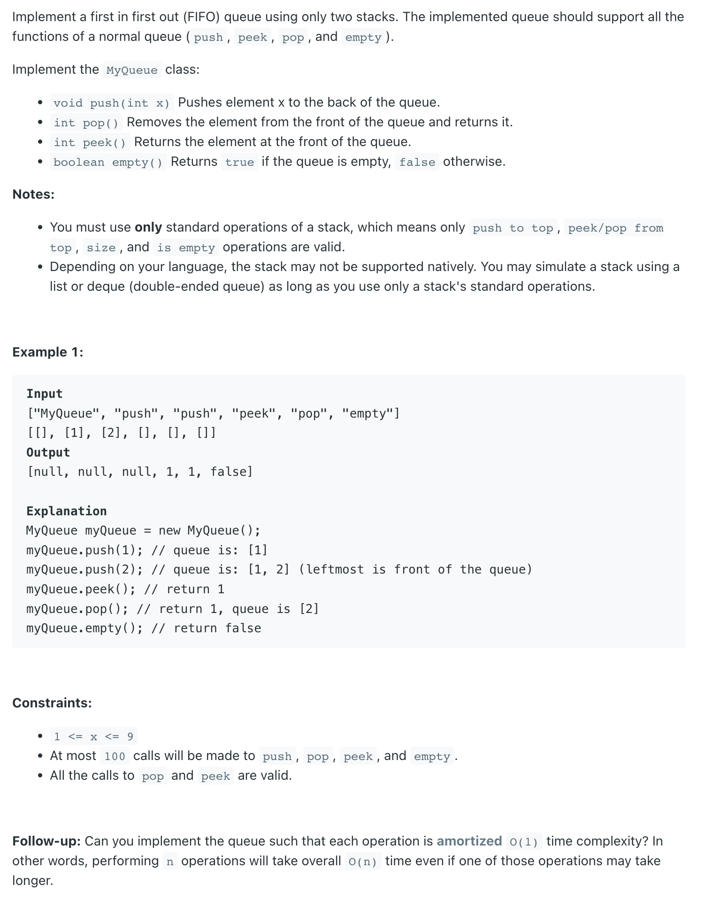

## 232. Implement Queue using Stacks


```ruby
Stack1(enqueue) [ 1, 2, 3
Stack2(dequeue) [

Queue <- 1, 2, 3

## 问题是我现在想把第一个元素（1）从Stack1 里拿出来，我该怎么做？
## 很明显我把1，2，3 从Stack1里 倒腾进 stack2


Stack1(enqueue) [ 
Stack2(dequeue) [ 3, 2, 1

Queue <- 1, 2, 3


## 如果现在我们要 enqueue 一个元素 9 , 我们把它放进 stack1

Stack1(enqueue) [ 9, 10
Stack2(dequeue) [ 3, 2, 1

Queue <- 1, 2, 3, 9, 10


## 如果现在我们要 enqueue 一个元素 10 ,  继续把它放进 stack1 
```

- `Stack1`: is the only stack to store new elements when adding a new element into the queue
- `Stack2`: is the only stack to pop old element out of the queue.
  - Case 1: if `Stack2` is **not empty**, then we can just pop.  - `O(1)`
  - Case 2: if `Stack2` is **empty**. we move all data from `Stack1` to `Stack2` one by one. 
    and then pop out the top element from `Stack2`   - `O(n)`

- Time for Enqueue(): `O(1)` 
- Time for Dequeue(): 
  - Case 1: `O(1)` 
  - Case 2: worst case `O(n)`

- **Amortized time complexity** `均摊时间复杂度`
  - assume `n = 1000`
  - `1st` `dequeue()` : how many stack operations do we need?
    - `1000 stack1.pop()` 
    - `1000 stack2.push()` 
    - `1 stack2.pop()` 
- Total = `2001 stack operations`
---

```ruby
             (1000 + 1000 + 1) + 1 + 1 + ... + 1 stack operations        3000
E(数学期望) = ------------------------------------------------------  =  --------- = 3 = O(1)
                     1000 dequeue() operations                           1000

     (n + n + 1) + (n - 1) * 1        3n
E = ---------------------------- = -------- = 3 = O(1)
               n                      n
```

---

```java
class _232_ImplementQueueUsingStacks {
    Stack<Integer> input;
    Stack<Integer> output;

    public _232_ImplementQueueUsingStacks() {
        input = new Stack<>();
        output = new Stack<>();
    }

    public void push(int x) {
        input.push(x);
    }

    public int pop() {
        // if out stacks is empty,
        // need to move the elements from in stack to out stack.
        move();
        return output.pop();
    }

    // when output stack is empty, move the elements from input stack to output stack
    private void move() {
        if (output.isEmpty()) {
            while (!input.isEmpty()) {
                output.push(input.pop());
            }
        }
    }

    public int peek() {
        move();
        return output.peek();
    }

    public boolean empty() {
        return input.isEmpty() && output.isEmpty();
    }

    public static void main(String[] args) {
        _232_ImplementQueueUsingStacks myQueue = new _232_ImplementQueueUsingStacks();
        myQueue.push(1);
        myQueue.push(2);
        myQueue.push(3);
        myQueue.push(5);
        myQueue.push(16);
        System.out.println(myQueue.peek()); // 1
        System.out.println(myQueue.pop()); // 1
        System.out.println(myQueue.empty()); // false
    }
}

/**
 * stk1 [ 4, 5
 * stk2 [ 3, 2,
 * queue [ 2, 3,
 */
```
