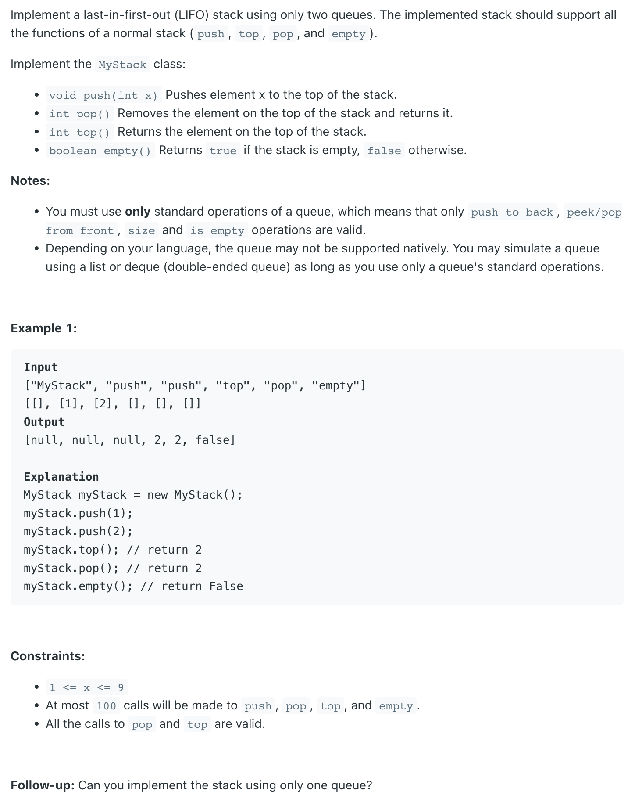

## 225. Implement Stack using Queues

---
### Only One Queue

```ruby
queue [1, 2, 3
Stack [1, 2, 3

## 现在我想pop 3 from stack:
## 我可以push 第一个元素从 queue 到它的末尾
queue [2, 3, 1
Stack [1, 2, 3

queue [3, 1, 2
Stack [1, 2, 3

queue [1, 2
Stack [1, 2
```
---
```java
class MyStack_OneQueue {
    Queue<Integer> queue;
    public MyStack_OneQueue() {
        queue = new ArrayDeque<>();
    }

    public void push(int x) {
        queue.offer(x);
    }

    public int pop() {
        int size = queue.size();
        for (int i = size - 1; i >= 1; i--) {
            Integer cur = queue.poll();
            queue.offer(cur);
        }
        return queue.poll();
    }

    public int top() {
        int ret = pop();
        queue.offer(ret);
        return ret;
    }

    public boolean empty() {
        return queue.isEmpty();
    }

    public static void main(String[] args) {
        MyStack_OneQueue myStack_oneQueue = new MyStack_OneQueue();
        myStack_oneQueue.push(1);
        myStack_oneQueue.push(2);
        myStack_oneQueue.push(3);
        myStack_oneQueue.push(4);
        System.out.println(myStack_oneQueue.top());
        System.out.println(myStack_oneQueue.pop());
    }
}
```


---
### Follow Up: implement a stack with two queues

```ruby
queue1 [ 1, 2, 3
queue2 [ 

Stack [1, 2, 3

## 现在如果我想pop element 3 from stack:
queue1 [ 3   ## 可以看到我只要剩下最后一个元素3，就是我所想pop的。
queue2 [ 1, 2

Stack [1, 2, 3

## 继续push元素到 stack:
queue1 [ 3, 4, 5   
queue2 [ 1, 2

Stack [1, 2, 3, 4, 5

## 现在我想pop 5 from stack
queue1 [ 5   # 留下最后一个元素5，就是我所想pop的.
queue2 [ 1, 2, 3, 4

Stack [1, 2, 3, 4, 5
```
---

```java
class MyStack_TwoQueues {
    Queue<Integer> q1;
    Queue<Integer> q2;
    public MyStack_TwoQueues() {
        q1 = new ArrayDeque<>();
        q2 = new ArrayDeque<>();
    }

    public void push(int x) {
        q1.offer(x);
    }

    public int pop() {
        Integer prev = q1.poll();
        Integer cur = q1.poll();
        while (cur != null) {
            q2.offer(prev);
            prev = cur;
            cur = q1.poll();
        }
        Queue<Integer> tmp = q1;
        q1 = q2;
        q2 = tmp;
        return prev;
    }

    public int top() {
        Integer ret = pop();
        if (ret != null) {
            q1.offer(ret);
        }
        return ret;
    }

    public boolean empty() {
        return q1.isEmpty() && q2.isEmpty();
    }

    public static void main(String[] args) {
        MyStack_TwoQueues myStack_twoQueues = new MyStack_TwoQueues();
        myStack_twoQueues.push(1);
        myStack_twoQueues.push(2);
        myStack_twoQueues.push(3);
        myStack_twoQueues.push(4);
        System.out.println(myStack_twoQueues.top()); // 4
        System.out.println(myStack_twoQueues.pop()); // 4
    }
}
/*
    q1 [ 1, 2, 3
    q2 [
 stack [ 1, 2, 3


    q1 [ 3
    q2 [ 1, 2
 stack [ 1, 2, 3
 */
```