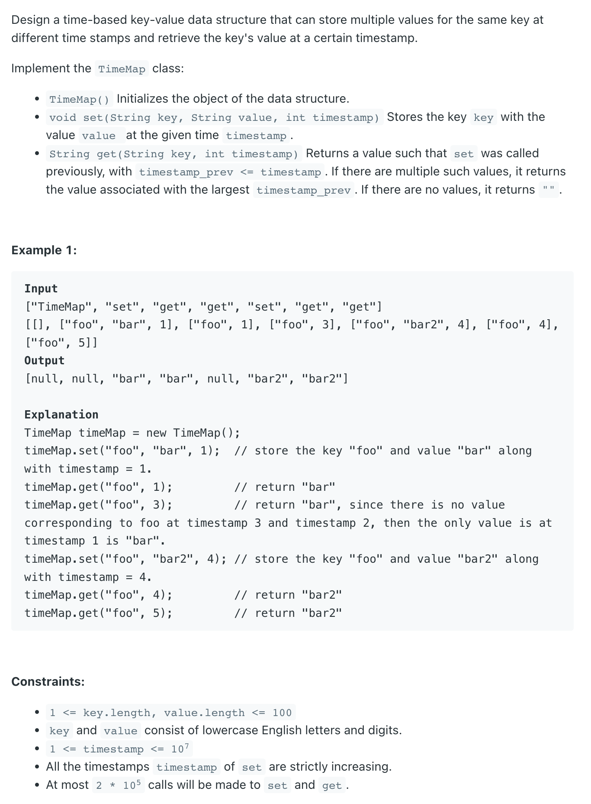
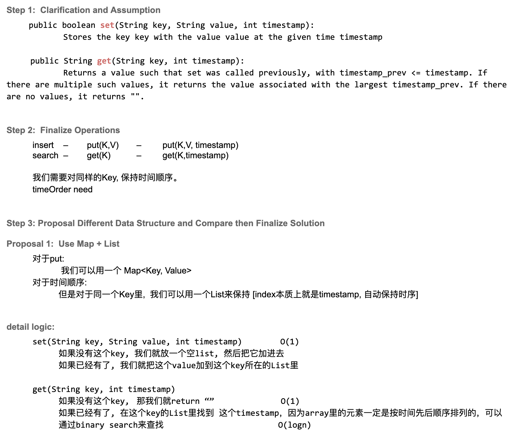
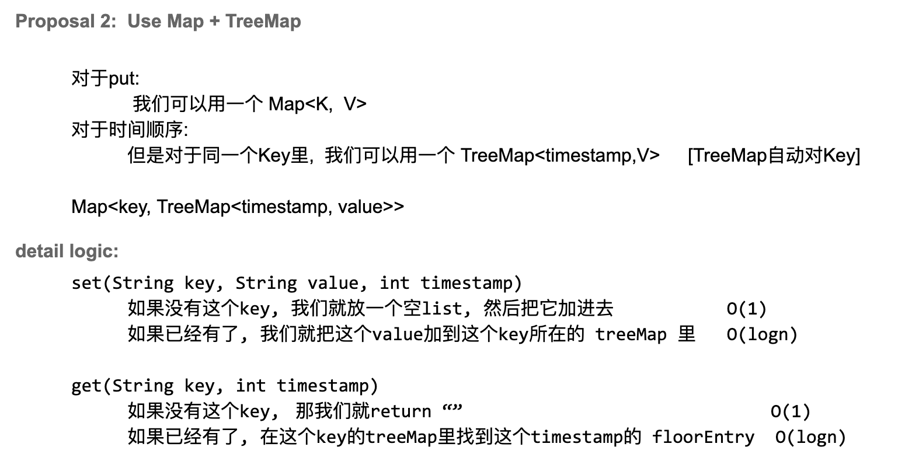

## 981. Time Based Key-Value Store

---


```java
class TimeBased_KeyValue_Store {
    static class Pair {
        String value;
        int time;

        public Pair(String value, int time) {
            this.value = value;
            this.time = time;
        }
    }

    Map<String, List<Pair>> map;

    public TimeBased_KeyValue_Store() {
        this.map = new HashMap<>();
    }

    public void set(String key, String value, int timestamp) {
        map.putIfAbsent(key, new ArrayList<>());
        map.get(key).add(new Pair(value, timestamp));
    }

    public String get(String key, int timestamp) {
        if (!map.containsKey(key)) {
            return "";
        }
        List<Pair> currentKeyList = map.get(key);
        int index = largestSmallerOrEqual(timestamp, currentKeyList);
        if (index == -1) {
            return "";
        }
        return currentKeyList.get(index).value;
    }

    private int largestSmallerOrEqual(int timestamp, List<Pair> currentKeyList) {
        int left = 0, right = currentKeyList.size() - 1;

        while (left < right - 1) {
            int mid = left + (right - left) / 2;
            if (currentKeyList.get(mid).time == timestamp) {
                left = mid;
            } else if (currentKeyList.get(mid).time < timestamp) {
                left = mid;
            } else {
                right = mid;
            }
        }
        if (currentKeyList.get(right).time <= timestamp) {
            return right;
        }
        if (currentKeyList.get(left).time <= timestamp) {
            return left;
        }
        return -1;
    }
}
```

---

### TreeMap


```java
class TimeBased_KeyValue_Store_Simple {
    Map<String, TreeMap<Integer, String>> map;

    public TimeBased_KeyValue_Store_Simple() {
        this.map = new HashMap<>();
    }

    public void set(String key, String value, int timestamp) {
        map.putIfAbsent(key, new TreeMap<>());
        map.get(key).put(timestamp, value);
    }

    public String get(String key, int timestamp) {
        TreeMap<Integer, String> treeMap = map.get(key);
        if (treeMap == null) {
            return "";
        }
        Map.Entry<Integer, String> entry = treeMap.floorEntry(timestamp);
        return entry == null ? "" : entry.getValue();
    }
}
```
