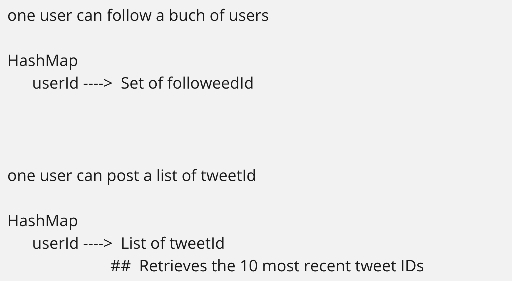

## 355. Design Twitter


---

- if **user A follows user B** on Twitter, then **user B is the followee of user A**.


- This user is following that user.

- one user can follow a buch of users



- Note: **if we can't get a user's followee, we can let him follow himself**!

```java
class Twitter {    
    Map<Integer, Set<Integer>> userMap;
    LinkedList<int[]> tweets;

    public Twitter() {
        userMap = new HashMap<>();
        tweets = new LinkedList<>();
    }
    
    public void postTweet(int userId, int tweetId) {
        tweets.addFirst(new int[]{userId, tweetId});
    }
    
    // Retrieves the 10 most recent tweet IDs in the user's news feed. 
    public List<Integer> getNewsFeed(int userId) {
        if (!userMap.containsKey(userId)) {
            // following himself
            followingSelf(userId);            
        }
        
        List<Integer> feeds = new ArrayList<>();
        Set<Integer> followSet = userMap.get(userId);
        int count = 10;
        
        for (int[] tweet : tweets) {
            if (count <= 0) {
                break;
            }

            if (followSet.contains(tweet[0])) {
                feeds.add(tweet[1]);
                count--;
            }                

        }
        return feeds;
    }
    
    public void follow(int followerId, int followeeId) {
        if (!userMap.containsKey(followerId)) {
            // following himself
            followingSelf(followerId);            
        }
        userMap.get(followerId).add(followeeId);
    }
    
    public void unfollow(int followerId, int followeeId) {
        if (!userMap.containsKey(followerId)) {
            // following himself
            followingSelf(followerId);
        }
        userMap.get(followerId).remove(followeeId);
    }
    
    //initialize a user's following list(add to global hashmap and following himself)
    private void followingSelf(int userId) {
        userMap.putIfAbsent(userId, new HashSet<>());
        userMap.get(userId).add(userId);
    }
}

/**
 * Your Twitter object will be instantiated and called as such:
 * Twitter obj = new Twitter();
 * obj.postTweet(userId,tweetId);
 * List<Integer> param_2 = obj.getNewsFeed(userId);
 * obj.follow(followerId,followeeId);
 * obj.unfollow(followerId,followeeId);
 */
```