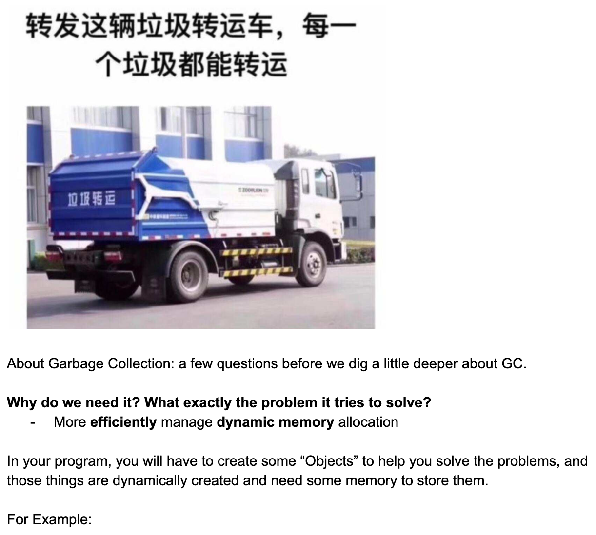
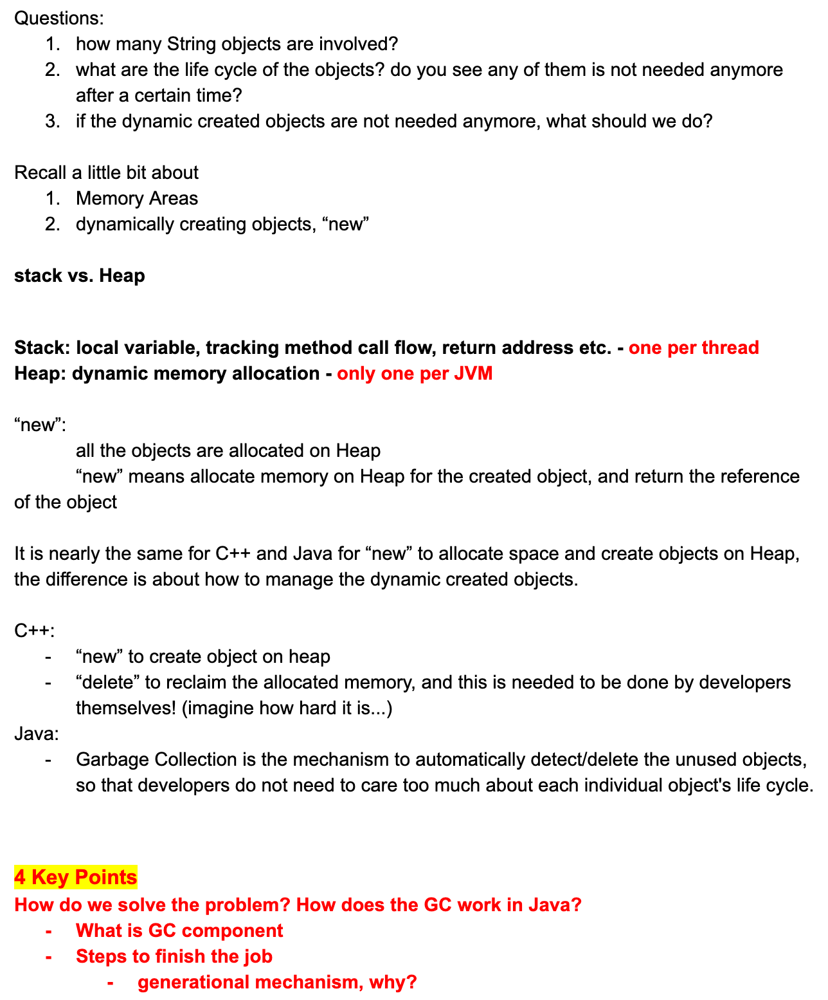
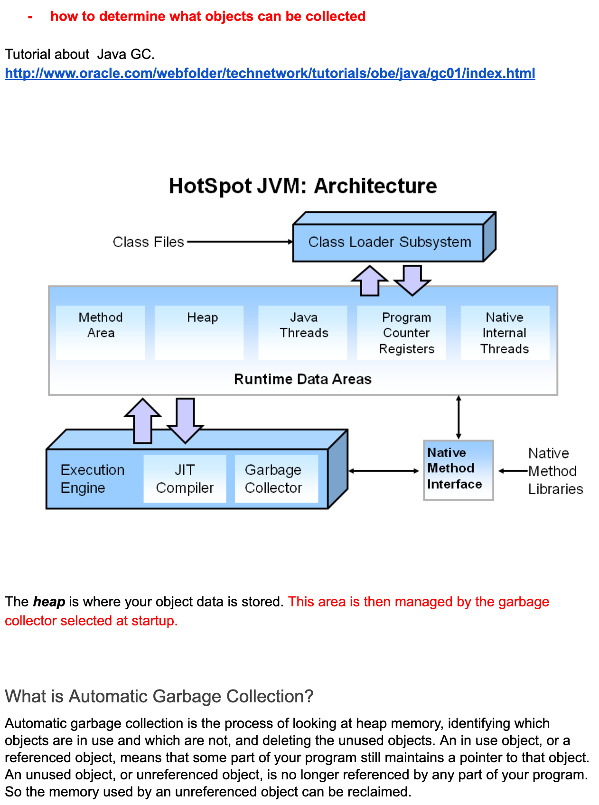

## Garbage Collection






```java
public static void main(String[] args) {
    String name = "garbage collection";
    printHello(name);
    // .. a lot of operations afterwards
}

public void static printHello(String name) {
    String message = "Greeting from " + name;
    System.out.println(message);
    //...
}
```