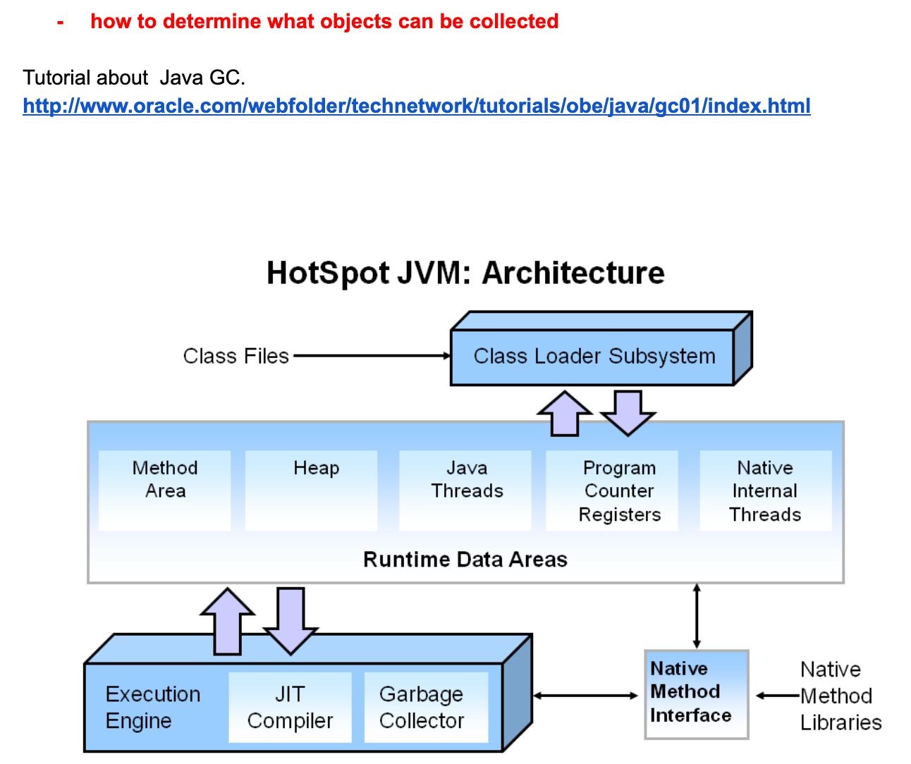

## Garbage Collection




- The **heap** is where your object data is stored. This area is then managed by the garbage 
  collector selected startup.

- What is Automatic Garbage Collection?
  - Automatic garbage collection is the process of looking at heap memory, identifying which objects
    are in use and which are not, and deleting the unused objects. An in use object, or a referenced
    object, means that some part of your program still maintains a pointer to that object. An unused
    object, or unreferenced object, is no longer referenced by any part of your program. So the 
    memory used by an unreferenced object can be reclaimed.


```java
public static void main(String[] args) {
    String name = "garbage collection";
    printHello(name);
    // .. a lot of operations afterwards
}

public void static printHello(String name) {
    String message = "Greeting from " + name;
    System.out.println(message);
    //...
}
```


