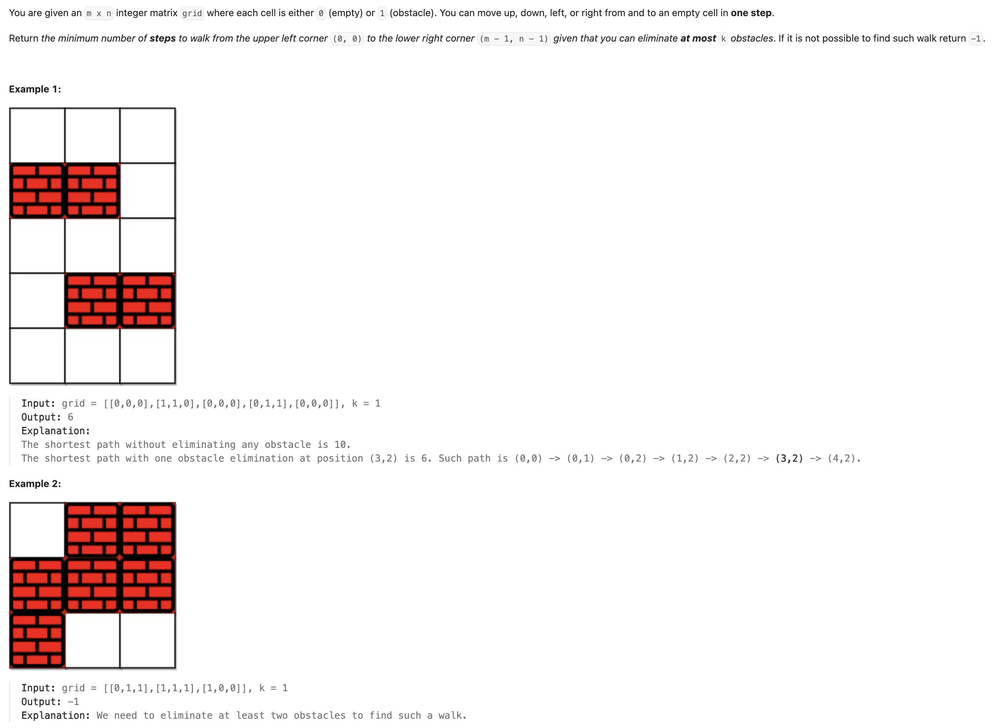
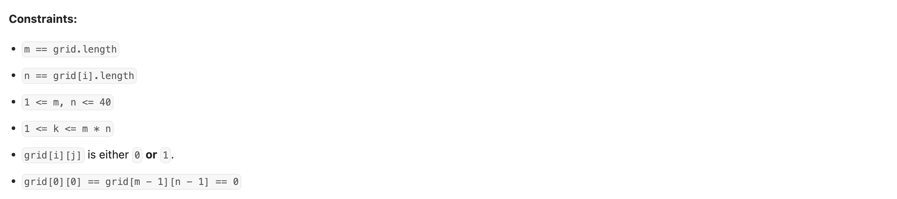

## 1293. Shortest Path in a Grid with Obstacles Elimination


---

```ruby
        // If k is large enough, the shortest path is just Manhattan distance
        if (k >= m + n - 2) {
            return m + n - 2;
        }
```

- `m + n - 2`: This is the Manhattan distance from the starting cell (0, 0) to the target cell (m-1, n-1). 
  The Manhattan distance is the minimum number of steps required to move from one cell to another in a grid, only moving horizontally or 
  vertically (like on a city grid). 


- why did `boolean[][][] visited = new boolean[m][n][k + 1];` set to be **k + 1** ?
- We use **k + 1** for the **third dimension** of the visited array to represent **all possible counts of obstacle eliminations**, from 
  **0** up to **k**.

- If `k = 2`, that means:
  - You can eliminate **0**, **1**, or **2** obstacles on your path.
  - That's **3 distinct states** (0 to 2 inclusive), so we need indices 0 to k.

---

```java
class _1293_Shortest_Path_in_a_Grid_with_Obstacles_Elimination {
    int[][] dirs = new int[][]{{-1, 0}, {1, 0}, {0, -1}, {0, 1}};
    public int shortestPath(int[][] grid, int k) {
        int m = grid.length;
        int n = grid[0].length;

        // If k is large enough, the shortest path is just Manhattan distance
        if (k >= m + n - 2) {
            return m + n - 2;
        }

        // visited[r][c][kLeft] = true means we've been at (r,c) with kLeft eliminations remaining.
        // This 3D array tracks visited states to avoid cycles and redundant processing.
        boolean[][][] visited = new boolean[m][n][k + 1];

        // Queue for BFS: stores {row, col, remaining_k}
        Queue<int[]> queue = new ArrayDeque<>();
        // Queue stores {row, col, steps, remaining_k}
        queue.offer(new int[]{0, 0, 0, k});
        visited[0][0][k] = true; // Mark the starting state as visited

        // BFS traversal
        while (!queue.isEmpty()) {
            int levelSize = queue.size();
            // Process all states at the current level (smae num of steps)
            for (int i = 0; i < levelSize; i++) {
                 int[] cur = queue.poll();
                 int row = cur[0];
                 int col = cur[1];
                 int steps = cur[2];
                 int kLeft = cur[3];

                // If we reached the target cell
                if (row == m - 1 && col == n - 1) {
                    return steps; //  Return the cur num of steps
                }
                // Explore neighbors
                for (int[] dir : dirs) {
                    int nr = row + dir[0];
                    int nc = col + dir[1];

                    // Check if the neighbor is within grid bounds
                    if (nr < 0 ||nr >= m || nc < 0 || nc >= n) {
                        continue;
                    }

                    // Calculate remaining k after potentially eliminating an obstacle at (nr, nc)
                    int nextK = kLeft - grid[nr][nc];
                    // If we have enough eliminations left (nextK >= 0)
                    // AND this exact state (row, col, remainingK) hasn't been visited
                    if (nextK >= 0 && !visited[nr][nc][nextK]) {
                        visited[nr][nc][nextK] = true;
                        queue.offer(new int[]{nr, nc, steps + 1, nextK});
                    }
                }
            }
            // After processing all nodes at the current level, the next iteration
            // of the while loop will process nodes at the next level (steps + 1).
        }
        // If the queue is empty and the destination hasn't been reached, no path exists
        return -1;
    }
}
```
---

```py
class Solution:
    def shortestPath(self, grid: List[List[int]], k: int) -> int:
        m, n = len(grid), len(grid[0])

        # Shortcut: If k is large enough, the shortest path is just Manhattan distance
        # because we can eliminate any obstacle on the direct path (m-1 + n-1 steps).
        if k >= m + n - 2:
            return m + n - 2

        dirs = [(-1, 0), (1, 0), (0, -1), (0, 1)]
        visited = [[[False] * (k + 1) for _ in range(n)] for _ in range(m)]
        visited[0][0][k] = True

        # Queue: (row, col, steps taken, remaining k)
        queue = deque([(0, 0, 0, k)])

        while queue:
            size = len(queue)
            for i in range(size):
                row, col, steps, kLeft = queue.popleft()

                # Reached the goal
                if row == m - 1 and col == n - 1:
                    return steps

                for dr, dc in dirs:
                    nr = row + dr
                    nc = col + dc

                    # Check boundaries
                    if nr < 0 or nr >= m or nc < 0 or nc >= n:
                        continue

                    nextK = kLeft - grid[nr][nc]
                    if nextK >= 0 and not visited[nr][nc][nextK]:
                        visited[nr][nc][nextK] = True
                        queue.append((nr, nc, steps + 1, nextK))
        return -1 # No path found
```