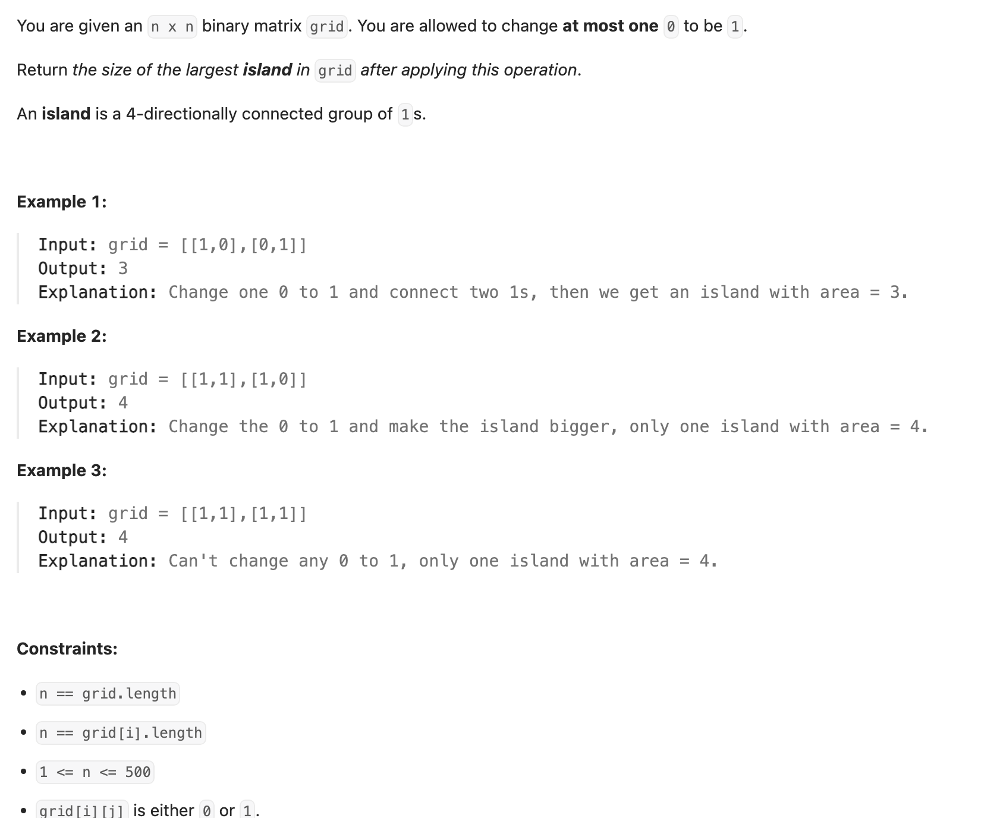
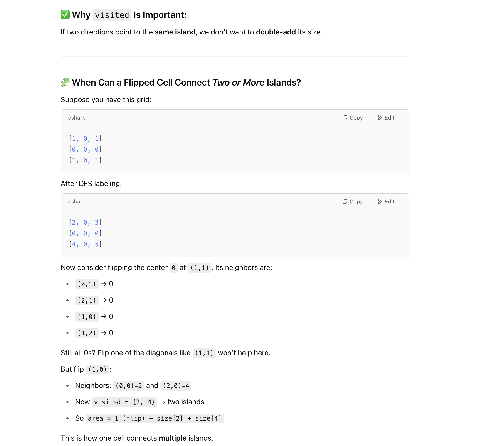

## 827. Making A Large Island

---

- [youtube](https://youtu.be/pq61VNqXGvA?t=634)
---

```py
class Solution:
    dirs = [(-1, 0), (1, 0), (0, -1), (0, 1)]

    def largestIsland(self, grid: List[List[int]]) -> int:
        self.N = len(grid)

        # 1. Precompute areas of existing islands:
        # Dictionary to store the size of each island.
        # Key: unique label for the island (starting from 2)
        # Value: size (number of cells) of the island
        size = defaultdict(int)
        # Label for the current island being processed.
        # Start from 2 to distinguish from land (1) and water (0).
        label = 2
        res = 0

        for r in range(self.N):
            for c in range(self.N):
                # If the cell is unvisited land (1)
                if grid[r][c] == 1:
                    # Perform DFS to find the entire island, label it, and get its size
                    size[label] = self.dfs(r, c, grid, label)
                    label += 1

        # 2. Try flipping each water cell (0) to land (1) and calculate the potential new island size

        # Initialize result with the size of the largest *existing* island (if any)
        # If size is empty (no islands initially), res is 0.
        res = 0 if not size else max(size.values())
        for r in range(self.N):
            for c in range(self.N):
                # If the cell is water (0)
                if grid[r][c] == 0:
                    # Calculate the potential size of the island if this 0 is flipped
                    # The size is the sum of adjacent labeled islands plus 1 (for the flipped cell)
                    res = max(res, self.connect(r, c, grid, size))
        return res

    def connect(self, r, c, grid, size):
        visited = set()
        area = 1  # start with the flipped cell
        for dx, dy in self.dirs:
            nr = r + dx
            nc = c + dy
            # OR: grid[r][c] != 1
            if not self.out_of_bounds(nr, nc) and grid[nr][nc] not in visited:
                area += size[grid[nr][nc]]
                visited.add(grid[nr][nc])
        return area

    def out_of_bounds(self, r, c):
        return r < 0 or r >= self.N or c < 0 or c >= self.N

    def dfs(self, r, c, grid, label) -> int:
        if (self.out_of_bounds(r, c) or grid[r][c] == 0 or grid[r][c] == label):
            return 0
        grid[r][c] = label
        size = 1
        for dx, dy in self.dirs:
            nr = r + dx
            nc = c + dy
            size += self.dfs(nr, nc, grid, label)
        return size
```
---

