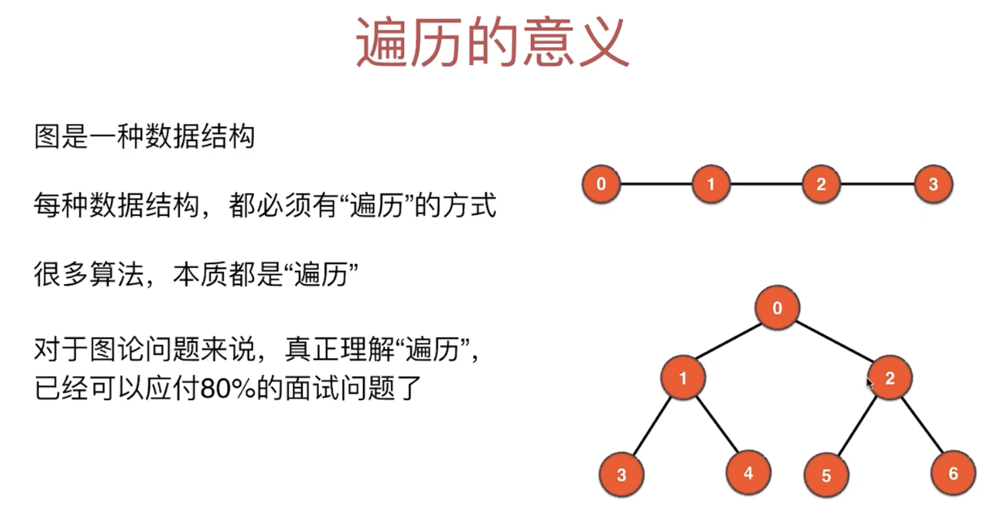
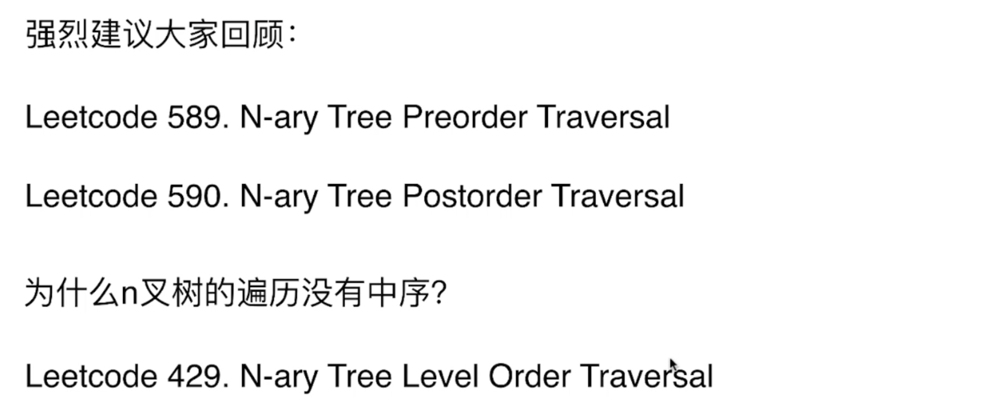
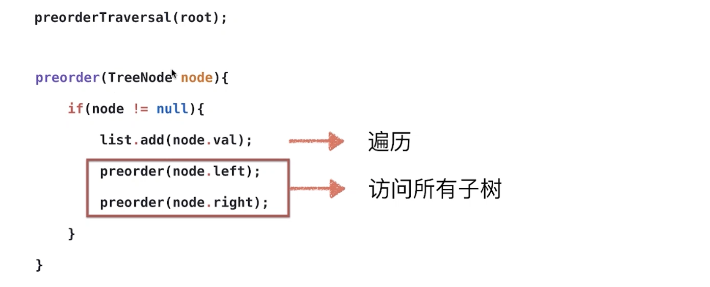
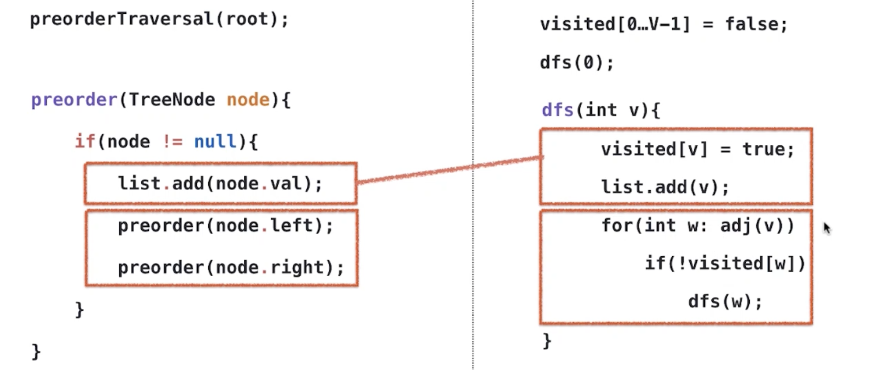
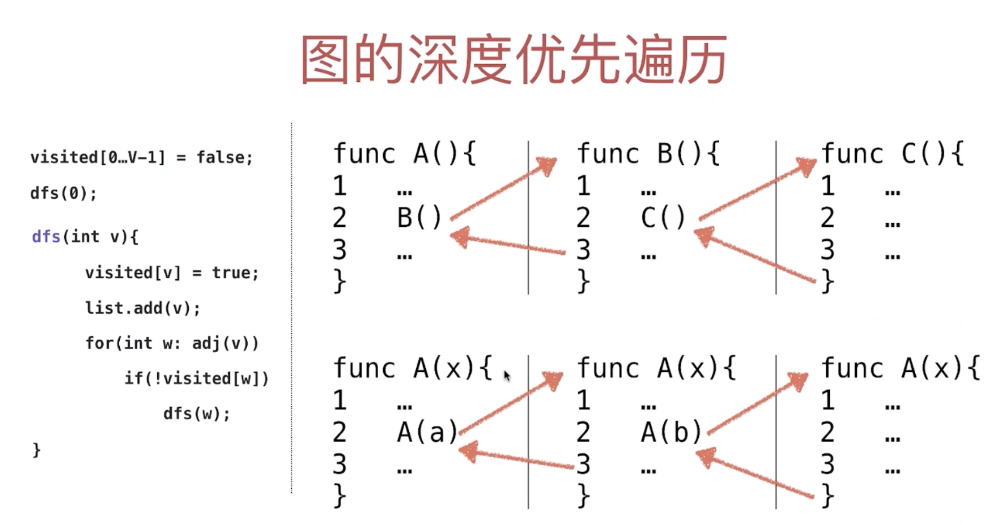
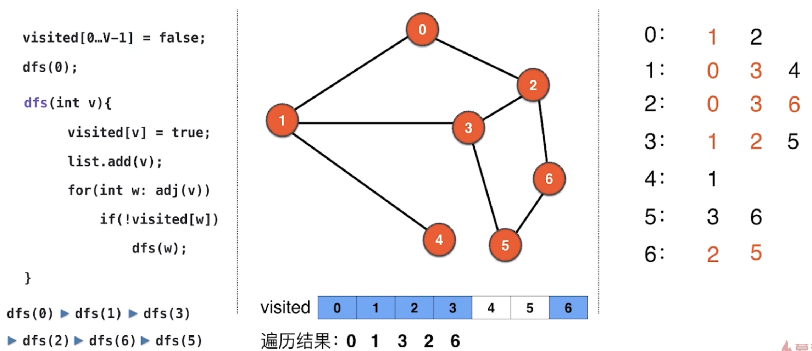
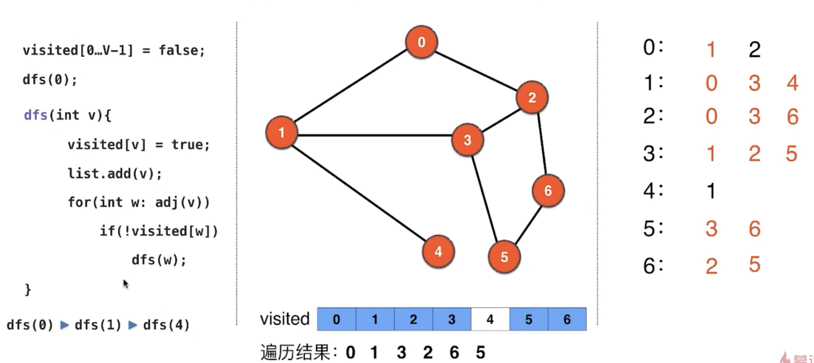
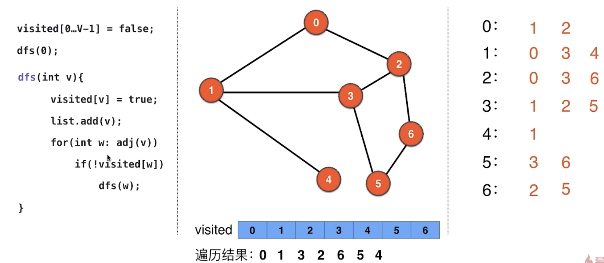

# 5. 图的深度优先遍历：遍历的意义




- After visited `1, 3, 4`, then return =>  `0`, => visit `4` agian
- 假如 `4` 节点下面是一颗非常大的数，那就非常冗余，因为我们已经遍历过了, 所以需要记录哪个节点被遍历过

- 可以回顾一下，BST 遍历：
- [144.Binary Tree Preorder Traversal](https://novemberfall.github.io/LeetCode-NoteBook/#/m2/bstPre-order)
- [94. Binary Tree Inorder Traversal](https://novemberfall.github.io/LeetCode-NoteBook/#/m2/bstIn-order)
- [145. Binary Tree Postorder Traversal](https://novemberfall.github.io/LeetCode-NoteBook/#/hBinaryTree/bstPost-order)
- [102. Binary Tree Level Order Traversal]()

- 其实 144, 94, 145 都是图的DFS 遍历



---



- 现在来看dfs pseudocode, 由于图中有环，所以必须判断是否访问过(去重)

```java
visited[0 ... V-1] = false;

dfs(0);

dfs(int v){
    list.add(v);
    for(int w : adj(v)){ // 对于v 可能有几个相邻顶点，所以遍历每一个
        if(!visited[w]){ //如果该顶点没有被访问过
            dfs(w);
        }
    }
}
```



- 那么递归终止（base case）条件呢?
  - `if(node != null)` => 终止
  - `for(int w: adj(v))` => 跳出for loop, 就到这个函数的底部，跳出递归
  - 另外如果 `if(!visited[w])` => 每次都为false => 就不会执行递归 `dfs(w)`



- DFS 递归调用过程：
  






---

## 现在来实现一下 dfs 代码，同时用一个新的graph

```
7 8
0 1
0 2
1 3
1 4
2 3
2 6
3 5
5 6
```

- implement a Graph, and DFS


```java
import java.io.File;
import java.io.FileNotFoundException;
import java.util.Scanner;
import java.util.TreeSet;

//暂时只支持无向无权图
public class Graph {
    private int V;
    private int E;
    private TreeSet<Integer>[] adj;//每一个vertex 都持有一个list
    //持有一个TreeSet 的数组

    public Graph(String filename){
        File file = new File(filename);
        try {
            Scanner scanner = new Scanner(file);
            V = scanner.nextInt();
            if (V < 0) {
                throw new IllegalArgumentException("V must be non-negative");
            }
            adj = new TreeSet[V];//给一个TreeSet array 分配一个顶点数为V的 数组
            for (int i = 0; i < V; i++) {
                adj[i] = new TreeSet<>();//给每一个节点分配一个新的TreeSet来储存相邻节点
            }
            E = scanner.nextInt();
            if (E < 0) {
                throw new IllegalArgumentException("E must be non-negative");
            }
            for (int i = 0; i < E; i++) {
                int a = scanner.nextInt();
                validateVertex(a);
                int b = scanner.nextInt();
                validateVertex(b);

                if (a == b) {//处理self-loop edge
                    throw new IllegalArgumentException("Self Loop is Detected!");
                    //由于我们只研究简单图，所以判断是否自环边，如果是自环边，并且平行边 => false
                }
                if (adj[a].contains(b)) {//由于是TreeSet contains O(log V)
                    throw new IllegalArgumentException("Parallel Edges are Detected!");
                    //检测Parallel Edges if exist
                }
                adj[a].add(b);//O(log V)
                adj[b].add(a);//O(log V)
            }
        } catch (FileNotFoundException e) {
            e.printStackTrace();
        }
    }

    private void validateVertex(int v) {
        if (v < 0 || v >= V) {
            throw new IllegalArgumentException("vertex " + v + "is invalid");
        }
    }

    /*
    Through V() E()，user only read vertex and edges, can not mute
    * */
    public int V() {
        return V;
    }

    public int E() {
        return E;
    }

    public boolean hasEdge(int v1, int v2) {//检查这两个vertex是否有边
        validateVertex(v1);
        validateVertex(v2);
        return adj[v1].contains(v2);
    }

    //实际返回的是和v 这个vertex相邻的顶点的集合
    public Iterable<Integer> adj(int v) {//只要找到相邻的vertex就能找到相邻的边
        //不管linkedList TreeSet 都是实现了 Iterable interface
        validateVertex(v);//v 由于是用户给的参数，所以有可能犯错，所以需要检验
        return adj[v];
    }

    public int degree(int v) {
        //度这个概念就是基于vertex有几个邻边
        validateVertex(v);//v 由于是用户给的参数，所以有可能犯错，所以需要检验
        return adj[v].size();
    }

    @Override
    public String toString(){
        StringBuilder sb = new StringBuilder();
        sb.append(String.format("V = %d, E = %d\n", V, E));
        for (int v = 0; v < V; v++) {
            sb.append(String.format("%d : ", v));
            for (int w : adj[v]) {
                sb.append(String.format("%d ", w));
            }
            sb.append("\n");
        }
        return sb.toString();
    }

    public static void main(String[] args) {
        Graph graph = new Graph("g.txt");
        System.out.println(graph);
    }
}
```

- dfs:

```java
import java.util.ArrayList;

public class GraphDFS {
    private Graph G;
    private boolean[] visited;
    ArrayList<Integer> order = new ArrayList<>();

    public GraphDFS(Graph G) {
        this.G = G;
        visited = new boolean[G.V()];
        dfs(0);
    }

    private void dfs(int v) {
        visited[v] = true;
        order.add(v);
        for (int w : G.adj(v)) {
            if (!visited[w]) {
                dfs(w);
            }
        }
    }

    public Iterable<Integer> order() {//这里用iterable, 是因为对用户屏蔽
        return order;
    }

    public static void main(String[] args) {
        Graph g = new Graph("g.txt");
        GraphDFS graphDFS = new GraphDFS(g);
        System.out.println( graphDFS.order());
    }
}
```

- result:

```
[0, 1, 3, 2, 6, 5, 4]
```

- 到目前代码可以简单表示 dfs, 但是还有bug, 下一节继续分析