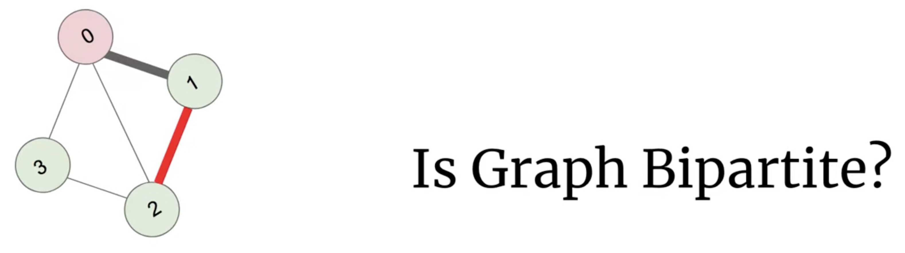

## 785. Is Graph Bipartite?


---

---


- **True**
---


- **False**

---


---


---

```java
class IsGraph_Bipartite {
    public boolean isBipartite(int[][] graph) {
        int[] visited = new int[graph.length];
        // label 1 : red
        // label 2 : green
        for (int i = 0; i < graph.length; i++) {
            if (visited[i] != 0) {
                continue;
            }
            Queue<Integer> queue = new LinkedList<>();
            queue.add(i);
            visited[i] = 1; // mark as red
            while (!queue.isEmpty()) {
                int cur = queue.poll();
                int curColor = visited[cur];
                int neighborColor = curColor == 1 ? 2 : 1;
                for (int neighbor : graph[cur]) {
                    if (visited[neighbor] == 0) {
                        visited[neighbor] = neighborColor;
                        queue.add(neighbor);
                    } else {
                        if (visited[neighbor] == curColor) {
                            return false;
                        }
                    }
                }
            }
        }
        return true;
    }

    public static void main(String[] args) {
        int[][] graph = {
                {1, 2, 3}, {0, 2}, {0, 1, 3}, {0, 2}
        };
        IsGraph_Bipartite igb = new IsGraph_Bipartite();
        boolean ans = igb.isBipartite(graph);
        System.out.println(ans);

        int[][] graph1 = {
                {1,  3}, {0, 2}, {1, 3}, {0, 2}
        };
        ans = igb.isBipartite(graph1);
        System.out.println(ans);
    }
}
```

