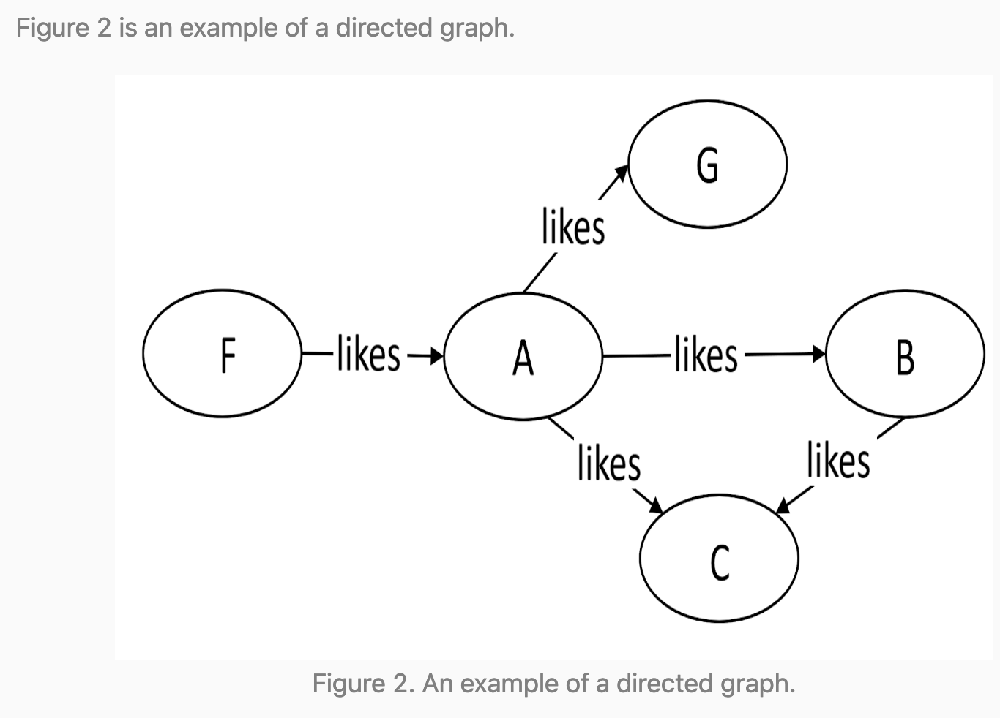
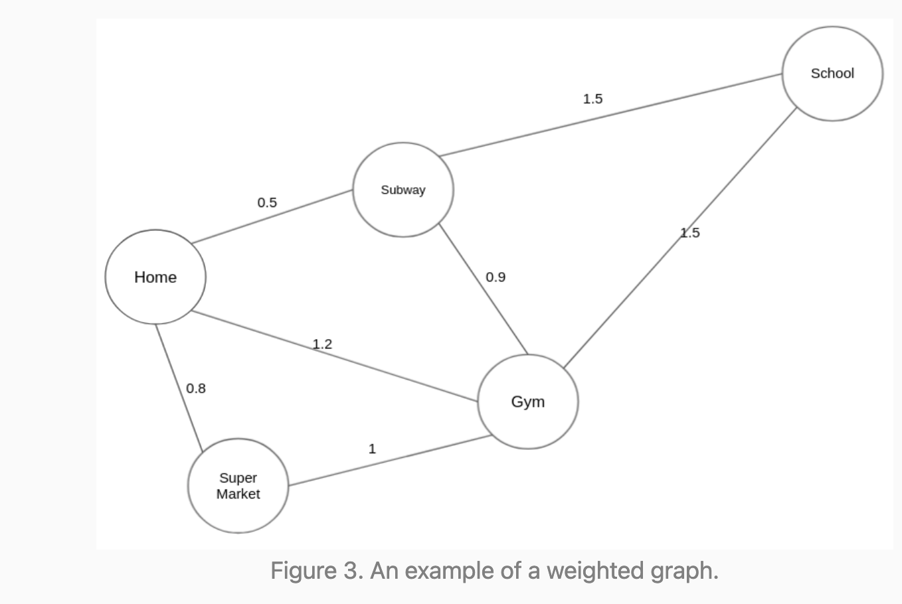
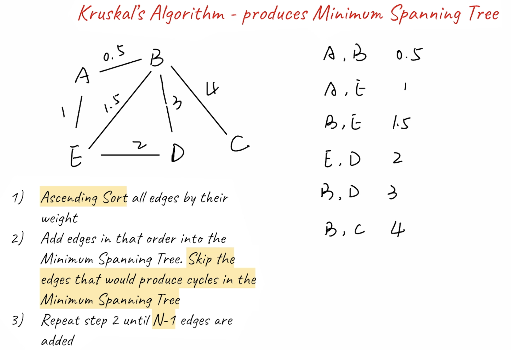

## Introduction

- [LeetCode Graph](https://leetcode.com/explore/learn/card/graph/)

---
- Types of “graphs”
  - `undirected graphs`, 
    - The edges between any two vertices in an “undirected graph” do not have a direction, indicating a two-way relationship.
  - `directed graphs`
    - The edges between any two vertices in a “directed graph” graph are directional.

  - `weighted graphs`
    - Each edge in a “weighted graph” has an associated weight. The weight can be of any metric, such as time, distance, size, etc. The most commonly seen “weighted map” in our daily life might be a city map.

---


### Disjoint Set 不相交集

- [Disjoint Sets using union by rank and path compression Graph Algorithm | youtube](https://www.youtube.com/watch?v=ID00PMy0-vE&t=28s)

- [Introduction to Disjoint Sets](https://leetcode.com/explore/learn/card/graph/618/disjoint-set/3881/#:~:text=Introduction%20to%20Disjoint%20Sets)

- [find && union function](https://leetcode.com/explore/learn/card/graph/618/disjoint-set/3881/#:~:text=Implementing%20%E2%80%9Cdisjoint%20sets%E2%80%9D)
  
- [Explanation of Quick Union](https://leetcode.com/explore/learn/card/graph/618/disjoint-set/3840/#:~:text=Explanation%20of%20Quick%20Union)

- [Why is Quick Union More Efficient than Quick Find?](https://leetcode.com/explore/learn/card/graph/618/disjoint-set/3840/#:~:text=Why%20is%20Quick%20Union%20More%20Efficient%20than%20Quick%20Find%3F)

- [Union by Rank - Disjoint Set](https://leetcode.com/explore/learn/card/graph/618/disjoint-set/3879/#:~:text=Disjoint%20Set%20%2D%20Union%20by%20Rank)

- [Path Compression Optimization - Disjoint Set](https://leetcode.com/explore/learn/card/graph/618/disjoint-set/3880/#:~:text=Next-,Path%20Compression%20Optimization%20%2D%20Disjoint%20Set,-Report%20Issue)
  - Thre reason of **Path Compression** can be optimiz:
    - 1. **Initial Find Operation**:
      - When you perform the find operation initially on an element, you indeed traverse all the parent nodes until you reach the root node. 
        This is where the optimization starts.
    - 2. **Recursion and Path Compression**:    
      - After finding the root node, during the recursive backtracking, you update the parent node of each traversed element to directly point 
        to the root node. This process effectively compresses the path from each node to the root node.
      - This means that every element in the path from the initial element to the root node directly points to the root node after the initial 
        find operation. Subsequent find operations for the same element or any element in the same path will require minimal traversal, 
        typically just one or two hops, because the path has been compressed.
  

- [Optimized “disjoint set” with Path Compression and Union by Rank](https://leetcode.com/explore/learn/card/graph/618/disjoint-set/3843/#:~:text=Next-,Optimized%20%E2%80%9Cdisjoint%20set%E2%80%9D%20with%20Path%20Compression%20and%20Union%20by%20Rank,-Report%20Issue)


### **union by rank (depth of each tree)**  vs **union by size (number of elements in each tree)**

```java
// 1: Union by Rank (depth)
public void union(int x, int y) {
    int rootX = find(x);
    int rootY = find(y);
    if (rootX == rootY) return;

    if (rank[x] > rank[y]) {
        parent[rootY] = rootX;   // Attach smaller rank tree under larger rank
    } else if (rank[x] < rank[y]) {
        parent[rootX] = rootY;
    } else {
        parent[rootY] = rootX;
        rank[rootX] += 1;        // If ranks are equal, increment the new root's rank
    }
}


// 2: Union by Size (or Weight)
public void union(int x, int y) {
    int rootX = find(x);
    int rootY = find(y);

    if (rootX != rootY) {
        parent[rootX] = rootY;       // Attach smaller tree under larger one
        size[rootY] += size[rootX];  // Update size of the new root
    }
}
```
---

#### Union Find Template:

```java
class UnionFind {
    private int[] root;
    private int[] rank;

    public UnionFind(int size) {
        root = new int[size];
        rank = new int[size];
        for (int i = 0; i < size; i++) {
            root[i] = i;
            rank[i] = 1;
        }
    }

    public int find(int x) {
        while (x != root[x]) {
            x = root[x];
        }
        return x;
    }

    public void union(int x, int y) {
        int rootX = find(x);
        int rootY = find(y);
        if (rootX == rootY) {
            return;
        }
        if (rootX != rootY) {
            if (rank[rootX] > rank[rootY]) {
                root[rootY] = rootX;
            } else if (rank[rootX] < rank[rootY]) {
                root[rootX] = rootY;
            } else {
                root[rootY] = rootX;
                rank[rootX] += 1;
            }
        }
    }

    public boolean connected(int x, int y) {
        return find(x) == find(y);
    }
}
```

---

### Minimum Spanning Tree

- [Overview of Minimum Spanning Tree](https://leetcode.com/explore/learn/card/graph/621/algorithms-to-construct-minimum-spanning-tree/3884/)

- “**Kruskal**’s algorithm” is an algorithm to construct a “**minimum spanning tree**” of a “**weighted undirected graph**”.

---

###  Dijkstra's Algorithm

- [djikstra are very similar problems. It's just that djikstra cost is different compared with bfs, so use priorityQueue instead a Queue for a standard bfs search.](https://leetcode.com/explore/learn/card/graph/622/single-source-shortest-path-algorithm/3862/)




### [Bellman Ford Algorithm](https://leetcode.com/explore/learn/card/graph/622/single-source-shortest-path-algorithm/3864/)

- **Theorem 1**: In a “**graph with no negative-weight cycles” with N vertices, the shortest path between any two vertices has at most N-1 edges**.

- **Theorem 2**: In a “**graph with negative weight cycles”, there is no shortest path**.


- Using **Dynamic Programming** to Find the Shortest Path

- [youtube bellman ford](https://www.youtube.com/watch?v=FtN3BYH2Zes)
