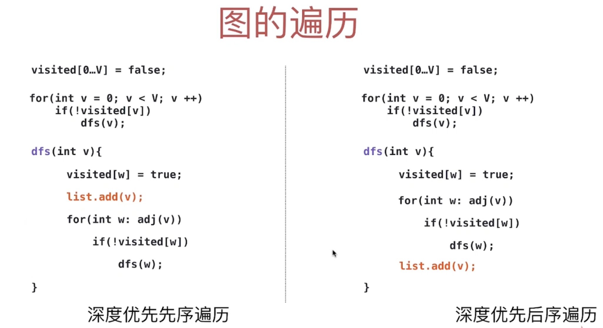
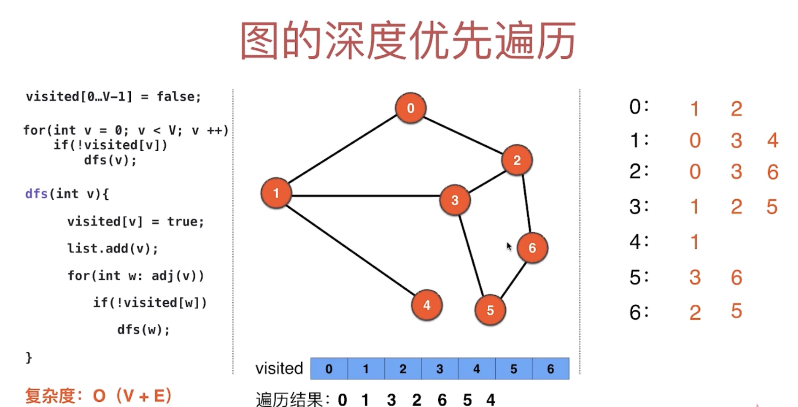

# 7. 图的深度优先遍历 I


- 之前的代码的bug:
  - 我们无法遍历到图中， 5 这个节点

- 我们需要修改一下 graph 结构

```
7 6
0 1
0 2
1 3
1 4
2 3
2 6
```

- 我们run 前一节的代码 得到：

```
[0, 1, 3, 2, 6, 4]
```

- 可以看到 5 这个节点已经不在其中，就如同上图所示。

- 那么我们对 `public GraphDFS(Graph G)` 构造函数进行修改：


- [前面的 Graph class](https://novemberfall.github.io/LeetCode-Algorithm/graph/DFSintro.html)

```java
public class GraphDFS {
    private Graph G;
    private boolean[] visited;
    ArrayList<Integer> order = new ArrayList<>();

    public GraphDFS(Graph G) {
        this.G = G;
        visited = new boolean[G.V()];
        for (int v = 0; v < G.V(); v++) {//对所有顶点初始化，这样即便假设全部节点都不与 5 联通，也可以遍历 5
            if (!visited[v]) {
                dfs(v);
            }
        }
    }

    private void dfs(int v) {
        visited[v] = true;
        order.add(v);
        for (int w : G.adj(v)) {
            if (!visited[w]) {
                dfs(w);
            }
        }
    }

    public Iterable<Integer> order() {//这里用iterable, 是因为对用户屏蔽
        return order;
    }

    public static void main(String[] args) {
        Graph g = new Graph("g.txt");
        GraphDFS graphDFS = new GraphDFS(g);
        System.out.println( graphDFS.order());
    }
}
```

---


- 对于图来说， 没有中序遍历
- 一般只介绍图的先序遍历

- preOrder and postOrder implementation

```java
public class GraphDFS {
    private Graph G;
    private boolean[] visited;
    ArrayList<Integer> pre = new ArrayList<>();
    ArrayList<Integer> post = new ArrayList<>();

    public GraphDFS(Graph G) {
        this.G = G;
        visited = new boolean[G.V()];
        for (int v = 0; v < G.V(); v++) {
            if (!visited[v]) {
                dfs(v);
            }
        }
    }

    private void dfs(int v) {
        visited[v] = true;
        pre.add(v);
        for (int w : G.adj(v)) {
            if (!visited[w]) {
                dfs(w);
            }
        }
        post.add(v);
    }

    public Iterable<Integer> pre() {//这里用iterable, 是因为对用户屏蔽
        return pre;
    }
    public Iterable<Integer> post() {//这里用iterable, 是因为对用户屏蔽
        return post;
    }
    public static void main(String[] args) {
        Graph g = new Graph("g.txt");
        GraphDFS graphDFS = new GraphDFS(g);
        System.out.println( graphDFS.pre());
        System.out.println( graphDFS.post());
    }
}
```

- result:
  
```
[0, 1, 3, 2, 6, 4, 5]
[6, 2, 3, 4, 1, 0, 5]
```



- Time Complexity:
  - O(V + E)


