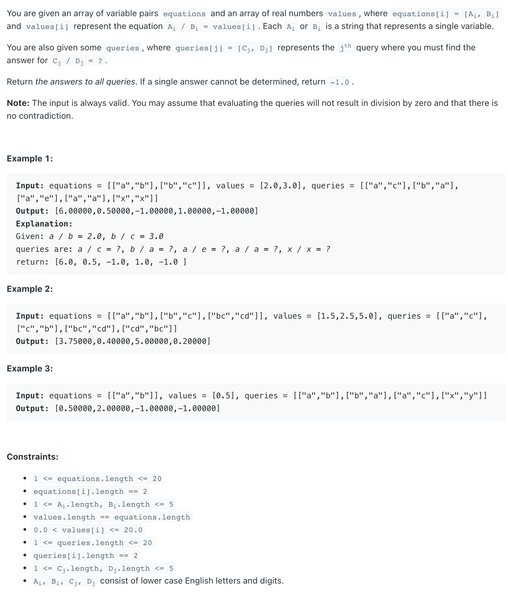

## 399. Evaluate Division


- If `a/b = 2.0` and `b/c = 3.0`, we can treat `a,b`, and `c` as vertices.
  then `edge(a,b)` weight `2.0` and `edge(b,c)` weight `3.0`
  backward `edge(b,a)` weight `1/2.0` and backward `edge(c,b)` weight `1/3.0`
  query `a,c` is a path from `a` to `c`, `distance (a,c) = weight(a,b) * weight(b,c)`

---

```java
class EvaluateDivision {
    static class Node {
        String key;
        double val;

        public Node(String key, double val) {
            this.key = key;
            this.val = val;
        }
    }

    public double[] calcEquation(List<List<String>> equations, double[] values, List<List<String>> queries) {
        Map<String, List<Node>> graph = buildGraph(equations, values);

        double[] res = new double[queries.size()];
        Arrays.fill(res, -1.0);
        for (int i = 0; i < queries.size(); i++) {
            res[i] = dfs(queries.get(i).get(0), queries.get(i).get(1), new HashSet<>(), graph);
        }
        return res;
    }

    private double dfs(String src, String des, HashSet<String> visited, Map<String, List<Node>> graph) {
        if (!(graph.containsKey(src) && graph.containsKey(des))) {
            return -1.0;
        }
        if (src.equals(des)) {
            return 1.0;
        }
        visited.add(src);
        for (Node ng : graph.get(src)) {
            if (!visited.contains(ng.key)) {
                double ans = dfs(ng.key, des, visited, graph);
                if (ans != -1.0) {
                    return ans * ng.val;
                }
            }
        }
        return -1.0;
    }

    private Map<String, List<Node>> buildGraph(List<List<String>> equations, double[] values) {
        Map<String, List<Node>> graph = new HashMap<>();
        for (int i = 0; i < values.length; i++) {
            String src = equations.get(i).get(0);
            String des = equations.get(i).get(1);
            graph.putIfAbsent(src, new ArrayList<>());
            graph.putIfAbsent(des, new ArrayList<>());
            graph.get(src).add(new Node(des, values[i]));
            graph.get(des).add(new Node(src, 1 / values[i]));
        }
        return graph;
    }

    public static void main(String[] args) {
        List<List<String>> equations = Arrays.asList(
                Arrays.asList("a", "b"),
                Arrays.asList("b", "c")
        );

        List<List<String>> queries = Arrays.asList(
                Arrays.asList("a", "c"),
                Arrays.asList("b", "a"),
                Arrays.asList("a", "e"),
                Arrays.asList("a", "a"),
                Arrays.asList("x", "x")
        );
        double[] values = new double[]{2.0, 3.0};

        EvaluateDivision ed = new EvaluateDivision();
        double[] ans = ed.calcEquation(equations, values, queries);
        System.out.println(Arrays.toString(ans));
    }
}
```