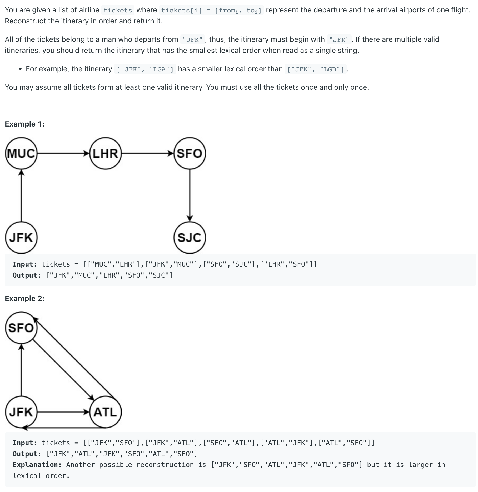

## 332. Reconstruct Itinerary


- [youtube](https://www.youtube.com/watch?v=kZXsB3WemYY)
- [Topological Sort (DFS)](https://www.cs.usfca.edu/~galles/visualization/TopoSortDFS.html)

---

#### stack

```java
class ReconstructItinerary_stack {
    public List<String> findItinerary(List<List<String>> tickets) {
        List<String> res = new ArrayList<>();
        Map<String, PriorityQueue<String>> map = new HashMap<>();
        buildGraph(tickets, map);
        Stack<String> stk = new Stack<>();
        dfs(map, stk, "JFK");
        while (!stk.isEmpty()) {
            res.add(stk.pop());
        }
        return res;
    }

    private void buildGraph(List<List<String>> tickets, Map<String, PriorityQueue<String>> flights) {
        for (List<String> ticket : tickets) {
            String from = ticket.get(0);
            String to = ticket.get(1);
            flights.putIfAbsent(from, new PriorityQueue<>());

            flights.get(from).offer(to);
        }
    }

    private void dfs(Map<String, PriorityQueue<String>> map, Stack<String> stk, String from) {
        PriorityQueue<String> arrivals = map.get(from);
        while (arrivals != null && !arrivals.isEmpty()) {
            String to = arrivals.poll();
            dfs(map, stk, to);
        }
        stk.push(from);
    }
}
```