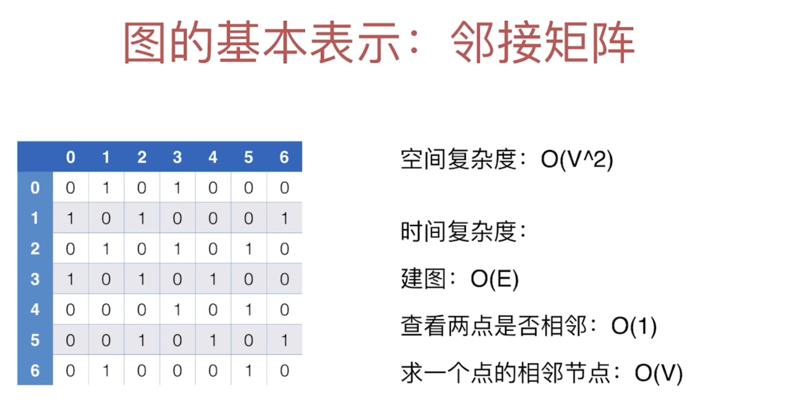
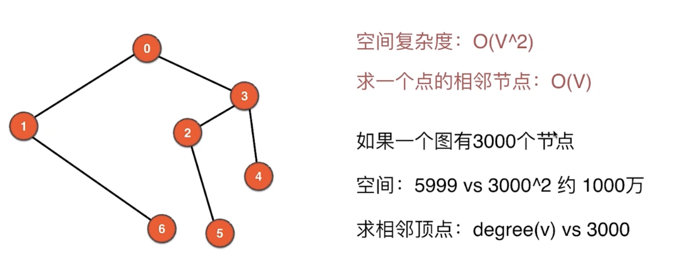
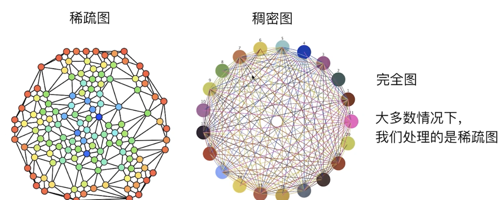
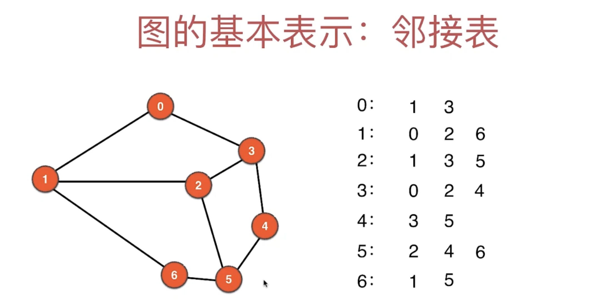

# 4. 图的基本表示：Adjacent List I

- 上一节，我们解释了邻接矩阵，这一节我们将介绍邻接表 (Graph 另外一种重要表示方法)



- [对照上一小节的代码，来探讨Time Complexity:](https://novemberfall.github.io/LeetCode-Algorithm/graph/matrix1.html)
- 在上一节中，我们调用`adj()` => 求一个点的相邻节点： O(V)
- 建图，我们通过构造函数， 一个for loop => O(E)
- 查看两点是否相邻 => `hasEdge(v1, v2)` => O(1)



- 如果能找到 `O(degree(v))`的time complexity，就比O(V) 快很多



---



- 通过邻接表只需要查找相邻节点


---

## implementation

```java
public class AdjList {
    private int V;
    private int E;
    private LinkedList<Integer>[] adj;//每一个vertex 都持有一个list

    public AdjList(String filename){
        File file = new File(filename);
        try {
            Scanner scanner = new Scanner(file);
            V = scanner.nextInt();
            if (V < 0) {
                throw new IllegalArgumentException("V must be non-negative");
            }
            adj = new LinkedList[V];//给一个list array 分配一个顶点数为V的 数组
            for (int i = 0; i < V; i++) {
                adj[i] = new LinkedList<>();//给每一个节点分配一个新的list来储存相邻节点
            }
            E = scanner.nextInt();
            if (E < 0) {
                throw new IllegalArgumentException("E must be non-negative");
            }
            for (int i = 0; i < E; i++) {
                int a = scanner.nextInt();
                validateVertex(a);
                int b = scanner.nextInt();
                validateVertex(b);

                if (a == b) {//处理self-loop edge
                    throw new IllegalArgumentException("Self Loop is Detected!");
                    //由于我们只研究简单图，所以判断是否自环边，如果是自环边，并且平行边 => false
                }
                if (adj[a].contains(b)) {
                    throw new IllegalArgumentException("Parallel Edges are Detected!");
                    //检测Parallel Edges if exist
                }
                adj[a].add(b);
                adj[b].add(a);
            }
        } catch (FileNotFoundException e) {
            e.printStackTrace();
        }
    }

    private void validateVertex(int v) {
        if (v < 0 || v >= V) {
            throw new IllegalArgumentException("vertex " + v + "is invalid");
        }
    }

    /*
    Through V() E()，user only read vertex and edges, can not mute
    * */
    public int V() {
        return V;
    }

    public int E() {
        return E;
    }

    public boolean hasEdge(int v1, int v2) {//检查这两个vertex是否有边
        validateVertex(v1);
        validateVertex(v2);
        return adj[v1].contains(v2);
    }

    //实际返回的是和v 这个vertex相邻的顶点的集合
    public LinkedList<Integer> adj(int v) {//只要找到相邻的vertex就能找到相邻的边
        validateVertex(v);//v 由于是用户给的参数，所以有可能犯错，所以需要检验
        return adj[v];
    }

    public int degree(int v) {
        //度这个概念就是基于vertex有几个邻边
        return adj(v).size();//we reuse adj(), so don't need to handle
    }

    @Override
    public String toString(){
        StringBuilder sb = new StringBuilder();
        sb.append(String.format("V = %d, E = %d\n", V, E));
        for (int v = 0; v < V; v++) {
            sb.append(String.format("%d : ", v));
            for (int w : adj[v]) {
                sb.append(String.format("%d ", w));
            }
            sb.append("\n");
        }
        return sb.toString();
    }

    public static void main(String[] args) {
        AdjList adjList = new AdjList("g.txt");
        System.out.println(adjList);
    }
}

/* 

V = 7, E = 9
0 : 1 3 
1 : 0 2 6 
2 : 1 3 5 
3 : 0 2 4 
4 : 3 5 
5 : 2 4 6 
6 : 1 5 

 */
```

- 如果用LinkedList还是有性能瓶颈