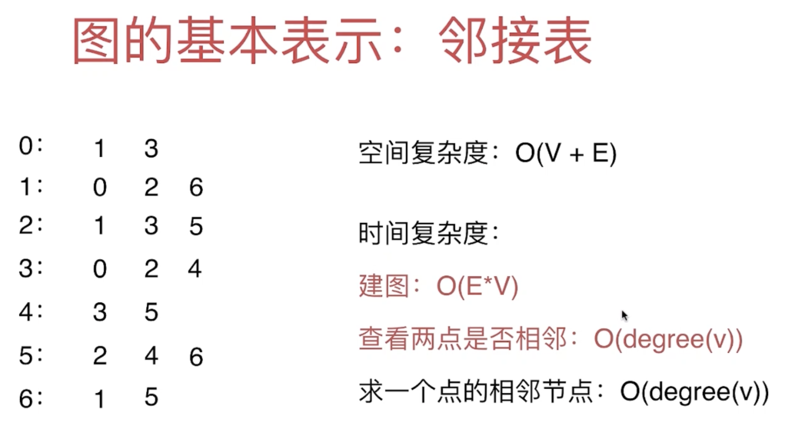
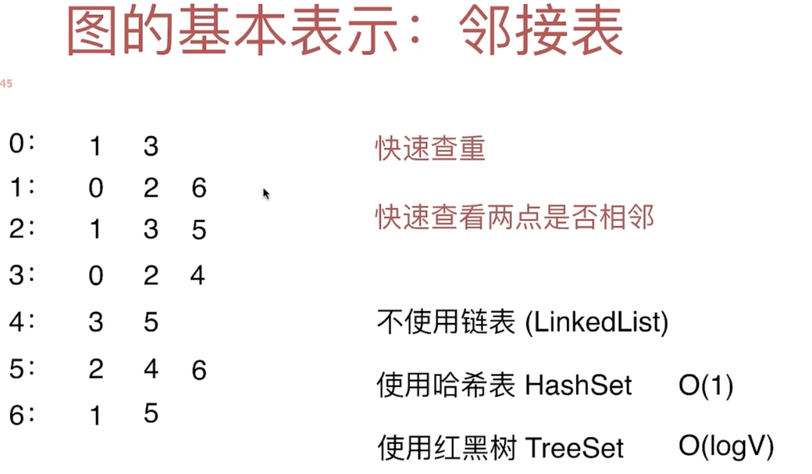
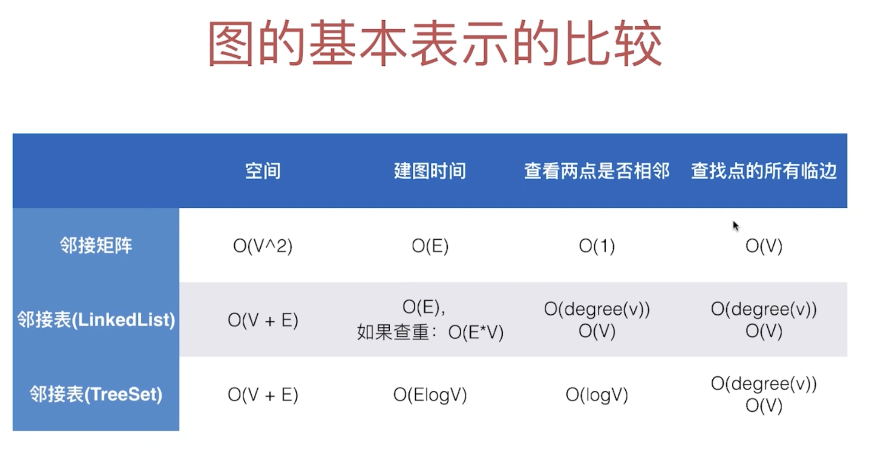

# 5. 图的基本表示：Adjacent List II



- 相比较 邻接矩阵，邻接表的性能提升：
- [对照代码来探讨Time Complexity](https://novemberfall.github.io/LeetCode-Algorithm/graph/list.html)
- 求一个点的相邻节点： `O(degree(v))` => 假如一个图有3000节点，就不需要遍历全部节点来查找
- 但是还是有其缺点： 快速查重
- 快速查看两点是否相邻



- 哈希表 和 红黑树 都可以，但是推荐使用红黑树
- 虽然红黑树 O(log n), 但是它maintain顺序性
- 哈希表 的顺序是不一定的，特别是用不同的语言来实现，他们的哈希库都是不同的
- 另外红黑树比哈希表更节省空间


$$O(1) < O(logn) <O(n)$$

- 如果 n = 100 万

- `1 < 20 < 1000000`
- 可以看出 `logn` 是非常接近 `O(1)` 的，这也是为什么学习排序算法，我们要学习`n logn`

- when n is increasing, `logn` 只是 `30`,  但是`O(n)` 已经到达 10亿

---

## Implementation by using TreeSet (红黑树)

```java
import java.io.File;
import java.io.FileNotFoundException;
import java.util.Scanner;
import java.util.TreeSet;

public class AdjSet {
    private int V;
    private int E;
    private TreeSet<Integer>[] adj;//每一个vertex 都持有一个list
    //持有一个TreeSet 的数组

    public AdjSet(String filename){
        File file = new File(filename);
        try {
            Scanner scanner = new Scanner(file);
            V = scanner.nextInt();
            if (V < 0) {
                throw new IllegalArgumentException("V must be non-negative");
            }
            adj = new TreeSet[V];//给一个TreeSet array 分配一个顶点数为V的 数组
            for (int i = 0; i < V; i++) {
                adj[i] = new TreeSet<>();//给每一个节点分配一个新的TreeSet来储存相邻节点
            }
            E = scanner.nextInt();
            if (E < 0) {
                throw new IllegalArgumentException("E must be non-negative");
            }
            for (int i = 0; i < E; i++) {
                int a = scanner.nextInt();
                validateVertex(a);
                int b = scanner.nextInt();
                validateVertex(b);

                if (a == b) {//处理self-loop edge
                    throw new IllegalArgumentException("Self Loop is Detected!");
                    //由于我们只研究简单图，所以判断是否自环边，如果是自环边，并且平行边 => false
                }
                if (adj[a].contains(b)) {//由于是TreeSet contains O(log V)
                    throw new IllegalArgumentException("Parallel Edges are Detected!");
                    //检测Parallel Edges if exist
                }
                adj[a].add(b);//O(log V)
                adj[b].add(a);//O(log V)
            }
        } catch (FileNotFoundException e) {
            e.printStackTrace();
        }
    }

    private void validateVertex(int v) {
        if (v < 0 || v >= V) {
            throw new IllegalArgumentException("vertex " + v + "is invalid");
        }
    }

    /*
    Through V() E()，user only read vertex and edges, can not mute
    * */
    public int V() {
        return V;
    }

    public int E() {
        return E;
    }

    public boolean hasEdge(int v1, int v2) {//检查这两个vertex是否有边
        validateVertex(v1);
        validateVertex(v2);
        return adj[v1].contains(v2);
    }

    //实际返回的是和v 这个vertex相邻的顶点的集合
    public Iterable<Integer> adj(int v) {//只要找到相邻的vertex就能找到相邻的边
        //不管linkedList TreeSet 都是实现了 Iterable interface
        validateVertex(v);//v 由于是用户给的参数，所以有可能犯错，所以需要检验
        return adj[v];
    }

    public int degree(int v) {
        //度这个概念就是基于vertex有几个邻边
        validateVertex(v);//v 由于是用户给的参数，所以有可能犯错，所以需要检验
        return adj[v].size();
    }

    @Override
    public String toString(){
        StringBuilder sb = new StringBuilder();
        sb.append(String.format("V = %d, E = %d\n", V, E));
        for (int v = 0; v < V; v++) {
            sb.append(String.format("%d : ", v));
            for (int w : adj[v]) {
                sb.append(String.format("%d ", w));
            }
            sb.append("\n");
        }
        return sb.toString();
    }

    public static void main(String[] args) {
        AdjSet adjSet = new AdjSet("g.txt");
        System.out.println(adjSet);
    }
}


/* 

V = 7, E = 9
0 : 1 3 
1 : 0 2 6 
2 : 1 3 5 
3 : 0 2 4 
4 : 3 5 
5 : 2 4 6 
6 : 1 5 

 */
```


## Summary:




