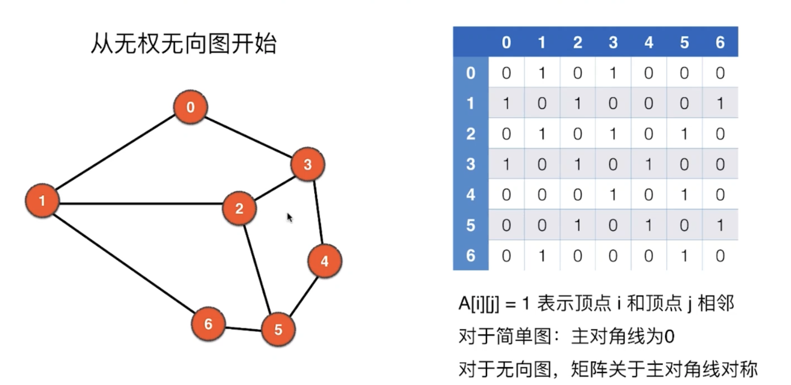
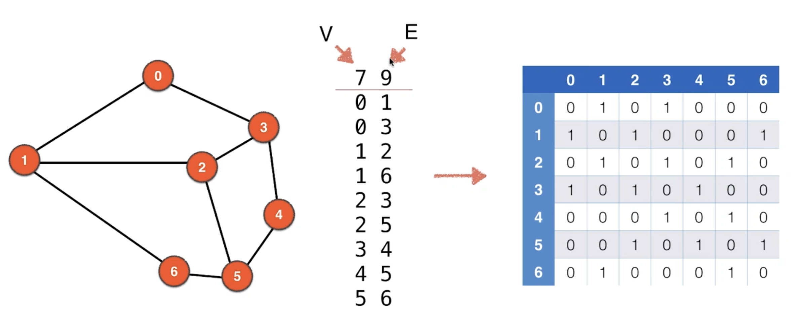

# 1. 图的基本表示：adjacent matrix邻接矩阵



- 对于简单图来说，是没有平行边，自环边



- 简易表示邻接矩阵代码：

```java
public class AdjMatrix {
    private int V;
    private int E;
    private int [][] adj;

    public AdjMatrix(String filename){
        File file = new File(filename);
        try {
            Scanner scanner = new Scanner(file);
            V = scanner.nextInt();
            adj = new int[V][V];
            E = scanner.nextInt();
            for (int i = 0; i < E; i++) {
                int a = scanner.nextInt();
                int b = scanner.nextInt();
                adj[a][b] = 1;
                adj[b][a] = 1;
            }
        } catch (FileNotFoundException e) {
            e.printStackTrace();
        }
    }

    @Override
    public String toString(){
        StringBuilder sb = new StringBuilder();
        sb.append(String.format("V = %d, E = %d\n", V, E));
        for (int i = 0; i < V; i++) {
            for (int j = 0; j < V; j++) {
                sb.append(String.format("%d ", adj[i][j]));
            }
            sb.append("\n");
        }
        return sb.toString();
    }

    public static void main(String[] args) {
        AdjMatrix adjMatrix = new AdjMatrix("g.txt");
        System.out.println(adjMatrix);
    }
}
```

- 同时创建一个 `g.txt`

```
7 9
0 1
0 3
1 2
1 6
2 3
2 5
3 4
4 5
5 6
```


- output:

```ruby
V = 7, E = 9
0 1 0 1 0 0 0 
1 0 1 0 0 0 1 
0 1 0 1 0 1 0 
1 0 1 0 1 0 0 
0 0 0 1 0 1 0 
0 0 1 0 1 0 1 
0 1 0 0 0 1 0 
```


