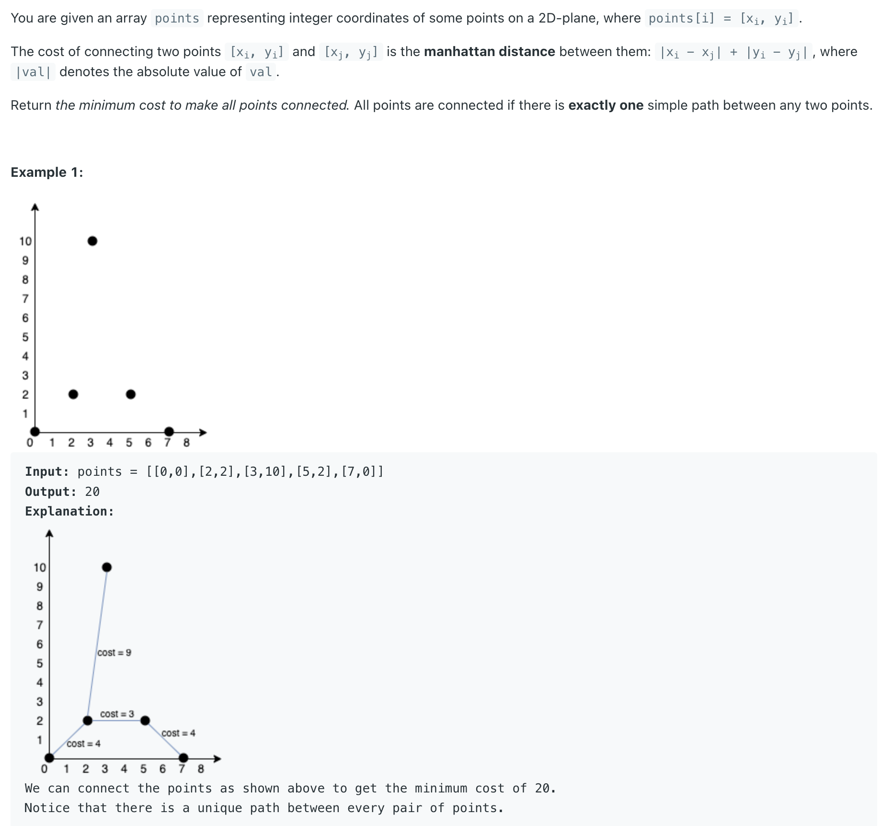
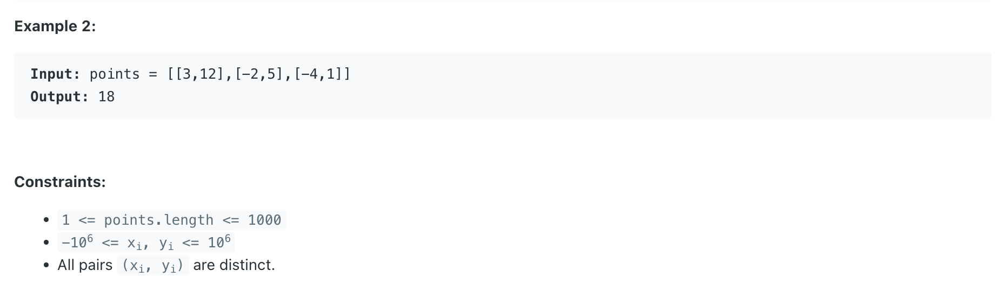
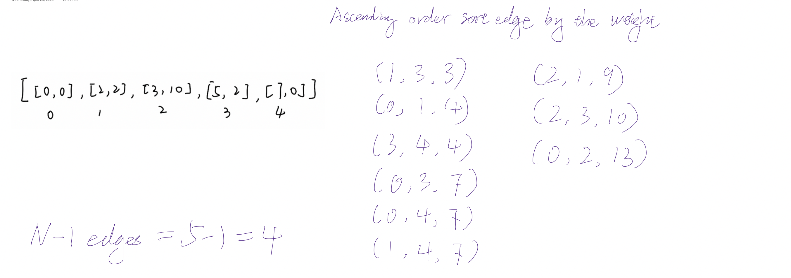
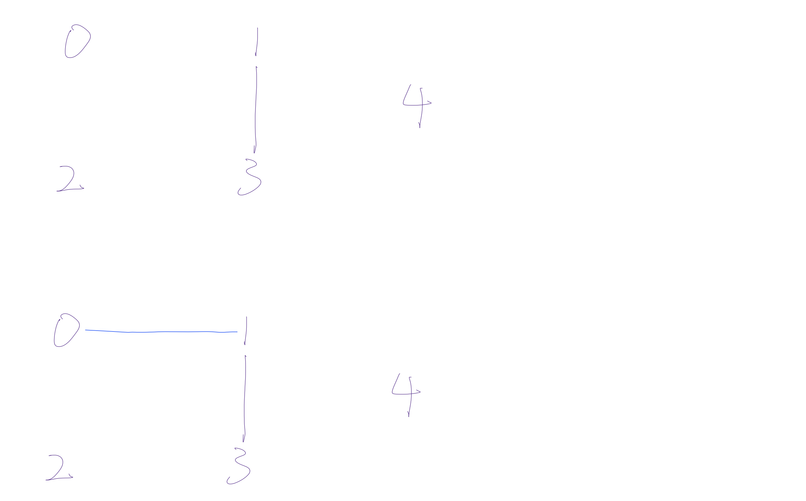
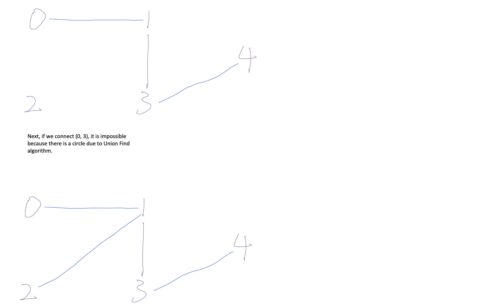

## 1584. Min Cost to Connect All Points



- [Kruskal's Algorithm | Explain from 2:17](https://leetcode.com/explore/learn/card/graph/621/algorithms-to-construct-minimum-spanning-tree/3858/)







---
- the line `Edge edge = new Edge(i, j, cost)`; is used to create a new edge between two points in the graph. 
  Let's break down what i and j represent in this context:

- The variable `i` represents the index of the first point in the points array.
- The variable `j` represents the index of the second point in the points array.

Here's how it works:

1. The outer loop iterates over each point in the points array.
2. For each point at index `i`, the inner loop starts from `i + 1` to avoid repeating edges and iterates over all subsequent points in the 
   points array.
3. For each pair of `points (i, j)`, the algorithm calculates the **Manhattan distance** between them (sum of absolute differences in their x 
   and y coordinates) and creates an edge with this distance as the cost.
4. The edge is then added to the priority queue `minHeap` for further processing.


By iterating over all pairs of points in this manner, the algorithm considers all possible edges in the graph formed by the given points.

This approach **ensures that each edge is considered exactly once, avoiding duplicate edges** and ensuring that the algorithm finds the minimum 
spanning tree (MST) of the graph using Kruskal's algorithm efficiently.


---
```java
class MinCostToConnectAllPoints {
    // Kruskal's Algorithm
    public int minCostConnectPoints(int[][] points) {
        if (points == null || points.length == 0) {
            return 0;
        }
        int size = points.length;
        PriorityQueue<Edge> minHeap = new PriorityQueue<>((x, y) -> (x.cost - y.cost));
        UnionFind uf = new UnionFind(size);

        for (int i = 0; i < size; i++) {
            int[] coordinate1 = points[i];
            for (int j = i + 1; j < size; j++) {
                int[] coordinate2 = points[j];
                // Calculate the distance between two coordinates.
                int cost = Math.abs(coordinate1[0] - coordinate2[0]) +
                        Math.abs(coordinate1[1] - coordinate2[1]);
                //The variable i represents the index of the first point in the points array.
                //The variable j represents the index of the second point in the points array.
                Edge edge = new Edge(i, j, cost);
                minHeap.offer(edge);
            }
        }

        int res = 0;
        int count = 0;
        while (!minHeap.isEmpty() && count < size -1) {
            Edge edge = minHeap.poll();
            if (!uf.isConnect(edge.point1, edge.point2)) {
                uf.union(edge.point1, edge.point2);
                res += edge.cost;
                count++;
            }
        }
        return res;
    }

    class Edge {
        int point1;
        int point2;
        int cost;

        public Edge(int point1, int point2, int cost) {
            this.point1 = point1;
            this.point2 = point2;
            this.cost = cost;
        }
    }

    class UnionFind {
        int parent[];
        int rank[];

        public UnionFind(int size) {
            parent = new int[size];
            rank = new int[size];
            for (int i = 0; i < size; i++) {
                parent[i] = i;
                rank[i] = 1;
            }
        }

        public int find(int x) {
            if (x == parent[x]) {
                return x;
            }
            return parent[x] = find(parent[x]);
        }

        public void union(int x, int y) {
            int rootX = find(x);
            int rootY = find(y);
            if (rootX == rootY) {
                return;
            }
            if (rank[rootX] > rank[rootY]) {
                parent[rootY] = rootX;
            } else if (rank[rootX] < rank[rootY]) {
                parent[rootX] = rootY;
            } else {
                parent[rootY] = rootX;
                rank[rootX] += 1;
            }
        }

        public boolean isConnect(int x, int y) {
            return find(x) == find(y);
        }
    }
}

```
---

```py
class Solution:
    def minCostConnectPoints(self, points: List[List[int]]) -> int:
        if not points:
            return 0
        size = len(points)
        min_heap = []
        uf = UnionFind(size)

        for i in range(size):
            x1, y1 = points[i]
            for j in range(i + 1, size):
                x2, y2 = points[j]
                cost = abs(x1 - x2) + abs(y1 - y2)
                heapq.heappush(min_heap, (cost, i, j))

        res = 0
        edges_used = 0

        # Kruskal's Algorithm
        while min_heap and edges_used < size - 1:
            cost, u, v = heapq.heappop(min_heap)
            if not uf.is_connect(u, v):
                uf.union(u, v)
                res += cost
                edges_used += 1
        return res


class UnionFind(object):
    def __init__(self, size):
        self.parent = [i for i in range(size)]
        self.rank = [1] * size

    def find(self, x) -> int:
        if x == self.parent[x]:
            return x
        self.parent[x] = self.find(self.parent[x])  # Path compression
        return self.parent[x]

    def union(self, x, y) -> None:
        rootX = self.find(x)
        rootY = self.find(y)
        if rootX == rootY:
            return
        if self.rank[rootX] > self.rank[rootY]:
            self.parent[rootY] = rootX
        elif self.rank[rootX] < self.rank[rootY]:
            self.parent[rootX] = rootY
        else:
            self.parent[rootY] = rootX
            self.rank[rootX] += 1

    def is_connect(self, x, y) -> bool:
        return self.find(x) == self.find(y)
```