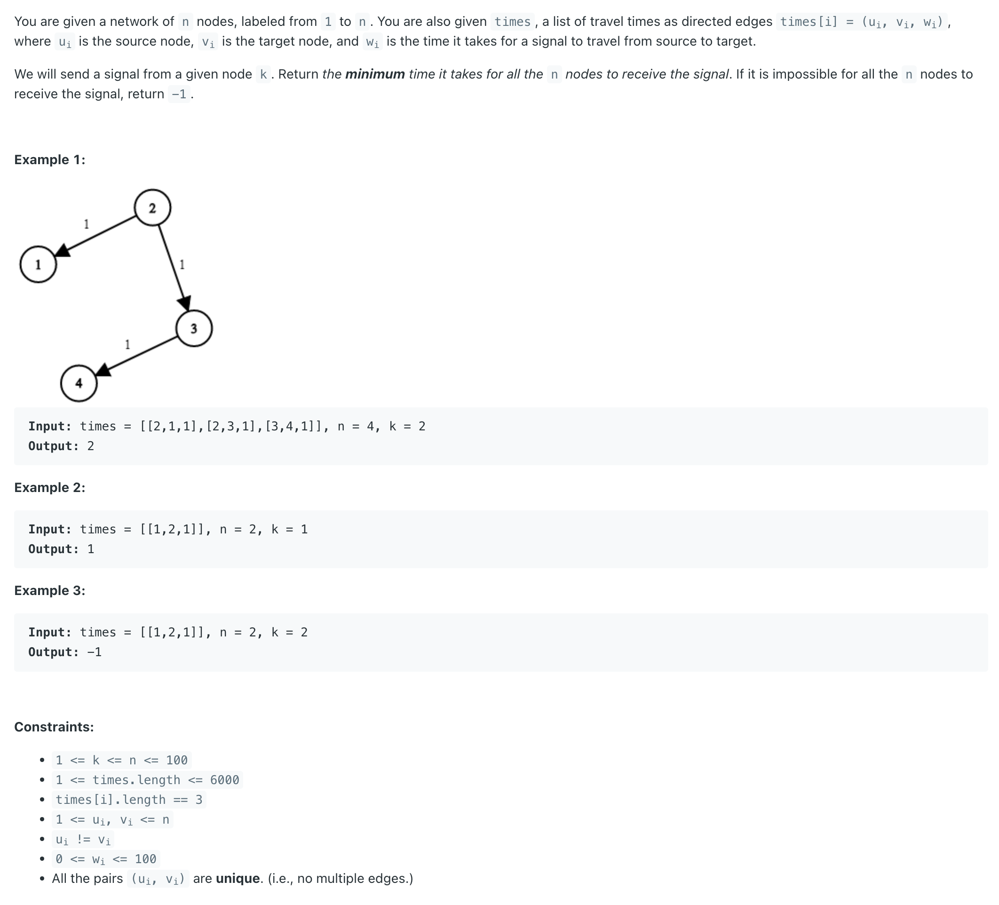

## 743. Network Delay Time


- **dijkstra** are very similar problems. It's just that djikstra cost is different compared with bfs, so use priorityQueue instead a Queue for a standard bfs search.

---

#### [Dijkstra - Shortest Path | youtube video](https://youtu.be/EaphyqKU4PQ?t=278)

- for `Map<TargetNode, Path>`, key is the `previous Node`, or `from Node`, value is the `time` of edge,

```java
class _743_NetworkDelayTime {
    public int networkDelayTime(int[][] times, int n, int k) {
        // for `Map<TargetNode, Path>`, key is the `previous Node`, or `from Node`, value is the `time` of edge,
        Map<Integer, Map<Integer, Integer>> map = new HashMap<>();
        for (int[] time : times) {
            // time[0] : source node, time[1] : target node, time[2] : time
            map.putIfAbsent(time[0], new HashMap<>());
            map.get(time[0]).put(time[1], time[2]);
        }

        //distance, node into pq
        PriorityQueue<int[]> minHeap = new PriorityQueue<>((a, b) -> (a[0] - b[0]));
        minHeap.offer(new int[]{0, k});

        // since a network of n nodes, labeled from `1` to `n`.
        boolean[] visited = new boolean[n + 1];
        int res = 0;

        while (!minHeap.isEmpty()) {
            int[] cur = minHeap.poll();
            int curDist = cur[0];
            int curNode = cur[1];
            if (visited[curNode]) {
                continue;
            }
            visited[curNode] = true;
            res = curDist;
            n--;
            if (map.containsKey(curNode)) {
                for (int nextNode : map.get(curNode).keySet()) {
                    minHeap.offer(new int[]{curDist + map.get(curNode).get(nextNode), nextNode});
                }
            }
        }

        return n == 0 ? res : -1;
    }
}
```