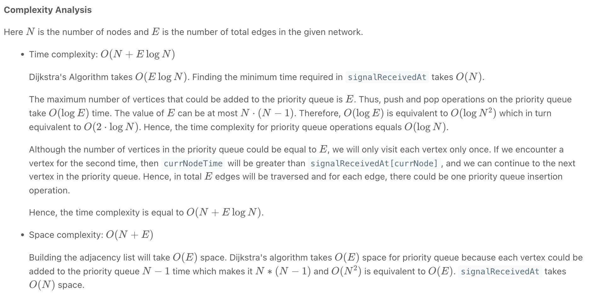

## 743. Network Delay Time


- **dijkstra** are very similar problems. It's just that djikstra cost is different compared with bfs, so use priorityQueue instead a Queue for a standard bfs search.

---

#### [Dijkstra - Shortest Path | youtube video](https://youtu.be/EaphyqKU4PQ?t=278)




---
- `boolean[] visited = new boolean[n + 1]`, Here's why you need boolean[] visited:
  -  **Preventing Infinite Loops**: Without marking visited nodes, you risk getting stuck in infinite loops in cyclic graphs. Marking visited 
    nodes ensures that you won't revisit the same node multiple times, preventing infinite loops

---
```java
class Solution {
    public int networkDelayTime(int[][] times, int n, int k) {
        // for `List[int[]{TargetNode, Path}]`, index-0 is the `previous Node`, or `from Node`, index-1 is the `time` of edge,

        Map<Integer, List<int[]>> map = new HashMap<>();
        for (int[] time : times) { // time[0] : source node, time[1] target node, time[2] : time
            map.putIfAbsent(time[0], new ArrayList<>());
            map.get(time[0]).add(new int[]{time[1], time[2]});
        }
        
        // since a network of n nodes, labeled from `1` to `n`.
        boolean[] visited = new boolean[n + 1];
        int res = 0;
        
        // [0] : target node, [1] : distance
        PriorityQueue<int[]> minHeap = new PriorityQueue<>((a, b) -> a[1] - b[1]);
        minHeap.offer(new int[]{k, 0});
        
        while (!minHeap.isEmpty()) {
            int[] cur = minHeap.poll();
            
            int curNode = cur[0];
            int curDist = cur[1];
            if (visited[curNode]) {
                continue;
            }            
            visited[curNode] = true;            
            res = curDist;
            n--;
            
            List<int[]> nextEdges = map.get(curNode);
            if (nextEdges != null) {
                for (int[] nextEdge : nextEdges) {
                    int nextNode = nextEdge[0];
                    int nextDist = nextEdge[1];
                    minHeap.offer(new int[]{nextNode, curDist + nextDist});
                }                
            }
        }
        
        return n == 0 ? res : -1;
    }
}
```

