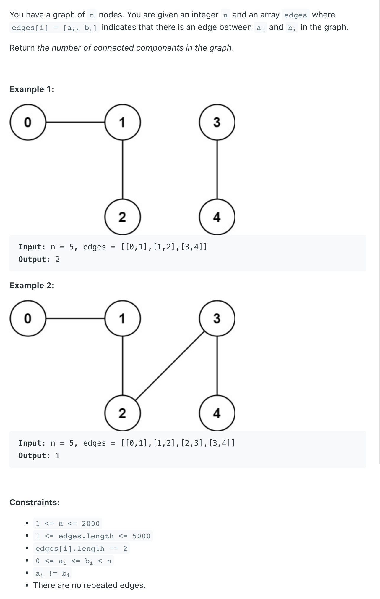

## 323. Number of Connected Components in an Undirected Graph

---

```ruby
本题还是用 union find， 寻找是否有共同root, 如果 isConnect(i, j) == true
不用connect, 如果无法connect, 则 union 的次数 +1.

    0 ---- 1         3

           2         4 


    0 ---- 1         3
           |
           2         4 


    0 ---- 1         3
           |         |
           2         4
           
最后， node's nums - union's nums
           n   -   numOfUnion           
```

---

```java
class _323_NumberOfConnectedComponentsIn_UndirectedGraph {
    public int countComponents(int n, int[][] edges) {
        int numOfComponents = n;
        int unionNum = 0;
        UnionFind uf = new UnionFind(n);
        for (int[] edge : edges) {
            if (uf.isConnected(edge[0], edge[1])) {
                continue;
            }
            uf.union(edge[0], edge[1]);
            unionNum++;
        }
        return numOfComponents - unionNum;
    }

    class UnionFind{
        private int[] parent;
        private int[] rank;

        public UnionFind(int size) {
            parent = new int[size];
            rank = new int[size];
            for (int i = 0; i < size; i++) {
                parent[i] = i;
                rank[i] = 1;
            }
        }

        public int find(int x) {
            if (parent[x] != x) {
                parent[x] = find(parent[x]);
            }
            return parent[x];
        }

        public void union(int x, int y) {
            int rootX = find(x);
            int rootY = find(y);
            if (rootX == rootY) return;

            if (rank[rootX] > rank[rootY]) {
                parent[rootY] = rootX;
            } else if (rank[rootX] < rank[rootY]) {
                parent[rootX] = rootY;
            } else {
                parent[rootY] = rootX;
                rank[rootX] += 1;
            }
        }

        public boolean isConnected(int x, int y) {
            return find(x) == find(y);
        }
    }
}
```