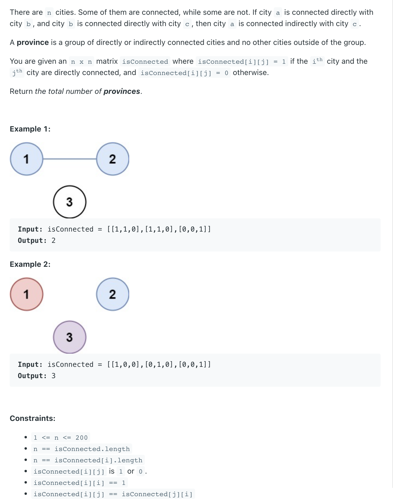
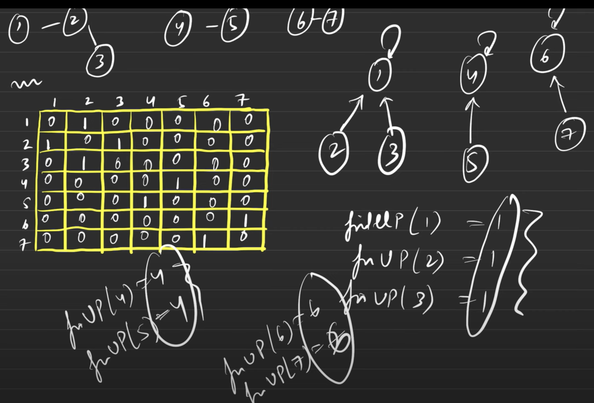

## 547. Number of Provinces

---

```ruby
   1 ----- 2
       
       3

isConnected = [
    [1, 1, 0],
    [1, 1, 0],
    [0, 0, 1]
]

假设 1 和 2 的 root node 是 1, 那么 1 和 2 connected, 就代表现在只有两个 groups: [1, 2], [3]


    1       2
      
        3

isConnected = [
    [1, 0, 0],
    [0, 1, 0],
    [0, 0, 1]
]

第一次初始化的时候， 1， 2， 3 的 root node 分别是相对应自己 1， 2， 3

假设 i = 1, j = 1,  那么 un.find(1) == un.find(1), 所以num of provin 并未减少
```    
---



- [youtube](https://youtu.be/ZGr5nX-Gi6Y?t=184)
---

```java
class Solution {
    public int findCircleNum(int[][] isConnected) {
        int numOfProvinces = isConnected.length;
        int m = isConnected.length, n = isConnected[0].length;
        UnionFind uf = new UnionFind(numOfProvinces);    
        
        for (int i = 0; i < m; i++) {
            for (int j = i + 1; j < n; j++) {
                if (isConnected[i][j] == 1 && uf.find(i) != uf.find(j)) {
                    numOfProvinces--;
                    uf.union_set(i, j);
                }        
            }
        }
        return numOfProvinces;
    }
    
    class UnionFind {
        private int[] parent;
        private int[] rank;
        
        public UnionFind(int size) {
            parent = new int[size];
            rank = new int[size];
            for (int i = 0; i < size; i++) {
                parent[i] = i;
                rank[i] = 1;
            }
        }
        
        public int find(int x) {
            if (parent[x] != x) {
                parent[x] = find(parent[x]);
            }
            return parent[x];
        }
        
        public void union_set(int x, int y) {
            int rootX = find(x);
            int rootY = find(y);
            if (rootX == rootY) return;
            
            if (rank[rootX] > rank[rootY]) {
                parent[rootY] = rootX;
            } else if (rank[rootX] < rank[rootY]) {
                parent[rootX] = rootY;
            } else {
                parent[rootY] = rootX;
                rank[rootX] += 1;
            }
        }
    }
}
```