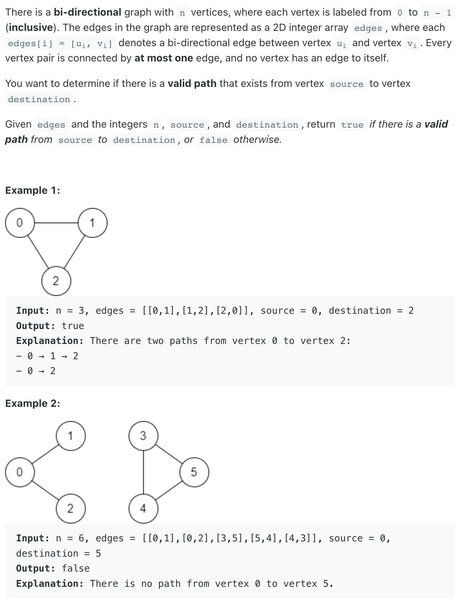
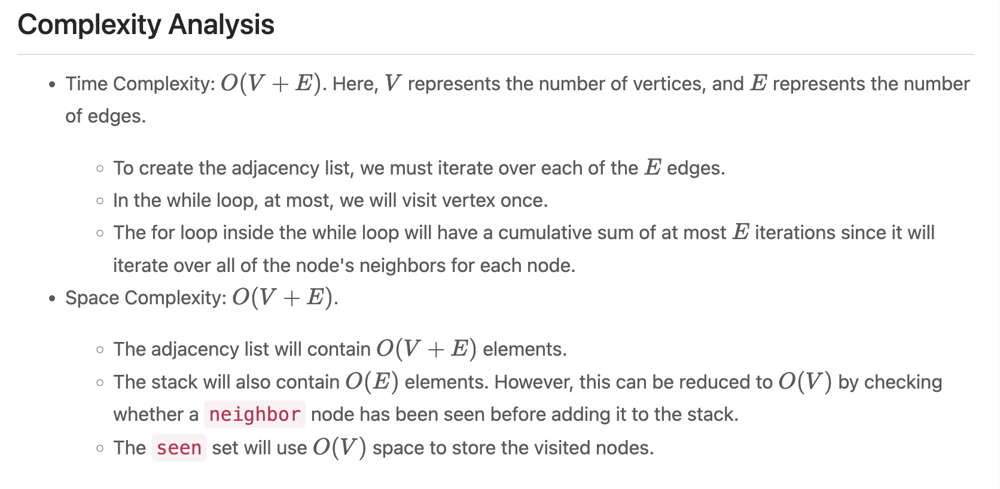

## 1971. Find if Path Exists in Graph




```java
public class Solution {
    public boolean validPath(int n, int[][] edges, int start, int end) {
        List<List<Integer>> adjacency_list = new ArrayList<>();
        for (int i = 0; i < n; i++) {
            adjacency_list.add(new ArrayList<>());
        }

        for (int[] edge : edges) {
            adjacency_list.get(edge[0]).add(edge[1]);
            adjacency_list.get(edge[1]).add(edge[0]);
        }

        Deque<Integer> stack = new ArrayDeque<>();
        stack.push(start);
        boolean[] visited = new boolean[n];
        Arrays.fill(visited, false);

        while (!stack.isEmpty()) {
            // Get the current node.
            int node = stack.pop();

            // Check if we have reached the target node.
            if (node == end) {
                return true;
            }

            // Check if we've already visited this node.
            if (visited[node]) {
                continue;
            }
            visited[node] = true;

            // Add all neighbors to the stack.
            for (Integer neighbor : adjacency_list.get(node)) {
                stack.push(neighbor);
            }
        }
        return false;
    }
}
```