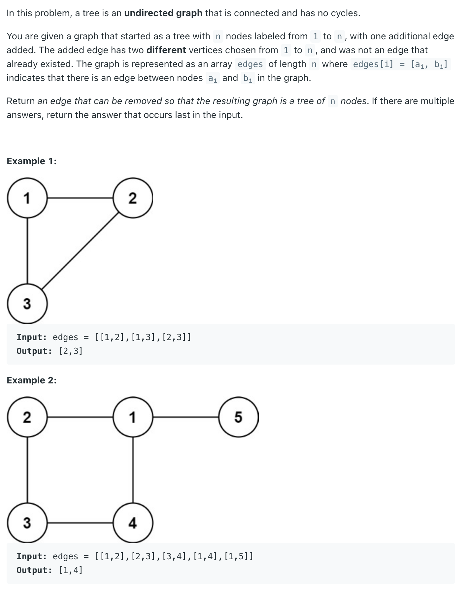

## 684. Redundant Connection


```java
class Solution {
    static class UnionFind {
        int[] parent;
        int[] rank;

        public UnionFind(int n) {
            parent = new int[n];
            rank = new int[n];
            for (int i = 0; i < n; i++) {
                parent[i] = i;
                rank[i] = 1;
            }
        }

        public int find(int x) {
            if (x == parent[x]) {
                return x;
            }
            return parent[x] = find(parent[x]);
        }

        public boolean union(int x, int y) {
            int rootX = find(x);
            int rootY = find(y);
            if (rootX == rootY) {
                return false;
            }
            if (rank[rootX] > rank[rootY]) {
                parent[rootY] = rootX;
            } else if (rank[rootX] < rank[rootY]) {
                parent[rootX] = rootY;
            } else {
                parent[rootY] = rootX;
                rank[rootX] += 1;
            }
            return true;
        }
    }

    public int[] findRedundantConnection(int[][] edges) {
        int n = edges.length;
        UnionFind uf = new UnionFind(n);
        for (int[] edge : edges) {
            if (!uf.union(edge[0] - 1, edge[1] - 1)) {
                return new int[]{edge[0], edge[1]};
            }
        }
        return new int[]{};
    }
}
```