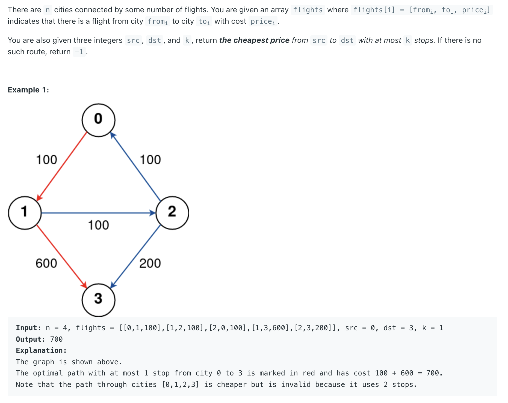
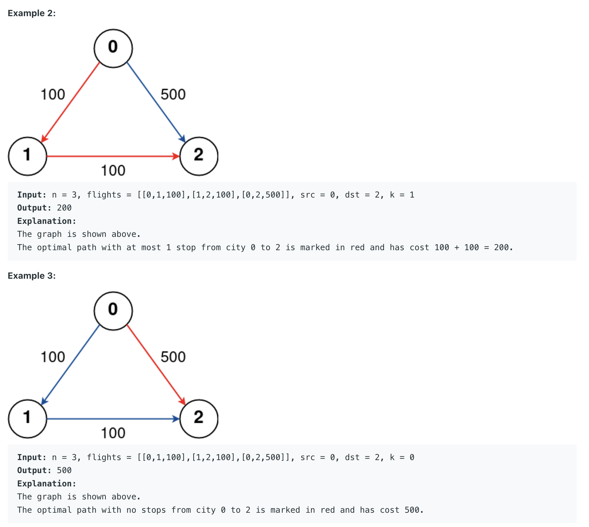

## 787. Cheapest Flights Within K Stops


---

```java
class cheapestFlightsWithinKStops {
    public int findCheapestPrice(int n, int[][] flights, int src, int dst, int K) {
        Map<Integer, List<int[]>> fmap = new HashMap<>();
        for (int[] flight : flights) { // flights[i] = [from, to, price]
            fmap.putIfAbsent(flight[0], new ArrayList<>());
            fmap.get(flight[0]).add(new int[]{flight[1], flight[2]});
        }
        PriorityQueue<int[]> minHeap = new PriorityQueue<>((a, b) -> a[0] - b[0]);
        // [0]: price, [1]: curNode, [3]: steps
        minHeap.offer(new int[]{0, src, K + 1});
        Map<Integer, Integer> visited = new HashMap<>();

        while (!minHeap.isEmpty()) {
            int[] e = minHeap.poll();
            int price = e[0], cur = e[1], steps = e[2];
            if (visited.containsKey(cur) && visited.get(cur) >= steps) {
                continue;
            }
            visited.put(cur, steps);

            if (cur == dst) {
                return e[0];
            }
            if (steps > 0) {
                List<int[]> list = fmap.get(cur);
                if (list == null || list.isEmpty()) {
                    continue;
                }
                for (int[] f : list) {
                    minHeap.offer(new int[]{price + f[1], f[0], steps - 1});
                }
            }
        }
        return -1;
    }
}

```