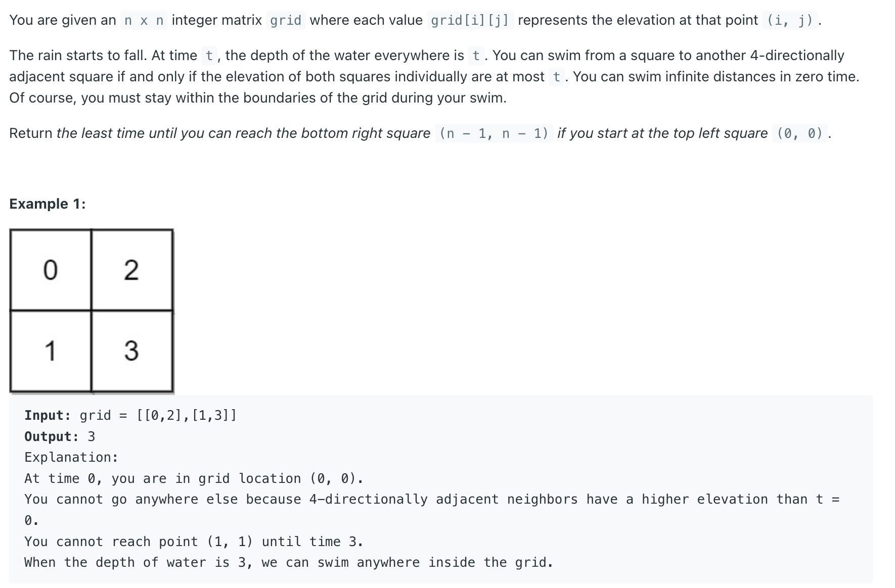
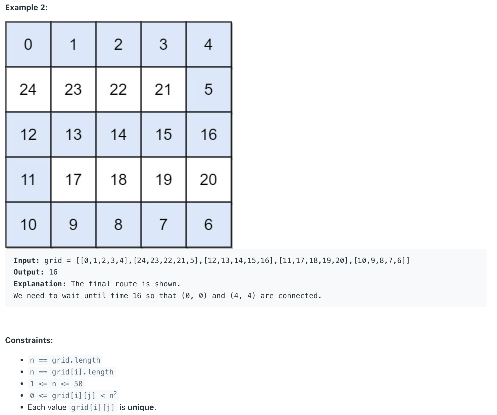

## 778. Swim in Rising Water



- 本体题意：从(0, 0), 到 (n - 1, n - 1), 寻找一条路径里的最高点，
- 比如刚开始 `grid[0][0]` 的值是 0， 那么哪里都无法移动，需要查看隔壁领居的**值**, 假如是 3， 那么就需要等待 **3 secs**
  所以这就是第二张图，如果这条路径里有一个 `16` 的最大值，所以必须等待16秒，因为16秒以后 等雨下16秒后 从 0 变成 16 的高度。
- 在 0 秒内，如果**周围的高度都和beginning 的高度一致**，那么就可以 **swim infinite distances**
---

### PriorityQueue

```java
class _778_Swim_in_RisingWater {
    int[][] dirs = new int[][]{{-1, 0}, {1, 0}, {0, -1}, {0, 1}};

    public int swimInWater(int[][] grid) {
        int n = grid.length;
        boolean[][] visited = new boolean[n][n];
        PriorityQueue<int[]> minHeap =
                new PriorityQueue<>((a, b) -> grid[a[0]][a[1]] - grid[b[0]][b[1]]);

        minHeap.offer(new int[]{0, 0});
        int level = 0;

        while (!minHeap.isEmpty()) {
            int[] cur = minHeap.poll();
            level = Math.max(level, grid[cur[0]][cur[1]]);
            if (cur[0] == n - 1 && cur[1] == n - 1) {
                break;
            }
            // System.out.println(level);
            for (int[] dir : dirs) {
                int row = cur[0] + dir[0];
                int col = cur[1] + dir[1];
                if (row < 0 || row >= n || col < 0 || col >= n || visited[row][col]) {
                    continue;
                }
                visited[cur[0]][cur[1]] = true;
                minHeap.offer(new int[]{row, col});
            }
        }
        return level;
    }
}
```