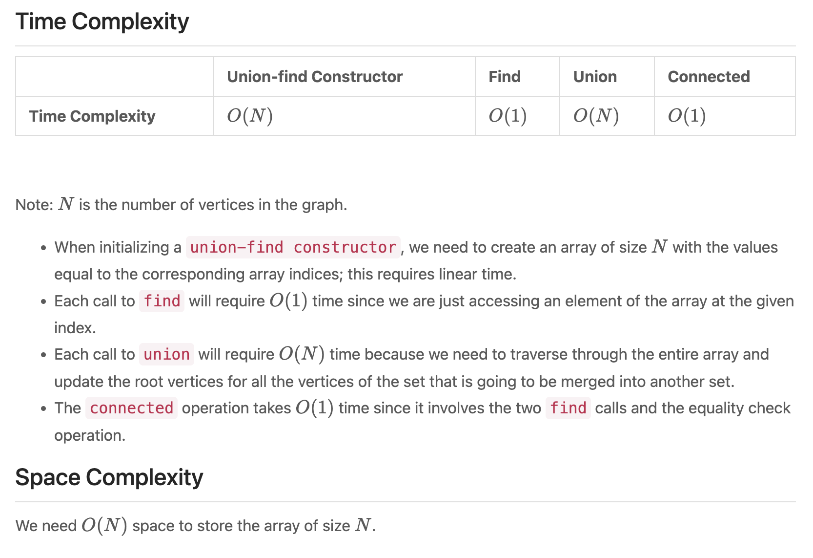
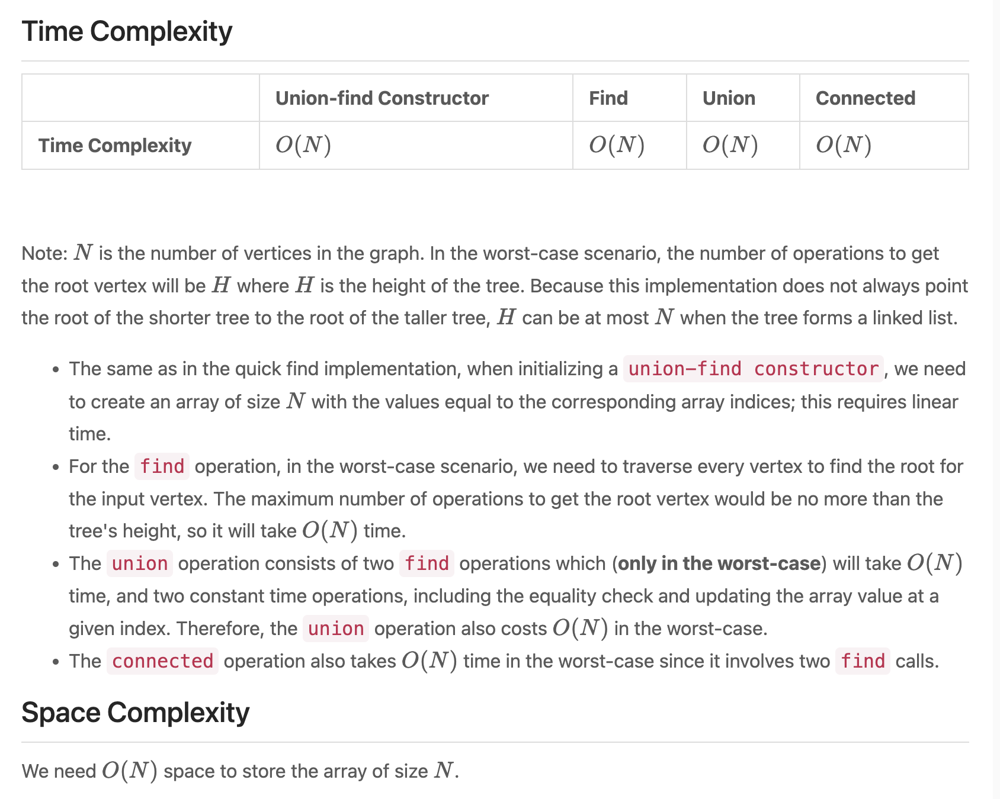

## Quick Find - Disjoint Set


- [Union Find](https://www.youtube.com/watch?v=ayW5B2W9hfo&t=130s)
- [Disjoint Set | UNION and FIND](https://www.youtube.com/watch?v=wU6udHRIkcc)


- **QuickFind**:
```java
// Quick Find
// UnionFind.class
class UnionFind {
    private int[] root;

    public UnionFind(int size) {
        root = new int[size];
        for (int i = 0; i < size; i++) {
            root[i] = i;
        }
    }

    public int find(int x) {
        return root[x];
    }
		
    public void union(int x, int y) {
        int rootX = find(x);
        int rootY = find(y);
        if (rootX != rootY) {
            for (int i = 0; i < root.length; i++) {
                if (root[i] == rootY) {
                    root[i] = rootX;
                }
            }
        }
    }

    public boolean connected(int x, int y) {
        return find(x) == find(y);
    }
}

// App.java
// Test Case
public class App {
    public static void main(String[] args) throws Exception {
        UnionFind uf = new UnionFind(10);
        // 1-2-5-6-7 3-8-9 4
        uf.union(1, 2);
        uf.union(2, 5);
        uf.union(5, 6);
        uf.union(6, 7);
        uf.union(3, 8);
        uf.union(8, 9);
        System.out.println(uf.connected(1, 5)); // true
        System.out.println(uf.connected(5, 7)); // true
        System.out.println(uf.connected(4, 9)); // false
        // 1-2-5-6-7 3-8-9-4
        uf.union(9, 4);
        System.out.println(uf.connected(4, 9)); // true
    }
}
```

---
- **Quick Union**:



```java
class UnionFind {
    private int[] root;

    public UnionFind(int size) {
        root = new int[size];
        for (int i = 0; i < size; i++) {
            root[i] = i;
        }
    }

    public int find(int x) {
        while (x != root[x]) {
            x = root[x];
        }
        return x;
    }

    public void union(int x, int y) {
        int rootX = find(x);
        int rootY = find(y);
        if (rootX != rootY) {
            root[rootY] = rootX;
        }
    }

    public boolean connected(int x, int y) {
        return find(x) == find(y);
    }
}

// App.java
// Test Case
public class App {
    public static void main(String[] args) throws Exception {
        UnionFind uf = new UnionFind(10);
        // 1-2-5-6-7 3-8-9 4
        uf.union(1, 2);
        uf.union(2, 5);
        uf.union(5, 6);
        uf.union(6, 7);
        uf.union(3, 8);
        uf.union(8, 9);
        System.out.println(uf.connected(1, 5)); // true
        System.out.println(uf.connected(5, 7)); // true
        System.out.println(uf.connected(4, 9)); // false
        // 1-2-5-6-7 3-8-9-4
        uf.union(9, 4);
        System.out.println(uf.connected(4, 9)); // true
    }
}
```