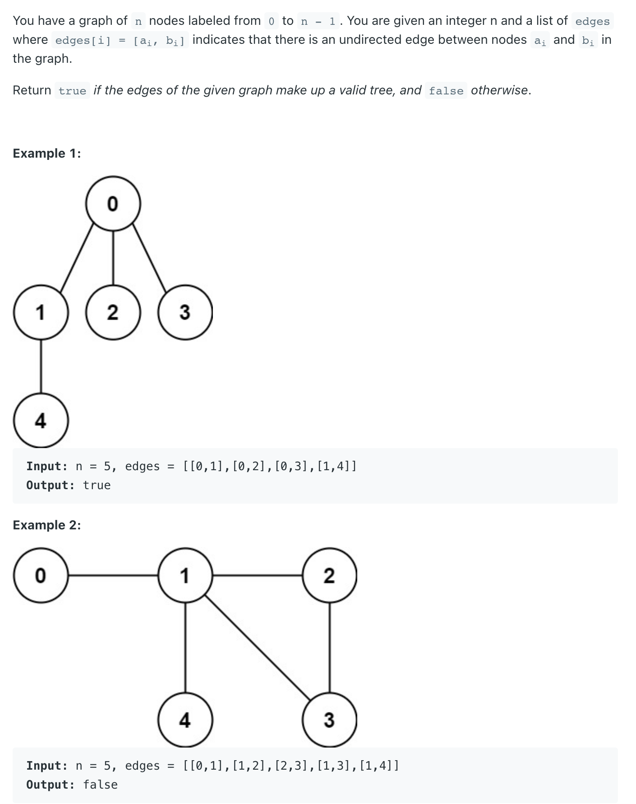
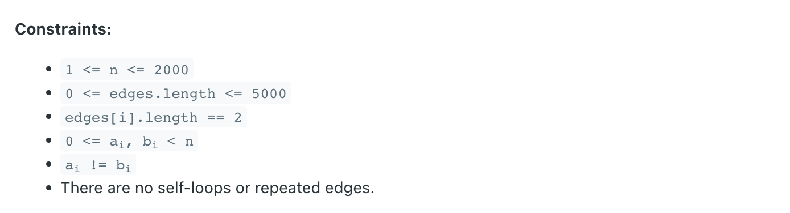
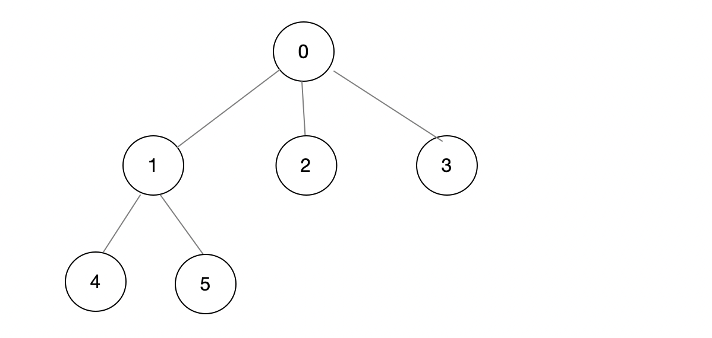
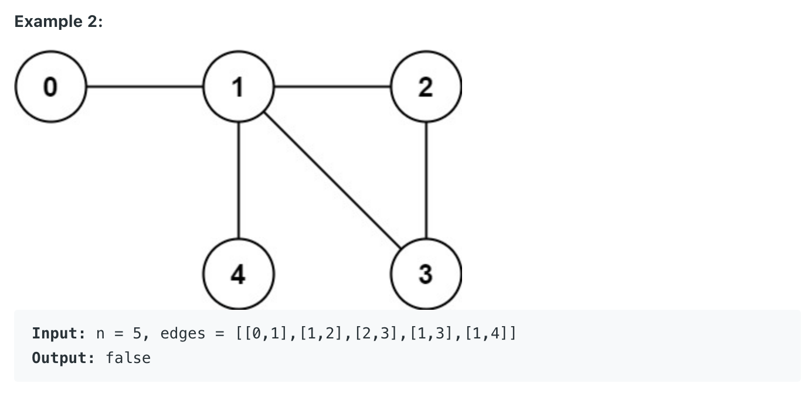

## 261. Graph Valid Tree


---

- Check if `edges.length != n - 1` (there is n-1 edge in edges). To form a n node tree, there must have `n - 1` 
  edges. If there is `n - 1` edges, check if all nodes are **connected** (if there is a loop in edges).
- Loop through edges and union two nodes of one edge
  - If that two nodes is already connected, means there is a loop is edges, means it can't be a tree, return false.



- 以上那段话，可以从上面这图看出，上面是一个`valid tree`, 如果遍历所有的边的集合，可以发现如果 `2` 和 `3` 已经 connected, 说明
  这是一个 **loop** (其中，`2` 和 `3` 有共同`parent`), 因为我们初始化的时候是每一个node的self:  `root[0, 1, 2, 3, 4, 5 ..]`, 
  所以当一个valid tree, 第一次 `2` 和 `3` 肯定不connected.
---



- 再看上面这图，after `union(1, 2)`, `1` 和 `2` 的`root` 变成 `1`, `union(2, 3)`, `2` 和 `3` 的`root` 变成 `1`
  循环到 `[1, 3]` 的时候，就会发现，`isConnected(1, 3)` is `true`, 因为 `1` 和 `3` 的root是 `1`, 所以 **return false**.

---

```java
class _261_GraphValidTree {
    public boolean validTree(int n, int[][] edges) {
        if (edges.length != n - 1) {
            return false;
        }
        UnionFind uf = new UnionFind(n);
        for (int[] edge : edges) {
            if (uf.isConnected(edge[0], edge[1])) {
                return false;
            }
            uf.union(edge[0], edge[1]);
        }
        return true;
    }

    class UnionFind{
        int[] parent;
        int[] rank;

        public UnionFind(int size) {
            parent = new int[size];
            rank = new int[size];
            for (int i = 0; i < size; i++) {
                parent[i] = i;
                rank[i] = 1;
            }
        }

        public int find(int x) {
            if (x == parent[x]) {
                return x;
            }
            return parent[x] = find(parent[x]);
        }

        public void union(int x, int y) {
            int rootX = find(x);
            int rootY = find(y);
            if (rootX == rootY) return;

            if (rank[rootX] > rank[rootY]) {
                parent[rootY] = rootX;
            } else if (rank[rootX] < rank[rootY]) {
                parent[rootX] = rootY;
            } else {
                parent[rootY] = rootX;
                rank[rootX] += 1;
            }
        }

        public boolean isConnected(int x, int y) {
            return find(x) == find(y);
        }
    }

    public static void main(String[] args) {
        int[][] edges = new int[][]{
                {0, 1}, {0, 2}, {0, 3}, {1, 4}
        };
        _261_GraphValidTree graphValidTree = new _261_GraphValidTree();
        boolean res = graphValidTree.validTree(5, edges);
        System.out.println(res); // true
    }
}
```
---

### method 2

```java
class Solution {
    class UnionFind {
        int[] parent;
        int[] rank;
        
        public UnionFind(int n) {
            parent = new int[n];
            rank = new int[n];
            for (int i = 0; i < n; i++) {
                parent[i] = i;
                rank[i] = 1;
            }
        } 
        public int find(int x) {
            if (x == parent[x]) {
                return x;
            }
            return parent[x] = find(parent[x]);
        }
        
        public boolean union(int x, int y) {
            int rootX = find(x);
            int rootY = find(y);
            if (rootX == rootY) {
                return false;
            }
            if (rank[rootX] > rank[rootY]) {
                parent[rootY] = rootX;
            } else if (rank[rootX] < rank[rootY]) {
                parent[rootX] = rootY;
            } else {
                parent[rootY] = rootX;
                rank[rootX] += 1;
            }
            return true;
        }
    }
    
    public boolean validTree(int n, int[][] edges) {
        int edgeNum = 0;
        UnionFind uf = new UnionFind(n);
        for (int[] edge : edges) {
            if (!uf.union(edge[0], edge[1])) {
                return false;
            }
            uf.union(edge[0], edge[1]);
            edgeNum++;
        }
        if (edgeNum != n - 1) {
            return false;
        }
        return true;
    }
}
```
