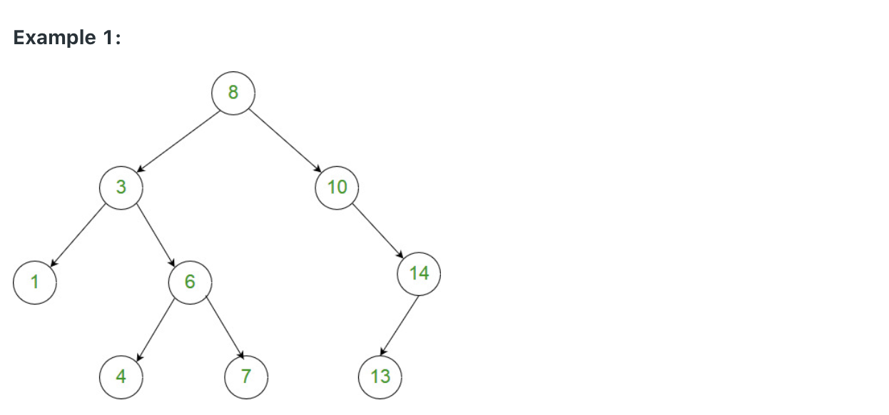

# 1026. Maximum Difference Between Node and Ancestor

```ruby
Given the root of a binary tree, find the maximum value V for which there exists 
different nodes A and B where V = |A.val - B.val| and A is an ancestor of B.

(A node A is an ancestor of B if either: any child of A is equal to B, 
or any child of A is an ancestor of B.)
```



```ruby
Input: [8,3,10,1,6,null,14,null,null,4,7,13]
Output: 7
Explanation: 
We have various ancestor-node differences, some of which are given below :
|8 - 3| = 5
|3 - 7| = 4
|8 - 1| = 7
|10 - 13| = 3
Among all possible differences, the maximum value of 7 is obtained by |8 - 1| = 7.


Note:

1. The number of nodes in the tree is between 2 and 5000.
2. Each node will have value between 0 and 100000.
```


### Analysis:

- 这题的max difference是直上直下的node之间关系，所以用从上面往下传值的方法会比三部曲容易。
  从上往下把路径上出现过的min和max传下去就行了。


```java
/**
 * Definition for a binary tree node.
 * public class TreeNode {
 *     int val;
 *     TreeNode left;
 *     TreeNode right;
 *     TreeNode() {}
 *     TreeNode(int val) { this.val = val; }
 *     TreeNode(int val, TreeNode left, TreeNode right) {
 *         this.val = val;
 *         this.left = left;
 *         this.right = right;
 *     }
 * }
 */
class Solution {
    public int maxAncestorDiff(TreeNode root) {
        int[] result = new int[]{Integer.MIN_VALUE};
        if(root == null){
            return result[0];
        }
        
        // initialize both max and min with root.val.
        dfs(root, root.val, root.val, result);
        return result[0];
    }
    private void dfs(TreeNode node, int min, int max, int[] res){
        if(node == null){//base case
            return;
        }
        //find difference at current node
        int diff = Math.max(Math.abs(node.val - min), Math.abs(node.val - max));
        res[0] = Math.max(res[0], diff);//update global max
        max = Math.max(node.val, max);//update max
        min = Math.min(node.val, min);//update min        
        // compare all super/sub differences to get result.
        dfs(node.left, min, max, res);
        dfs(node.right, min, max, res);
    }
}
```


