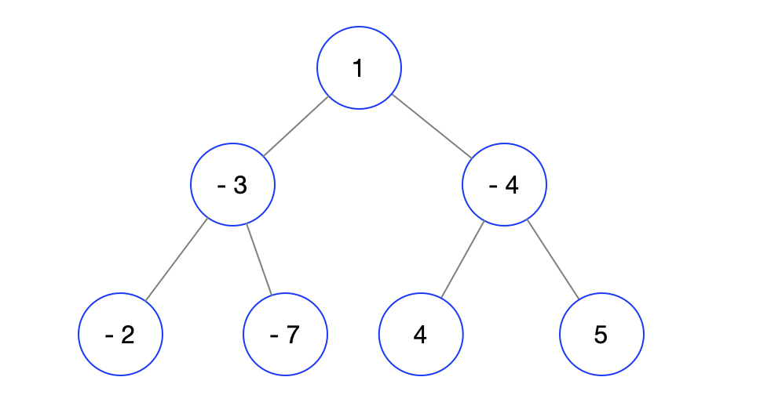

## 124. Binary Tree Maximum Path Sum 
### (path from any node to any node)

- **题目的要求是any node to any node**，就是你可以带上下面的node，也可以不带。
  如果下面node传上来的数是-10000，你说要不要带呢？所以这里和0比较.

- let's look at test case:


- 2nd test case:



---


## 三部曲

1. What do you expect from your leftChild / rightChild? (usually it is the return type of the
   recursion function)
   - left: max single path in my left subtree that starts from leftChild
   - right: max single path in my right subtree that starts from rightChild
2. What do you want to do in the current layer?
   - update globalMax with max(left, 0) + max(right, 0) + root.value
3. What do you want to report to your parent? (same as Q1 == Q3)
   - return max(left, right, 0) + root.value


- **Key Point:**

- 左树的max, 右树的的max，当前层：更新，返回的时候：要和第一个物理意义一样：返回当前的max + root.val
  基于这一点，一定要在最后return "current" + root.key, 必须保持递归's state 前后一致
  For example: if current.val = 1, root.val = 1, => return current.val + root.val

- **Additional data structure**
- create a new Array[1] to sotre globalMax
  - since java pass object by value, 子函数修改的是那份copy。 而用array is an object，通过array的reference修改array里面的值。 
  - so you can't pass primitive value, 简单来说int传入值，“int[]传入的是指针”
  - 也可以传递一个 Integer object, 我们要确保动态传递,
 
 
 Time: O(n)
 Space: O(height), worst case
 
---

 ```java
 /**
 * Definition for a binary tree node.
 * public class TreeNode {
 *     int val;
 *     TreeNode left;
 *     TreeNode right;
 *     TreeNode() {}
 *     TreeNode(int val) { this.val = val; }
 *     TreeNode(int val, TreeNode left, TreeNode right) {
 *         this.val = val;
 *         this.left = left;
 *         this.right = right;
 *     }
 * }
 */
class Solution {
    public int maxPathSum(TreeNode root) {
        int[] max = new int[1];
        max[0] = Integer.MIN_VALUE;
        helper(root, max);
        return max[0];
    }
    private int helper(TreeNode root, int[] max){
        if(root == null){
            return 0;
        }
        int left = helper(root.left, max);
        int right = helper(root.right, max);
        left = left < 0 ? 0 : left; 
        right = right < 0 ? 0 : right;
        max[0] = Math.max(max[0], left + right + root.val);
        return Math.max(left, right) + root.val;
    }
}
 ```