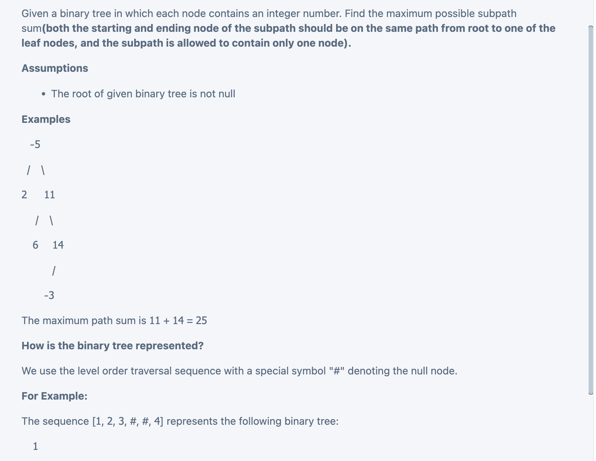
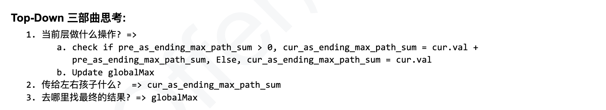
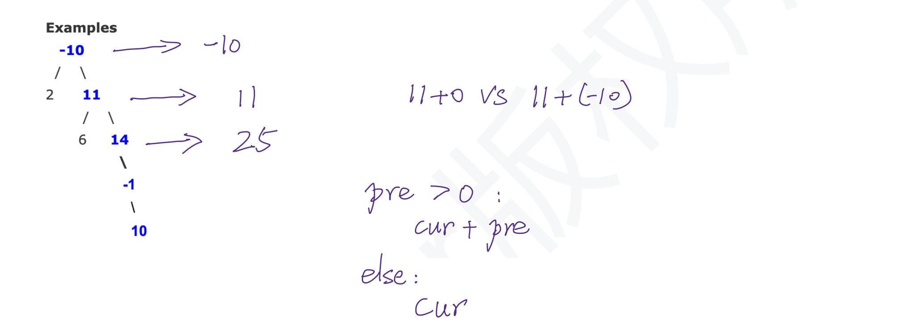

## Maximum Path Sum Binary Tree III


## reference

- [reference to 124. Binary Tree Maximum Path Sum | Maximum Path Sum Binary Tree II](./maxPathSum.md)


## Time

- Time = O(n)


```java
/**
 * public class TreeNode {
 *   public int key;
 *   public TreeNode left;
 *   public TreeNode right;
 *   public TreeNode(int key) {
 *     this.key = key;
 *   }
 * }
 */
public class Solution {
  public int maxPathSum(TreeNode root) {
    // Write your solution here
    if(root == null){
      return Integer.MIN_VALUE;
    }
    int[] max = new int[]{Integer.MIN_VALUE};
    helper(root, max, 0);
    return max[0];
  }
  //sum = the largest-sum path that ends at root.
  private void helper(TreeNode root, int[]max, int sum){
    //base case
    if(root == null){
      return;
    }
    if(sum < 0){
      sum = root.key;
    }else{
      sum += root.key;
    }
    max[0] = Math.max(max[0], sum);
    //this is actually a pre-order traversal.
    helper(root.left, max, sum);
    helper(root.right, max, sum);
  }
}
```
---





```py
class Solution(object):
    def maxPathSum(self, root):
        """
        input: TreeNode root
        return: int
        """
        # write your solution here
        if root is None:
            return 0
        self.res = root.val
        self.dfs(root, 0)
        return self.res

    def dfs(self, root, prev):
        if root is None:
            return
        if prev < 0:
            cur = root.val
        else:
            cur = prev + root.val
        self.res = max(self.res, cur)

        self.dfs(root.left, cur)
        self.dfs(root.right, cur)
```