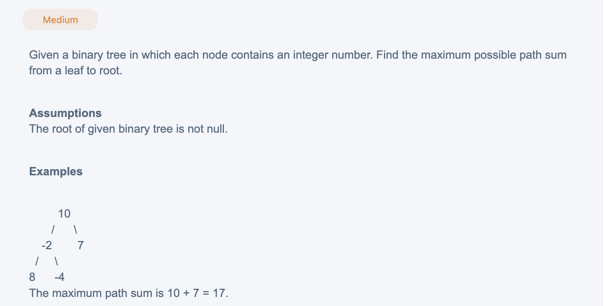

## Max Path Sum From Leaf To Root



## Analysis:

- Tree 相关问题，路径种类可以分为两大类：
  - Class 1: 人字形path, 这类题一般需要从下往上传integer value
  - Class 2: 从root往下 (直上直下) path
    - **Key point: carry a 直上直下 path prefix(非人字形) while traversing the tree:**


- int the above tree, there are three leaf to root paths `8 => 2 => 10`, `-4 => -2 =>10`
  `7 => 10`, the sums of these three path are 16, 4, and 17 respectively. The maximum of
  them is 17 and the path for maximum is 7 => 10


```java
/**
 * public class TreeNode {
 *   public int key;
 *   public TreeNode left;
 *   public TreeNode right;
 *   public TreeNode(int key) {
 *     this.key = key;
 *   }
 * }
 */
public class Solution {
  public int maxPathSumLeafToRoot(TreeNode root) {
    // Write your solution here
    int result[] = new int[]{Integer.MIN_VALUE};
    maxPath(root, 0, result);
    return result[0];
  }

  private void maxPath(TreeNode root, int prefixSum, int[] globalMax){
    if(root == null){
      return;
    }
    if(root.left == null && root.right == null){
      globalMax[0] = Math.max(prefixSum + root.key, globalMax[0]);
      return;
    }
    maxPath(root.left, prefixSum + root.key, globalMax);
    maxPath(root.right, prefixSum + root.key, globalMax);    
  }
}
```
---


```py
# class TreeNode(object):
#     def __init__(self, x):
#         self.val = x
#         self.left = None
#         self.right = None
class Solution(object):
  def maxPathSumLeafToRoot(self, root):
    """
    input: TreeNode root
    return: int
    """
    # write your solution here
    if root is None:
      return 0
    
    left = self.getPath(root.left, 0)
    right = self.getPath(root.right, 0)
    return max(left, right) + root.val
  
  def getPath(self, root, partial):
    if root is None:
      return 0
    
    if root.left is None and root.right is None:
      partial = max(partial, partial + root.val)
      
    
```