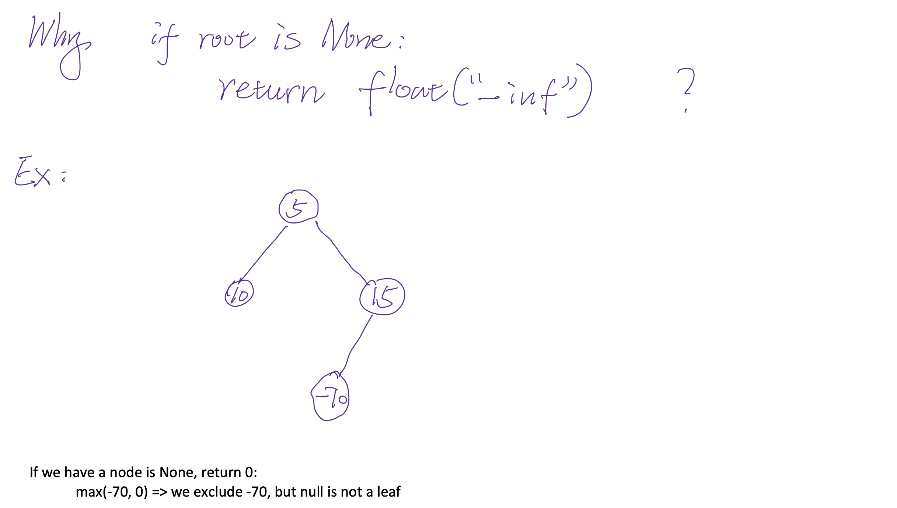
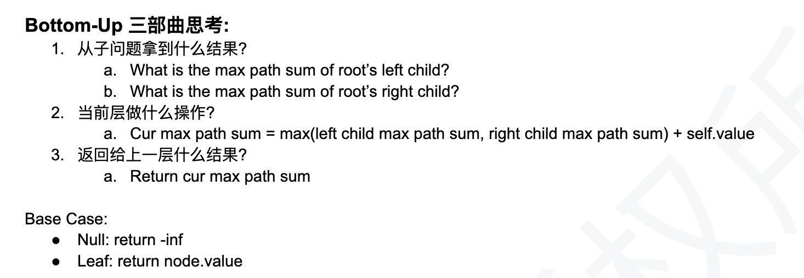
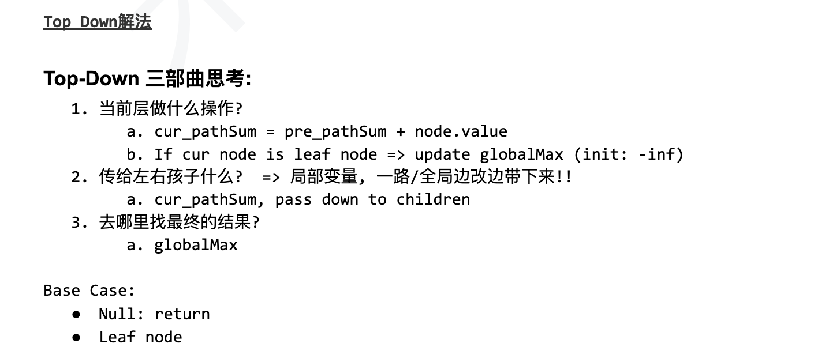

## Max Path Sum From Leaf To Root


## Analysis:

- Tree 相关问题，路径种类可以分为两大类：
  - Class 1: 人字形path, 这类题一般需要从下往上传integer value
  - Class 2: 从root往下 (直上直下) path
    - **Key point: carry a 直上直下 path prefix(非人字形) while traversing the tree:**


- int the above tree, there are three leaf to root paths `8 => 2 => 10`, `-4 => -2 =>10`
  `7 => 10`, the sums of these three path are 16, 4, and 17 respectively. The maximum of
  them is 17 and the path for maximum is 7 => 10




---


```py
class Solution(object):
    def maxPathSumLeafToRoot(self, root):
        """
        input: TreeNode root
        return: int
        """
        # write your solution here
        if root is None:
            return -float('inf')

        # when it is a leaf node
        if root.left is None and root.right is None:
            return root.val
        leftTree = self.maxPathSumLeafToRoot(root.left)
        rightTree = self.maxPathSumLeafToRoot(root.right)
        return max(leftTree, rightTree) + root.val    
```
---


---

```py

```


---
```java
/**
 * public class TreeNode {
 *   public int key;
 *   public TreeNode left;
 *   public TreeNode right;
 *   public TreeNode(int key) {
 *     this.key = key;
 *   }
 * }
 */
public class Solution {
  public int maxPathSumLeafToRoot(TreeNode root) {
    // Write your solution here
    int result[] = new int[]{Integer.MIN_VALUE};
    maxPath(root, 0, result);
    return result[0];
  }

  private void maxPath(TreeNode root, int prefixSum, int[] globalMax){
    if(root == null){
      return;
    }
    if(root.left == null && root.right == null){
      globalMax[0] = Math.max(prefixSum + root.key, globalMax[0]);
      return;
    }
    maxPath(root.left, prefixSum + root.key, globalMax);
    maxPath(root.right, prefixSum + root.key, globalMax);    
  }
}
```
---

```py
class Solution(object):
    def maxPathSumLeafToRoot(self, root):
        """
        input: TreeNode root
        return: int
        """
        # write your solution here
        if root is None:
            return 0
        self.maxPathSum = float('-inf')
        self.dfs(root, 0)
        return self.maxPathSum
    
    def dfs(self, node, curSum):
        if node is None:
            return
        if node.left is None and node.right is None:
            self.maxPathSum = max(self.maxPathSum, curSum + node.val)
            return
        
        self.dfs(node.left, curSum + node.val)
        self.dfs(node.right, curSum + node.val)
        return
```