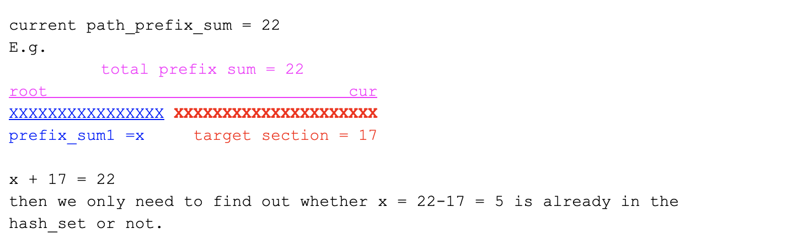

# Binary Tree Path Sum To Target III

```ruby
Medium
Given a binary tree in which each node contains an integer number. Determine if there exists
a path (the path can only be from one node to itself or to any of its descendants), 
the sum of the numbers on the path is the given target number.

Examples

    5

  /    \

2      11

     /    \

    6     14

  /

 3

If target = 17, There exists a path 11 + 6, the sum of the path is target.
If target = 20, There exists a path 11 + 6 + 3, the sum of the path is target.
If target = 10, There does not exist any paths sum of which is target.
If target = 11, There exists a path only containing the node 11.
```


## Analysis:

- Solution 0:
  - Pre-order to iterate over the whole tree, and for each current node X, we do a for loop in 
    {X ... root}
  - path_prefix = {5, 11, 6}
                           <- cur
  - with 6 as the bottom end, there are 3 paths:
    - {6}            sum = 6
    - {6, 11}        sum = 6 + 11 = 17
    - {6, 11, 5}     sum = 6 + 11 + 5 = 22 
  - Time = O(n * height) = O(n^2)

---

- Solution 1: Recursion + DP3 path-prefix in hashSet
  - Pre-order to iterate over the whole tree, and for each current node X, instead of doing a
    for loop, we maintain a path_prefix sum
  - historical path_prefix sum = {5, 16, 22} => HashSet
  - current prefix sum = 22
  - target = 17
  - `current prefix sum - target` is one of the historical path_prefix sum

  - What does this hash_set contain? It contains all `path_prefix_sum` from root node to the 
    current node.
    - set = {5, 16(=5+11), 22}



- Time = O(n) 
- Space = O(height) = O(n)


