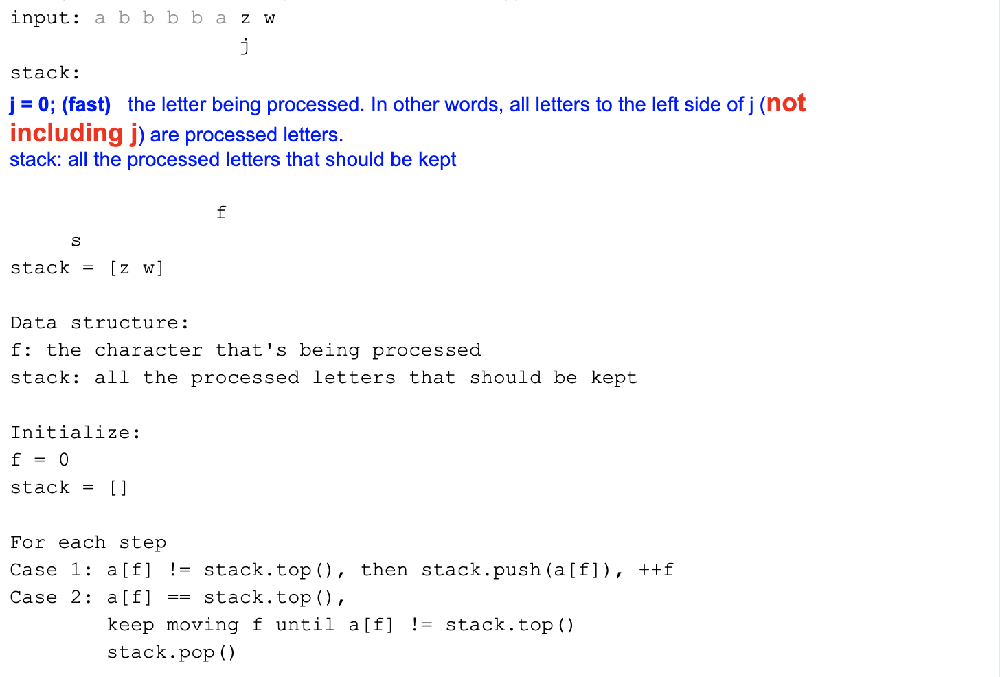

# Remove Adjacent Repeated Characters IV

```ruby
Repeatedly remove all adjacent, repeated characters in a given string from left to right.

No adjacent characters should be identified in the final string.

Examples

"abbbaaccz" → "aaaccz" → "ccz" → "z"
"aabccdc" → "bccdc" → "bdc"
```




- $$Time = O(n)$$


## using stack

```java
public class Solution {
  public String deDup(String input) {
    // Write your solution here
    if(input == null || input.length() <= 1){
      return input;
    }
    char[] array = input.toCharArray();
    Deque<Character> stack = new ArrayDeque<>();
    
    int fast = 0;
    while(fast < array.length){
      char curChar = array[fast];
      if(!stack.isEmpty() && stack.peekFirst() == curChar){
        while(fast < array.length && array[fast] == curChar){
          fast++;
        }
        stack.pollFirst();
      }else{
        stack.offerFirst(curChar);
        fast++;
      }
    }
    int len = stack.size();
    for(int i = len - 1; i >= 0; i--){
      array[i] = stack.pollFirst();
    }
    return new String(array, 0, len);
  }
}
```


## using array to simulate stack

```java
public class Solution {
  public String deDup(String input) {
    // Write your solution here
    if(input == null || input.length() <= 1){
      return input;
    }
    //try to convert the string to char[], and do it in-place
    char[] array = input.toCharArray();
    //instead of using a extra stack explicitly, we can actually
    //reuse the left side of the original char[] as the "stack"
    //end: is where the top of the stack is.
    int end = 0;
    for(int i = 1; i < array.length; i++){
      //if the stack is empty(when end == -1) or there is no duplicate chars,
      //we are able to push the character into the stack
      if(end == -1 || array[i] != array[end]){
        array[++end] = array[i];
      }else{
        //otherwise, we need pop the top element by end0--,
        //and ignore all the consecutive duplicate chars.
        end--;
        while(i + 1 < array.length && array[i] == array[i + 1]){
          i++;
        }
      }
    }
    return new String(array, 0, end + 1);
  }
}
```