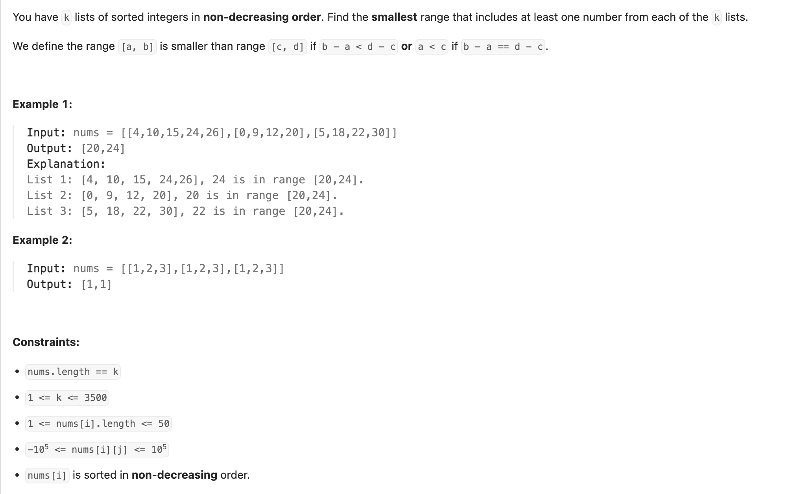

## 632. Smallest Range Covering Elements from K Lists

---

#### This diagram helped me to figure out the solution. Maybe it "will help you" too.

```ruby
    [4,10,15,24,26] [0,9,12,20] [5,18,22,30] 0, 5

    [4,10,15,24,26] [9,12,20] [5,18,22,30] 4, 9
    
    [10,15,24,26] [9,12,20] [5,18,22,30] 5, 10
    
    [10,15,24,26] [9,12,20] [18,22,30] 9, 18
    
    [10,15,24,26] [12,20] [18,22,30] 10, 18
    
    [15,24,26] [12,20] [18,22,30] 12, 18
    
    [24,26] [20] [18,22,30] 18, 24
    
    [24,26] [20] [22,30] 20, 24
    
    [24,26] [] [22,30]  stop
```
---

```ruby
class Solution:
    def smallestRange(self, nums: List[List[int]]) -> List[int]:
        heap = []
        k = len(nums)
        maxVal = -float('inf')  # get the max value in heap
        for i in range(len(nums)):
            # insert every first element in each array
            if len(nums[i]):
                heap.append((nums[i][0], i, 0))  # (value, array_index, element_index)
                maxVal = max(nums[i][0], maxVal)

        heapq.heapify(heap)
        # res is a 2-element array
        # res[0]: lower bound, res[1]: upper bound
        res = [-float('inf'), float('inf')]
        while len(heap) == k:
            minVal, array_index, ele_index = heapq.heappop(heap)
            # update the result
            # compare the current range maxVal - minVal to the range in result
            if maxVal - minVal < res[1] - res[0]:
                res = [minVal, maxVal]
            if ele_index < len(nums[array_index]) - 1:
                # update the maxVal when we want to insert element in heap
                maxVal = max(maxVal, nums[array_index][ele_index + 1])
                heapq.heappush(heap, (nums[array_index][ele_index + 1], array_index, ele_index + 1))
        return res
```
---


```java
class Solution {
    public int[] smallestRange(List<List<Integer>> nums) {
        PriorityQueue<int[]> minHeap = new PriorityQueue<>((a, b) -> a[0] - b[0]);
        int maxVal = Integer.MIN_VALUE;
        int k = nums.size();

        for (int i = 0; i < k; i++) {
            int val = nums.get(i).get(0);
            minHeap.offer(new int[]{val, i, 0});
            maxVal = Math.max(maxVal, val);
        }

        int start = -100000;
        int end = 100000;
        while (minHeap.size() == k) {
            int[] cur = minHeap.poll();
            int minVal = cur[0];
            int list_index = cur[1];
            int ele_index = cur[2];

            if (maxVal - minVal < end - start) {
                start = minVal;
                end = maxVal;
            }

            if (ele_index < nums.get(list_index).size() - 1) {
                int nextVal = nums.get(list_index).get(ele_index + 1);
                maxVal = Math.max(maxVal, nextVal);
                minHeap.offer(new int[]{nextVal, list_index, ele_index + 1});
            }
        }
        return new int[]{start, end};
    }
}
```