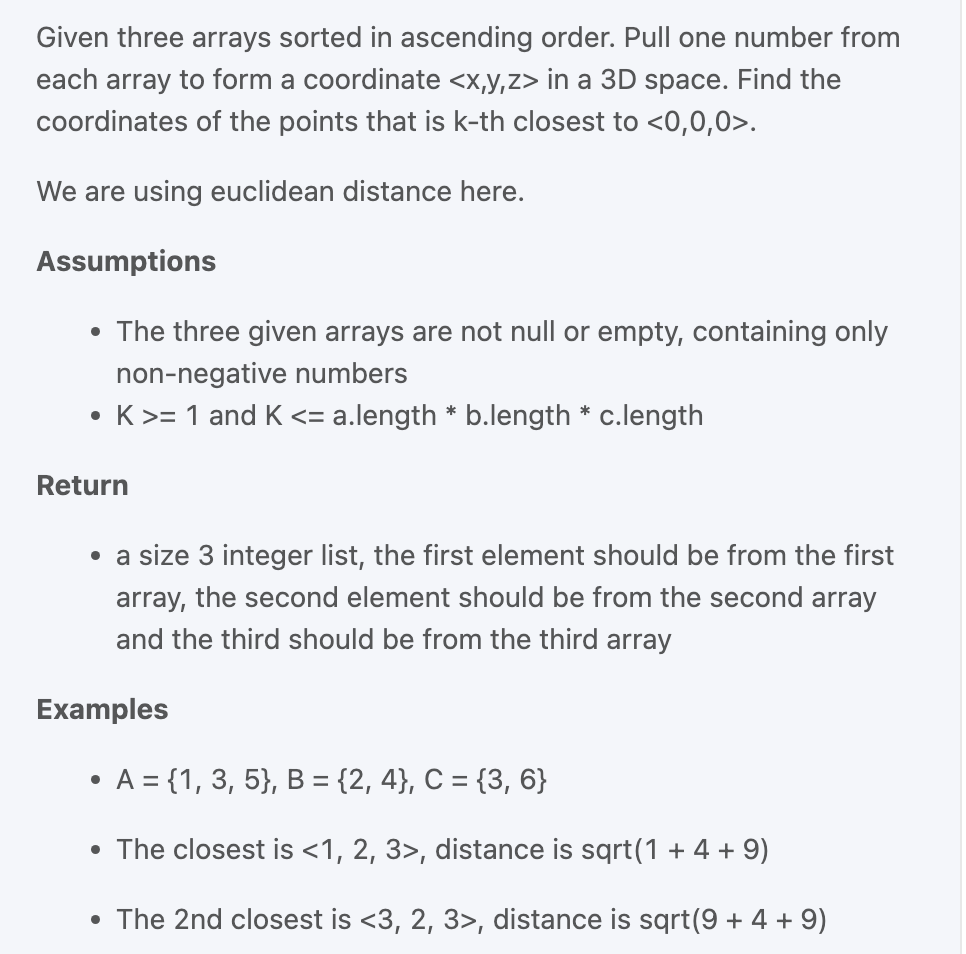

```py
import heapq
class Solution(object):
  def closest(self, a, b, c, k):
    """
    input: int[] a, int[] b, int[] c, int k
    return: Integer[]
    """
    # write your solution here
    heap = []
    for x in a:
      for y in b:
        for z in c:
          distance = x ** 2 + y ** 2 + z ** 2
          heap.append((distance, (x, y, z)))
    heapq.heapify(heap)
    dist = None
    point = []
    for i in range(k):
      dist, point = heapq.heappop(heap)
    return list(point)
  
  
  
    """
    TC = O(len(a) * len(b) * len(c)) = O(N^3), since the main time complexit is O(len(a) * len(b) * len(c))
            even though pop need K * log(N^3)
    SC = O(N^3), since heap need O(N1 * N2 * N3) sapce.
    """
```