## 84. Largest Rectangle in Histogram
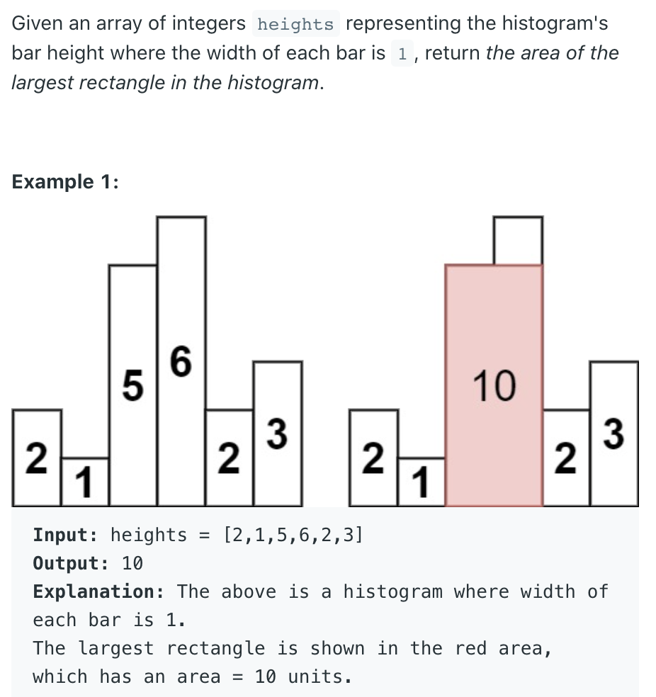

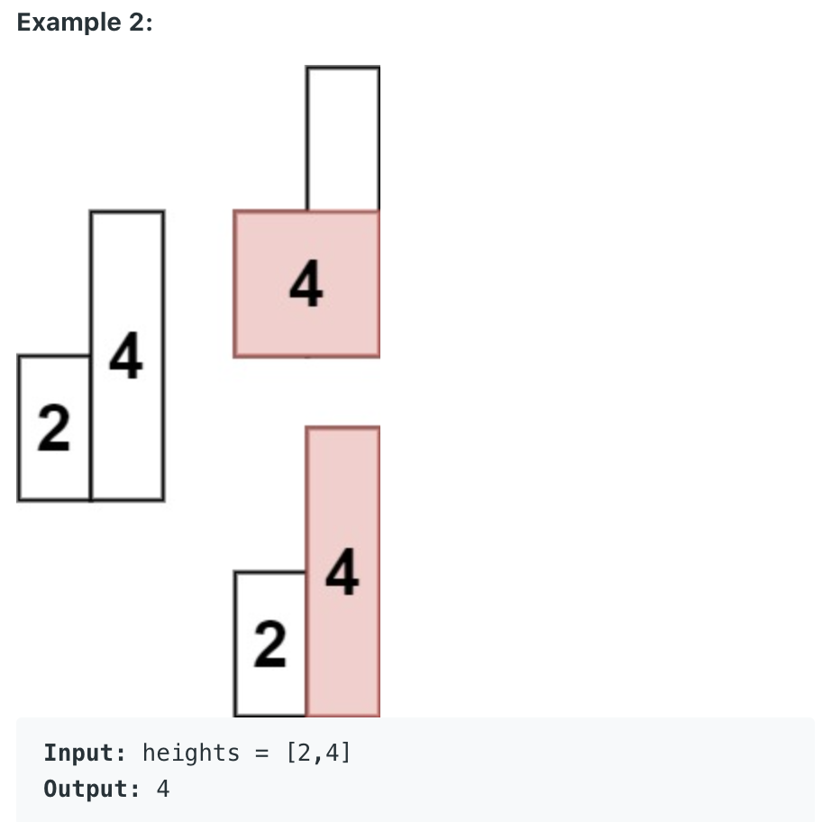
---
### brute force
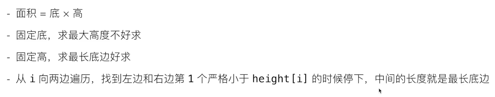
- 固定高度，求最长底边:
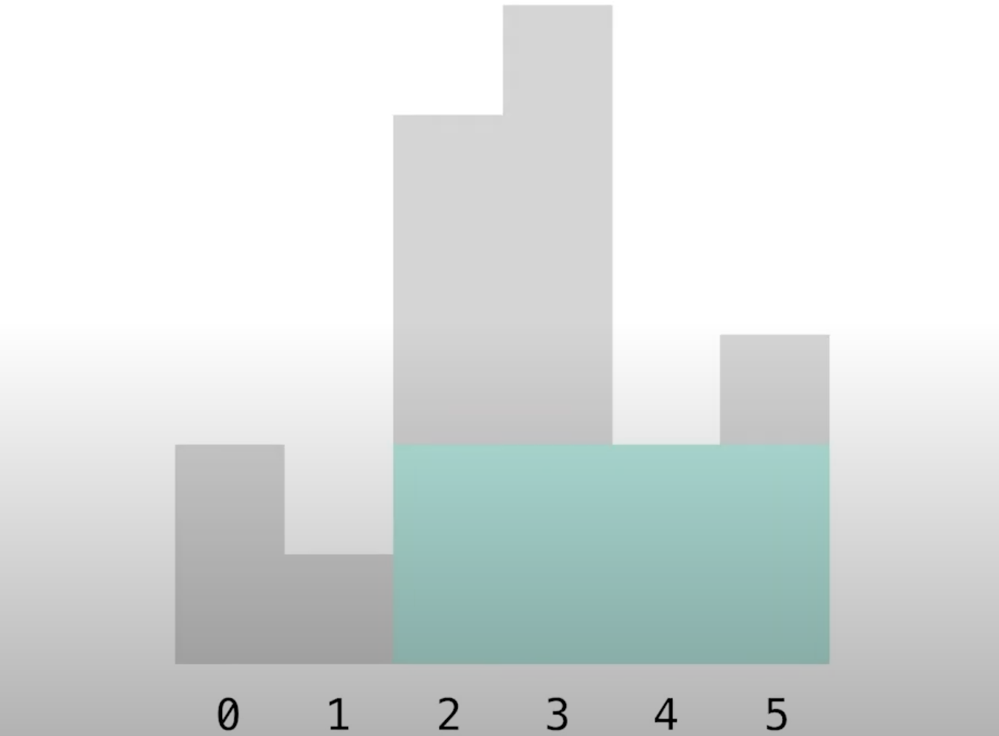
- T = O(N^2)
- Space = O(1), 使用常数个临时变量

#### 此方法（超时) :
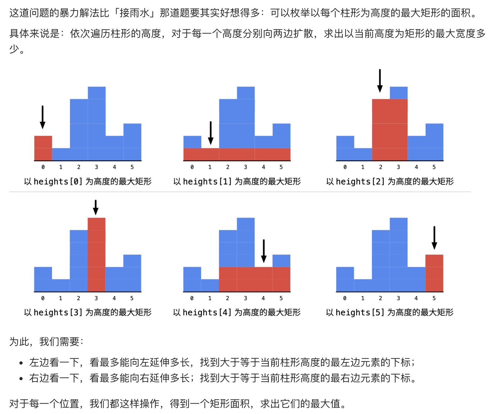

```java
public class Solution {
    public int largestRectangleArea(int[] heights) {
        int len = heights.length;
        if (len == 0) return 0;
        
        int res = 0;
        for (int i = 0; i < len; i++) {
            // 找左边最后 1 个大于等于 heights[i] 的下标
            int left = i;
            int curHeight = heights[i];
            while (left > 0 && heights[left - 1] >= curHeight) {
                left--;
            }
            // 找右边最后 1 个大于等于 heights[i] 的索引
            int right = i;
            while (right < len - 1 && heights[right + 1] >= curHeight) {
                right++;
            }
            int width = right - left + 1;
            res = Math.max(res, width * curHeight);
        }
        return res;
    }
}
```

---
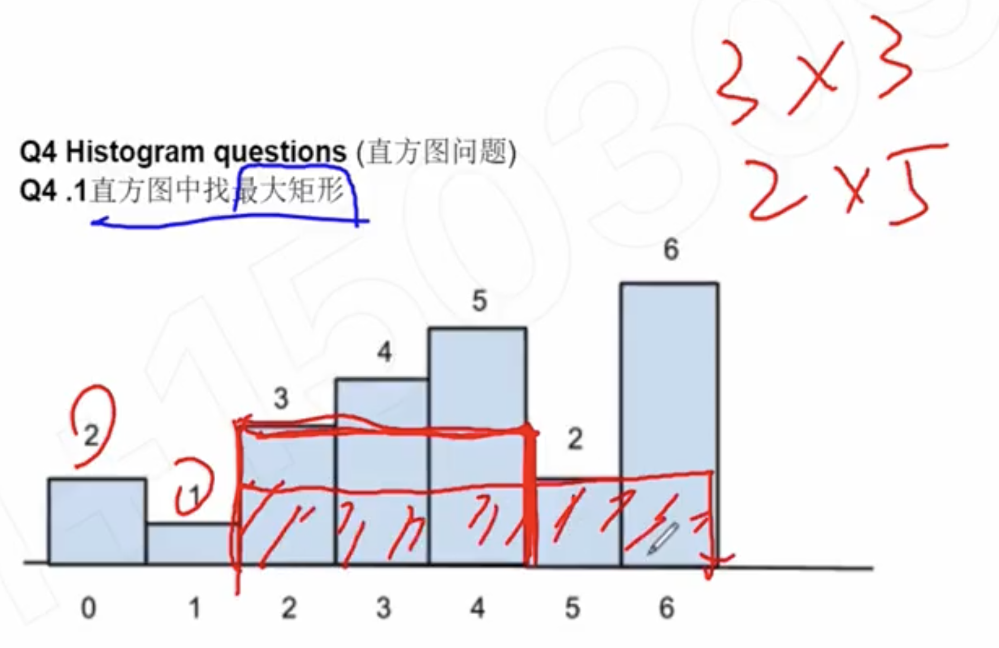

- 1. touch x-axis
- 2. touch one of the tops
- 3. touch certain one's left and right

```ruby
for i = 0; i < n; i++
    从 a[i] 向左延伸到哪里
    从 a[i] 向右延伸到哪里
```

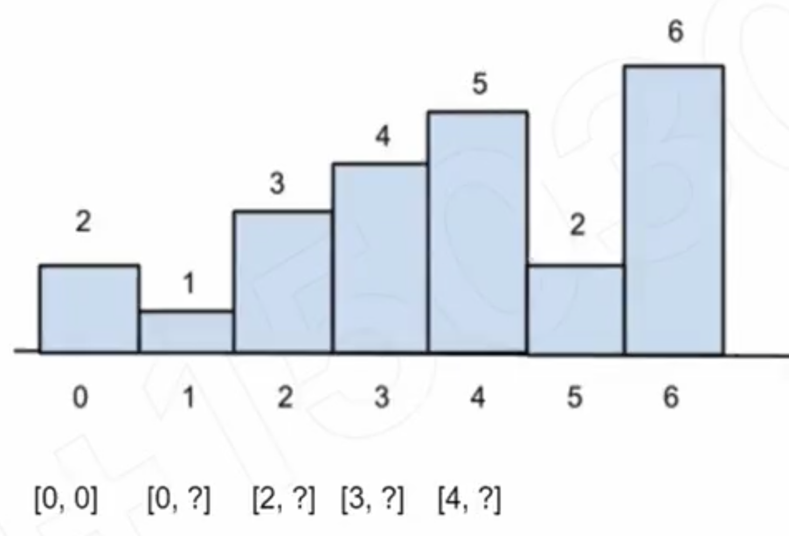

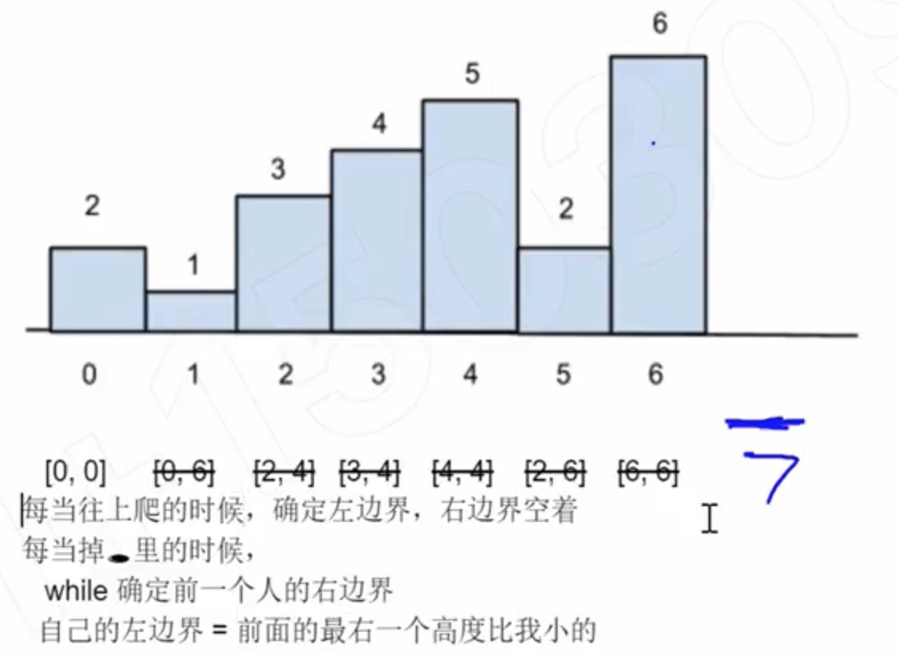

- stack!!! 单调栈 O(N) ,   性质： 单调递增，or 单调递减
---

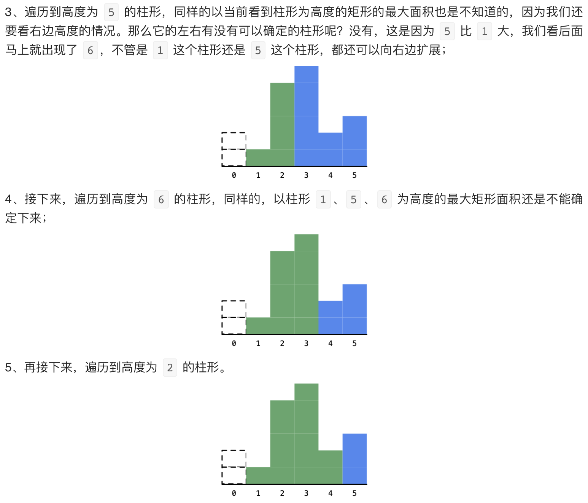
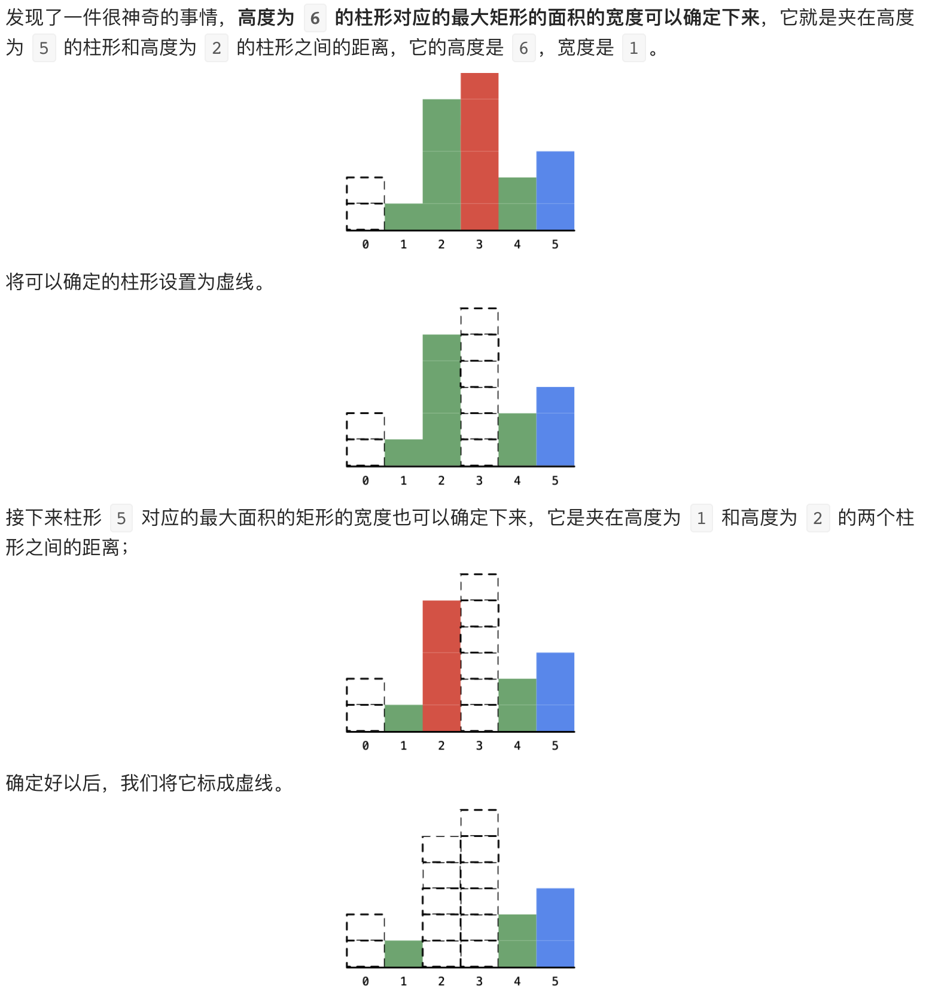

- 这个时候，还需要考虑的一个细节是，在确定一个柱形的面积的时候，**除了右边要比当前严格小**，
  其实还蕴含了一个条件，那就是**左边也要比当前高度严格小**。
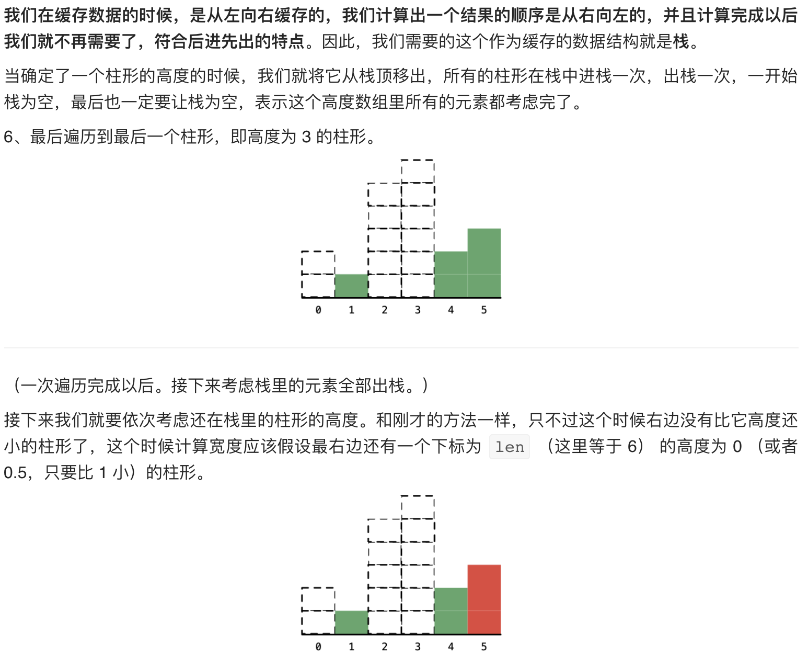
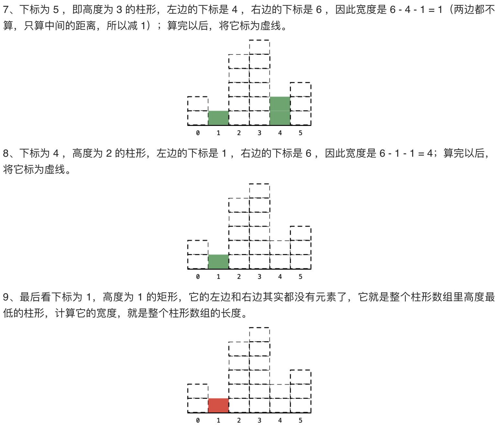
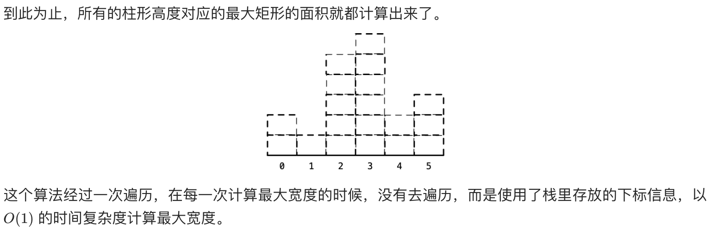
--- 

```java
class Solution {
  public int largestRectangleArea(int[] heights) {
    int result = 0;
    //Note that the stack contains the "index"
    //not the "value" of the array
    Deque<Integer> stack = new LinkedList<>();
    for (int i = 0; i <= heights.length; i++) {
        //we need a way of popping out all the elements in the stack
        //at least, so taht we explicitly add a bar of height 0.
        int cur = i == heights.length ? 0 : heights[i];
        while (!stack.isEmpty() && heights[stack.peekFirst()] >= cur) {
            int height = heights[stack.pollFirst()];
            //determine the left boundary of the largest rectangle
            //with height array[i]
            int left = stack.isEmpty() ? 0 : stack.peekFirst() + 1;
            //determine the right boundary of the largest rectangle
            //with height of the popped element
            result = Math.max(result, height * (i - left));
        }
        stack.offerFirst(i);
    }
    return result;
  }
}
```
