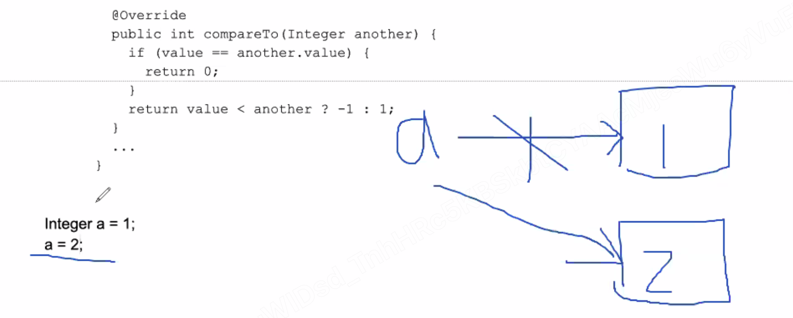
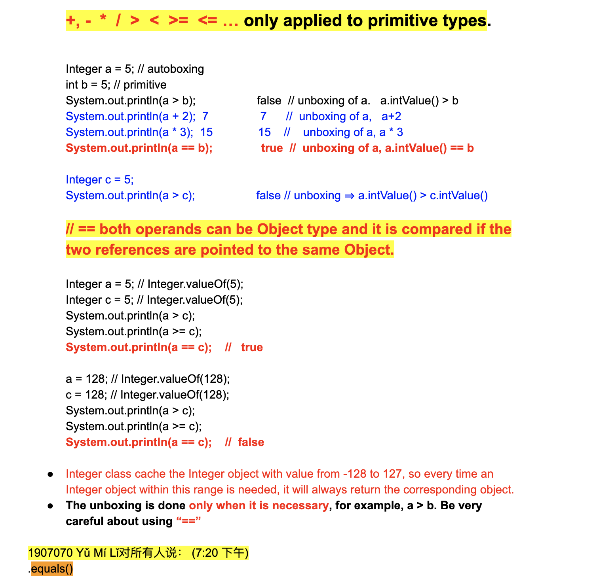
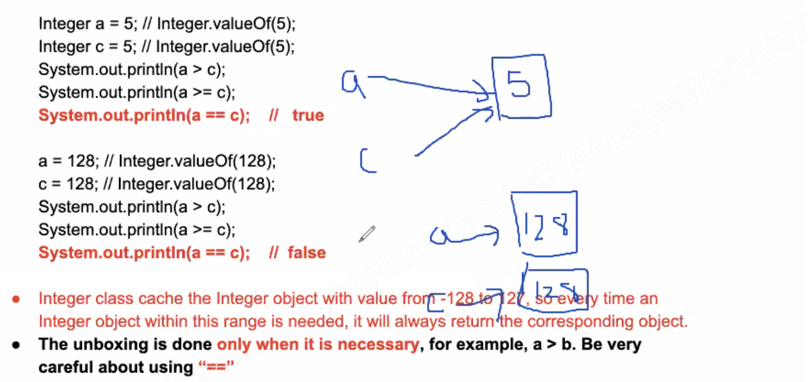
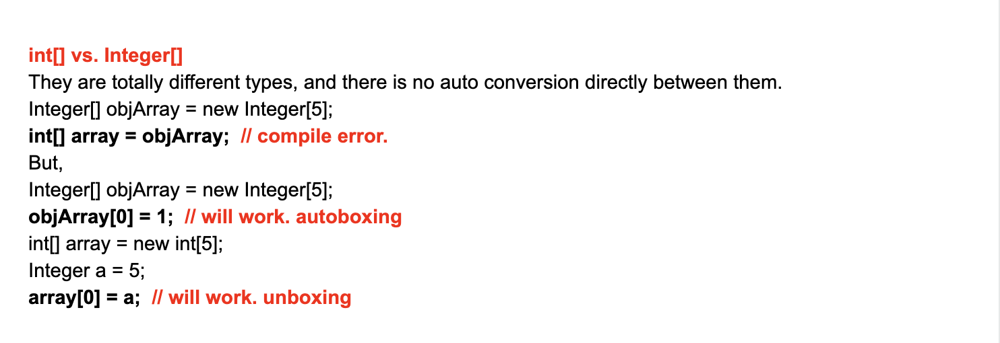

# Integers and Strings

## Autoboxing and Unboxing

```java
int - primitve type
integer - Object type

class Integer{
    private int value;

    public String toString(){

    }
}
```

- Primitive type vs. Wrapper class
  - int : Integer
  - long : Long
  - char : Character
  - double : Double
  - boolean : Boolean

- A wrapper class is just a wrapper of the corresponding primitive type, the Object 
  representation of primitive type values.
  **Similar to String, all the wrapper class objects are IMMUTABLE** 
  **internal values can't be changed after initialization.**

- It can help:
  1. Generic type can't be primitive type, `List<Integer>`, there can not be `List<int>`
  2. It can help provide useful functionalities and contracts (json serializer: obj -> json)
  3. How do you represent a "not existed" int value? "null"

- **In industry, always prefer primitive types to wrapper classes.(Extra overhead)**

```java
class Integer implements Comparable<Integer>{
    private final int value; //wrap the primitive type value inside
    public Integer(int value){
        this.value = value;
    }

    public int intValue(){
        return value;
    }

    public Integer plus(Integer another){
        return Integer.valueOf(value + another.intValue());
    }

    @Override
    public int comparaTo(Integer another){
        if(value == another.value){
            return 0;
        }
        return value < another ? -1 : 1;
    }

    ...
    ...
}
```

```java
Integer a = 1; //
a = 2;

Integer a = new Integer(1);
```




## Autoboxing

- **Autoboxing** is the automatic conversion that the Java compiler makes between the 
  primitive types and their corresponding object wrapper classes.

  For example, converting an int to an Integer, a double to a Double, and so on.

```java
List<Integer> integerList = new ArrayList<Integer>();

for(int i = 0; i < 50; i++){
    integerList.add(i); // => integerList.add(Integer.valueOf(i));
}
```


## Unboxing

- **Unboxing** is the reverse operation of autoboxing.
- Example:

```java
Integer a = 4;//autoboxing => Integer a = Integer.valueOf(4);
a += 4; 
a++;
```

- What happened when `Integer++` ?
  - Integer is immutable, the int value of the Integer object can never change

- a++ : 

```java
int temp = a.intValue();
temp++;
a = Integer.valueOf(temp); //a is pointing to another Integer object.
```

- `a += 4;`

```java
int temp = a.intValue();
temp += 4;
a = Integer.valueOf(temp); //a is poingting to another Integer object.
```


- **More Example**:




- **Thus, the best way is to use** `equals()`



---


## Strings

- a sequence of characters "abc",
- **In java, they are objects**

```java
class String{
    private final char[] value;
    //different String objects can reuse the same char array,
    //but can start with different offset index.
    private int offset;
    //maintain the length of the part in the char array
    //represented by this String object.
    private int count;
}
```
