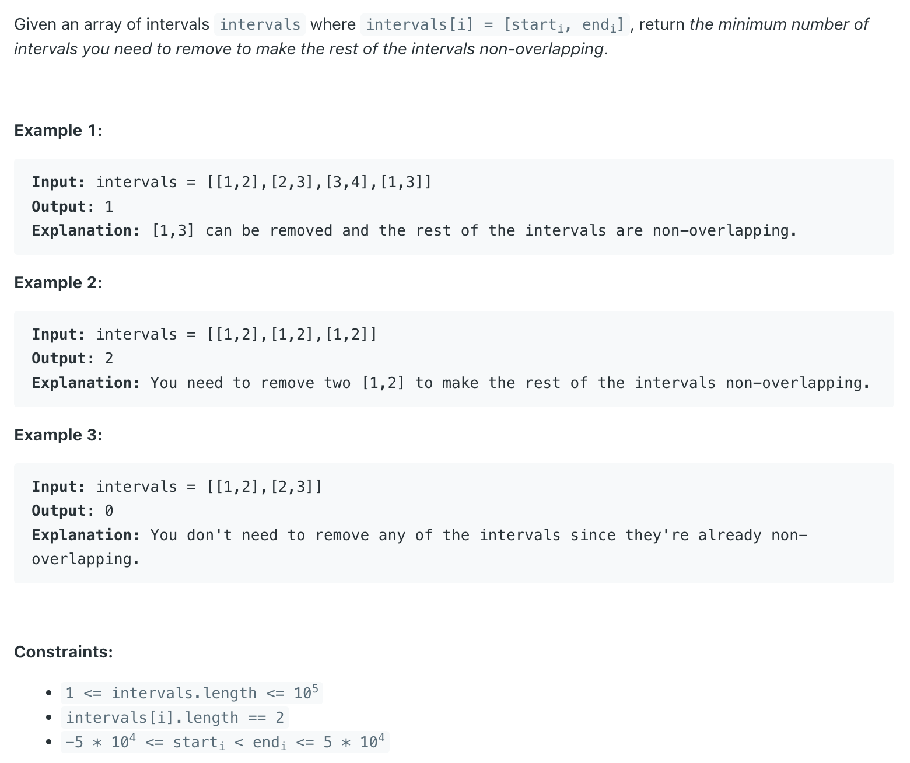

## 435. Non-overlapping Intervals


```ruby

    1                    3
    ----------------------
              2          3
              ------------
    __________            ___________
    1         2           3          4


    [0, 3], [2, 6], [4, 6], [6, 9]   =>  Remove [2, 6]   ans = 1


    [0    3]
        [2         6]
             [4    6]
                  [6     8]


    [0, 3], [1, 2], [2, 6], [5, 6]   =>  Remove [1, 2] and [2, 6]   OR  
                                                [0, 3] and [2, 6] or [5, 6]   ans = 2


    [0      3]
      [1  2]        
         [2        6]
                [5 6]   
```


```java
class Solution {
    public int eraseOverlapIntervals(int[][] intervals) {
        Arrays.sort(intervals, (a, b) -> a[0] - b[0]);
        
        int res = 0;
        int prevEnd = intervals[0][1];
        for (int i = 1; i < intervals.length; i++) {
            if (prevEnd <= intervals[i][0]) {
                prevEnd = intervals[i][1];
            } else {
                res++;
                prevEnd = Math.min(prevEnd, intervals[i][1]);
            }
        }
        return res;
    }
}

```