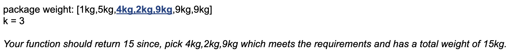
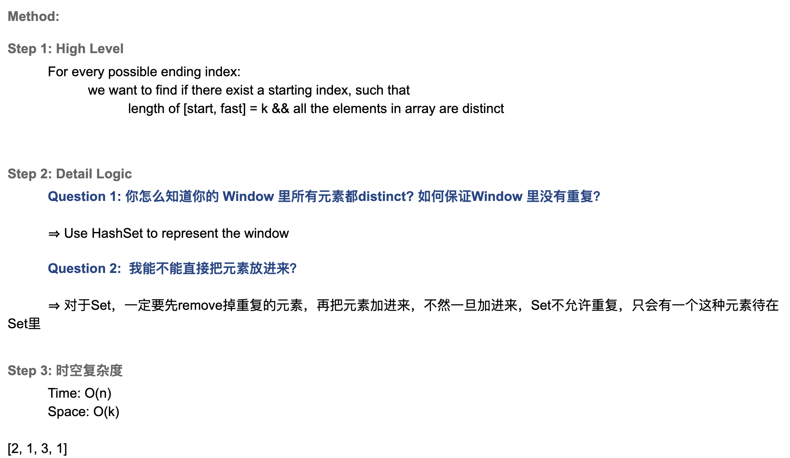

## K consecutive Packages
- our company is delivering packages for our customers. Each deliverer is picking **K consecutive** packages from the 
  packages warehouse. Each package's weight is measured by kilogram and it is listed on the table.
- Find the maximum total weight that a deliverer could take such that every parcel he takes in a different weight.




```java
class _K_Consecutive_Packages {
    public static int maximumSubarraySum(int[] nums, int k) {
        int start = 0;
        int sum = 0;
        int max = 0;
        Set<Integer> set = new HashSet<>();

        for (int end = 0; end < nums.length; end++) {
            int val = nums[end];
            while (set.contains(val) || end - start + 1 > k) {
                sum -= nums[start];
                set.remove(nums[start++]);
            }
            sum += val;
            set.add(val);

            if (end - start + 1 == k) {
                max = Math.max(max, sum);
            }
        }
        return max;
    }

    public static void main(String[] args) {
        int[] packages = new int[]{1, 5, 4, 2, 9, 9, 9};
        int res = maximumSubarraySum(packages, 3);
        System.out.println(res); // 15
    }
}
```