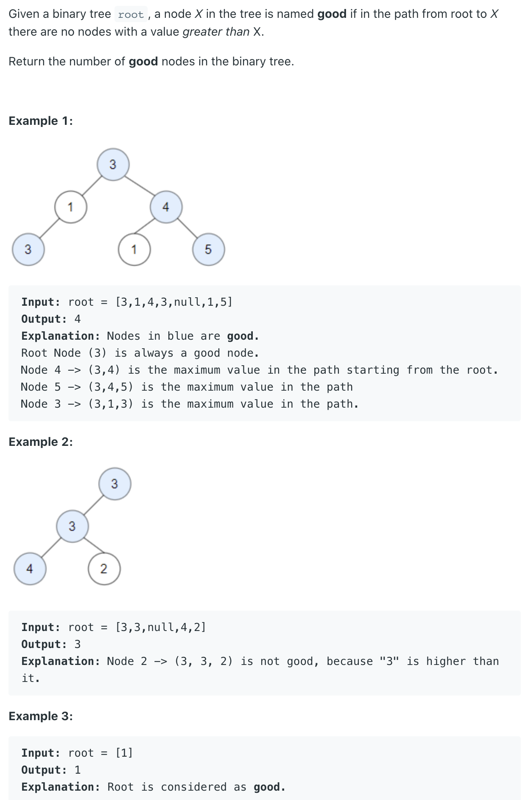

## 1448. Count Good Nodes in Binary Tree



```java
/**
 * Definition for a binary tree node.
 * public class TreeNode {
 *     int val;
 *     TreeNode left;
 *     TreeNode right;
 *     TreeNode() {}
 *     TreeNode(int val) { this.val = val; }
 *     TreeNode(int val, TreeNode left, TreeNode right) {
 *         this.val = val;
 *         this.left = left;
 *         this.right = right;
 *     }
 * }
 */
class Solution {
    int goodNum = 0;
    
    public int goodNodes(TreeNode root) {
        int max = root.val;
        // goodNum = 0;
        helper(root, max);
        return goodNum;
    }
    
    private void helper(TreeNode root, int max) {
        if (root == null) {
            return;
        }
        
        if (root.val >= max) {
            goodNum++;
            max = root.val;
        }
        
        helper(root.left, max);
        helper(root.right, max);
    }
}
```